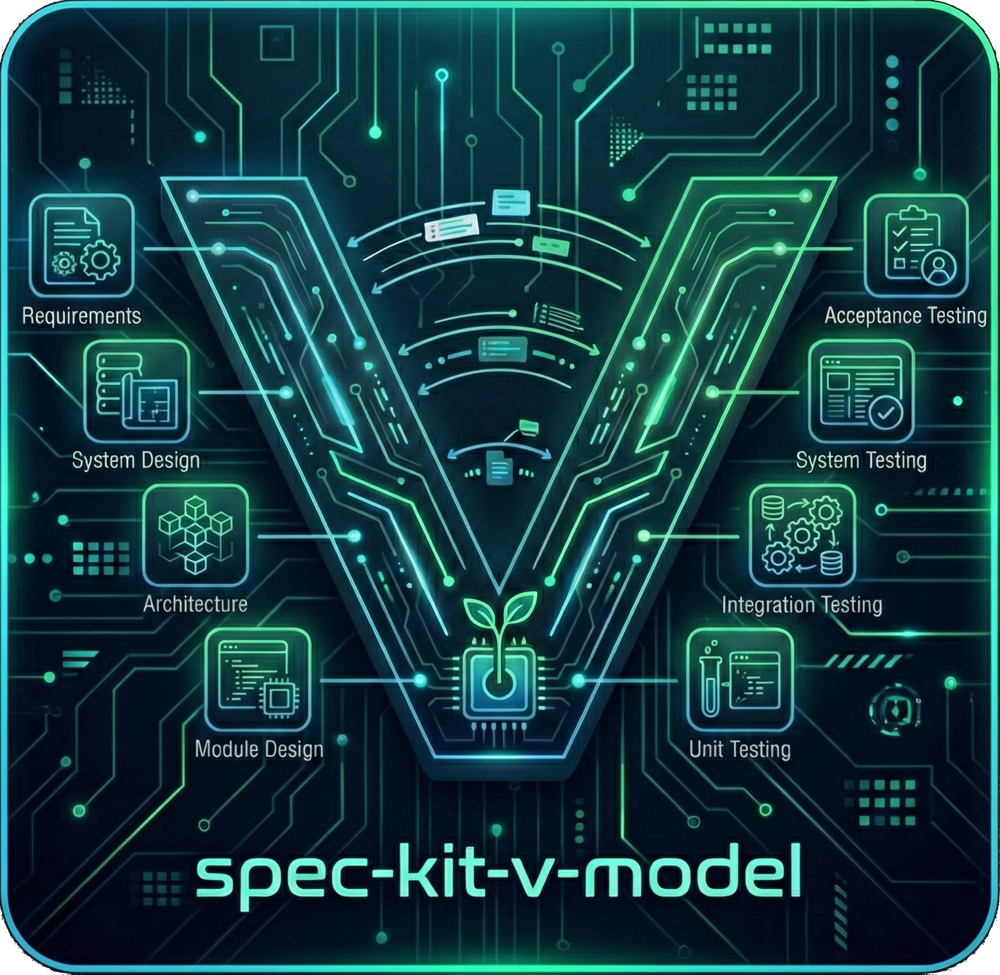

<div align="center">
    
    <h1>V-Model Extension Pack for Spec Kit</h1>
    <h3><em>Every specification paired with its test. Full traceability.</em></h3>
</div>

<p align="center">
    <a href="https://github.com/leocamello/spec-kit-v-model/actions/workflows/ci.yml"></a>
    <a href="https://github.com/leocamello/spec-kit-v-model/actions/workflows/evals.yml"></a>
    <a href="https://github.com/leocamello/spec-kit-v-model/stargazers"></a>
    <a href="https://github.com/leocamello/spec-kit-v-model/blob/main/LICENSE"></a>
    <a href="https://github.com/leocamello/spec-kit-v-model/releases/latest"></a>
</p>

---

An extension for [GitHub Spec Kit](https://github.com/github/spec-kit) that enforces the V-Model methodology: **every development specification has a simultaneously generated, paired testing specification with full traceability**.

> **The AI drafts. The human decides. The scripts verify. Git remembers.**

## Why

AI-native teams ship fast but produce no traceability. Regulated teams have full traceability but move too slowly. The V-Model Extension Pack closes this gap — from a single specification, it generates traceable requirements, paired test plans, hazard analysis, and a deterministic traceability matrix in minutes, not months.

## Features

| Category | Commands |
|----------|----------|
| **Specification** | `requirements` · `system-design` · `architecture-design` · `module-design` |
| **Test Planning** | `acceptance` · `system-test` · `integration-test` · `unit-test` |
| **Cross-Cutting** | `hazard-analysis` · `impact-analysis` · `peer-review` |
| **Verification** | `trace` · `test-results` · `audit-report` |
| **Bridge to Implementation** | `plan` · `tasks` · `implement` |

**17 commands** across 4 V-Model levels plus the bridge to implementation, with deterministic coverage validation, 5 traceability matrices (A–D + H), an 8-stage validation gate (`run-v-model-gate.sh`), 4 lifecycle hooks, and compliance gating for regulated industries.

## Quick Start

```bash
# Install the extension
specify extension add v-model \
  --from https://github.com/leocamello/spec-kit-v-model/archive/refs/tags/v0.7.0.zip

# Generate requirements from your spec
/speckit.v-model.requirements

# Generate paired acceptance tests (100% coverage validated by script)
/speckit.v-model.acceptance

# Build the traceability matrix
/speckit.v-model.trace
```

That's Level 1. Go deeper with `system-design` → `system-test` → `architecture-design` → `integration-test` → `module-design` → `unit-test`, running `trace` after each pair.

## Built for Regulated Industries

| Standard | Domain | Use Case |
|----------|--------|----------|
| **IEC 62304** | Medical Devices | Software safety classes A/B/C |
| **ISO 26262** | Automotive | ASIL A–D functional safety |
| **DO-178C** | Aerospace | DAL A–E design assurance |

Configure your domain in `v-model-config.yml`:

```yaml
domain: iec_62304  # or iso_26262, do_178c
```

## The Core Principle

Scripts handle all deterministic logic — coverage calculations, matrix generation, gap detection. AI handles creative translation — turning specifications into structured requirements and test scenarios. Humans review every artifact. Git remembers everything.

| What | Who |
|------|-----|
| Generate requirements & test plans | AI + Human review |
| Coverage calculation & matrix generation | Deterministic scripts |
| Quality evaluation | LLM-as-judge (advisory) |
| Audit trail | Git (cryptographic hashes) |

## Compliance & Hybrid Modes

The extension supports **two modes of operation**. Pick one and be explicit about it in your repository's README and CI configuration — this is the difference between a compliant audit trail and a prototyping shortcut.

### Compliant mode (recommended for regulated work)

Use the V-Model bridge end-to-end:

```
/speckit.v-model.plan       →  plan.md (V-Model-enriched, schema-validated)
/speckit.v-model.tasks      →  tasks.md (TDD-ordered, with `Implements` headers)
/speckit.v-model.implement  →  source + tests + hallucination guard + trace post-hook
```

Every step runs the V-Model gates (`run-v-model-gate.sh`: status → domain → matrix → 5 coverage validators), the deterministic `Implements`-directive hallucination guard, and the trace post-hook. Artifacts under `specs/<feature>/v-model/` must carry `**Status**: Approved` (enforced by `validate-artifact-status.sh` since v0.7.0). This is the path designed for regulated work targeting IEC 62304, ISO 26262, or DO‑178C.

### Hybrid mode (prototyping only)

It is technically possible to feed a `tasks.md` produced by `/speckit.v-model.tasks` to **core** `/speckit.implement` — the schema round-trips. **This is a hybrid mode that bypasses the V-Model gates, the `Implements`-directive hallucination guard, and the trace post-hook.** Use it only for prototyping or for non-safety-critical features inside an otherwise-V-Model repository.

> **Audit guidance**: a build that ran `/speckit.implement` against a V-Model `tasks.md` is **not** evidence of V-Model compliance, regardless of how the artifacts look. The deterministic gates left no record because they were not invoked.

v0.8.0 will introduce a `compliance_mode: strict` profile (see [EPIC-1 in the v0.8.0 backlog](docs/releases/v0.7.0.md)) that makes this distinction mechanically detectable in CI.

## Testing

| Layer | Tests | What it validates |
|-------|-------|-------------------|
| BATS | **455** | Bash script logic across all script files |
| Pester | **431** | PowerShell script parity |
| Structural | **89** | ID format, template conformance, section completeness |
| LLM evals | **53** | Requirements quality, BDD quality, traceability |
| End-to-end (E2E) | **32** | Bash + golden-output fixtures (advisory in v0.7.0; gated in v0.8.0 via EPIC-7) |

## 📖 Documentation

**Full documentation, tutorials, and guides are available at the [project website](https://leocamello.github.io/spec-kit-v-model/).**

- [Getting Started](https://leocamello.github.io/spec-kit-v-model/getting-started/) — Install and create your first V-Model project in 15 minutes
- [Guides](https://leocamello.github.io/spec-kit-v-model/guide/concepts/) — V-Model concepts, level-by-level guides, CI integration
- [Compliance](https://leocamello.github.io/spec-kit-v-model/compliance/) — IEC 62304, ISO 26262, DO-178C artifact mapping
- [Tutorials](https://leocamello.github.io/spec-kit-v-model/tutorials/medical-device/) — End-to-end walkthroughs for medical, automotive, and aerospace
- [Reference](https://leocamello.github.io/spec-kit-v-model/reference/commands/) — All 17 commands, ID schema, scripts, templates, configuration
- [Contributing](CONTRIBUTING.md) — Development setup, testing, PR process

## License

[MIT](LICENSE)
