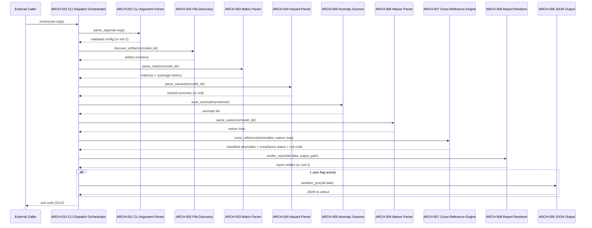

# V-Model Architecture Design: Release Audit Report

**Feature Branch**: `feature/005e-audit-report`
**Created**: 2026-04-05
**Status**: Approved
**Source**: `specs/005e-audit-report/v-model/system-design.md`

## Overview

This document decomposes the system components into architecture modules following IEEE 42010/Kruchten 4+1 views. The audit-report system is implemented as Bash + PowerShell wrapper scripts with shared logic patterns.

## Logical View — Component Breakdown

| ARCH ID | Name | Description | Parent SYS | Type |
|---------|------|-------------|------------|------|
| ARCH-001 | CLI Argument Parser | Parses and validates command-line arguments for both Bash and PowerShell entry points | SYS-008 | Component |
| ARCH-002 | File Discovery Module | Enumerates V-Model filenames, checks existence, collects Git metadata | SYS-001 | Component |
| ARCH-003 | Matrix Parser Module | Reads traceability-matrix.md, splits into matrix sections, extracts rows and coverage | SYS-002 | Component |
| ARCH-004 | Hazard Parser Module | Parses hazard-analysis.md FMEA table to extract HAZ-NNN entries | SYS-003 | Component |
| ARCH-005 | Anomaly Scanner Module | Scans matrix rows for failed/skipped statuses | SYS-004 | Component |
| ARCH-006 | Waiver Parser Module | Parses waivers.md for WAV-NNN entries and artifact ID mappings | SYS-004 | Component |
| ARCH-007 | Cross-Reference Engine | Joins anomalies with waivers, computes compliance status | SYS-004, SYS-005 | Component |
| ARCH-008 | Report Renderer Module | Renders 7-section Markdown report from all collected data | SYS-006 | Component |
| ARCH-009 | JSON Output Module | Serializes audit data to JSON when --json flag is active | SYS-007 | Component |
| ARCH-010 | CLI Dispatch Orchestrator | Top-level entry point in both Bash and PowerShell scripts; invokes ARCH-001 for argument parsing, then sequentially orchestrates ARCH-002 through ARCH-009, and propagates the exit code from compliance status. Uses only standard CI toolchain (Bash 4+, PowerShell 7+, Git, Python 3.x stdlib) — no external package managers or third-party libraries | SYS-008 | Component |

## Architecture Modules

### ARCH-001 — CLI Argument Parser

| Field | Value |
|-------|-------|
| **Traces To** | SYS-008 |
| **Description** | Parses command-line arguments for both Bash and PowerShell entry points: positional vmodel-dir, named options (--system-name, --version, --git-tag, --regulatory-context, --output, --json, --help). Validates required arguments and file existence. Invoked by ARCH-010 before pipeline dispatch. |

**Logical View**: Sequential argument parsing. Bash uses `getopts`-style loop; PowerShell uses `param()` block.

**Interface View**: Input: raw CLI args. Output: validated config object (vmodel_dir, system_name, version, git_tag, regulatory_context, output_path, json_flag). Exception: prints usage to stderr and exits 2 on missing required argument.

### ARCH-002 — File Discovery Module

| Field | Value |
|-------|-------|
| **Traces To** | SYS-001 |
| **Description** | Enumerates known V-Model filenames in the target directory and checks existence. Calls Git for metadata on each found file. |

**Logical View**: Iterate over a hardcoded list of expected filenames. For each existing file, run `git log -1 --format='%h|%aI' -- <file>` to extract SHA and date.

**Interface View**: Input: vmodel_dir path. Output: array of `{name, file, sha, date}` records.

### ARCH-003 — Matrix Parser Module

| Field | Value |
|-------|-------|
| **Traces To** | SYS-002 |
| **Description** | Reads traceability-matrix.md, splits into matrix sections, extracts table rows, and computes coverage metrics. |

**Logical View**: Line-by-line parsing. `## Matrix X` headings delimit sections. Within each section, the first `|`-row is the header, subsequent `|`-rows are data (skip separator). Coverage computed by counting unique design IDs in column 1 vs test IDs in the last ID column.

**Interface View**: Input: traceability-matrix.md path. Output: `{matrices: [{id, header, rows, coverage_metrics}]}`.

### ARCH-004 — Hazard Parser Module

| Field | Value |
|-------|-------|
| **Traces To** | SYS-003 |
| **Description** | Parses hazard-analysis.md FMEA table to extract HAZ-NNN entries. |

**Logical View**: Find the FMEA table by scanning for the `| HAZ` header pattern. Extract each data row. Compute aggregates.

**Interface View**: Input: hazard-analysis.md path (nullable). Output: `{hazards: [], summary: {}}` or null.

### ARCH-005 — Anomaly Scanner Module

| Field | Value |
|-------|-------|
| **Traces To** | SYS-004 |
| **Description** | Scans matrix rows for failed/skipped statuses, optionally scans peer-review files for Critical/Major findings. |

**Logical View**: Iterate matrix rows. Match status column for `❌ Failed` or `⏭️ Skipped` → add to anomaly list with type and matrix reference. Optionally glob for `peer-review-*.md` files, scan for `### PRF-` headings with `Critical` or `Major` severity.

**Interface View**: Input: parsed matrices, optional peer-review file paths. Output: `anomalies[]` array.

### ARCH-006 — Waiver Parser Module

| Field | Value |
|-------|-------|
| **Traces To** | SYS-004 |
| **Description** | Parses waivers.md for WAV-NNN entries and extracts artifact ID mappings. |

**Logical View**: Scan for `### WAV-NNN` heading pattern via regex. For each match, extract `**Artifact**:` field value. Build a map: `{artifact_id → {wav_id, type, justification, approved_by}}`.

**Interface View**: Input: waivers.md path (nullable). Output: waiver map `{artifact_id → waiver_record}`.

### ARCH-007 — Cross-Reference Engine

| Field | Value |
|-------|-------|
| **Traces To** | SYS-004, SYS-005 |
| **Description** | Joins anomalies with waivers to determine disposition (Waived/BLOCKING) and identifies orphaned waivers. Computes final compliance status. |

**Logical View**: For each anomaly, look up its ID in the waiver map → Waived if found, BLOCKING otherwise. For each waiver, check if its artifact ID is in the anomaly set → Orphaned if not. Count BLOCKING anomalies to determine status.

**Interface View**: Input: anomaly list + waiver map. Output: `{classified_anomalies[], orphaned_waivers[], compliance_status, exit_code}`.

### ARCH-008 — Report Renderer Module

| Field | Value |
|-------|-------|
| **Traces To** | SYS-006 |
| **Description** | Renders the final Markdown report by filling the template with all collected data. Writes to output file. Prints summary to stderr. |

**Logical View**: Build each section as a string. Executive summary uses `printf`/string interpolation for metrics. Tables rendered with Markdown pipe syntax. Concatenate all sections. Write to file. Print summary.

**Interface View**: Input: all computed data + metadata + output path. Output: Markdown file + stderr summary.

### ARCH-009 — JSON Output Module

| Field | Value |
|-------|-------|
| **Traces To** | SYS-007 |
| **Description** | Serializes all audit data into JSON format when --json flag is active. |

**Logical View**: Build JSON object from all data structures. Use `python3 -m json.tool` (Bash) or `ConvertTo-Json` (PowerShell) for formatting.

**Interface View**: Input: all computed data. Output: JSON string to stdout.

### ARCH-010 — CLI Dispatch Orchestrator

| Field | Value |
|-------|-------|
| **Traces To** | SYS-008 |
| **Description** | The top-level entry point function in both the Bash (`build-audit-report.sh`) and PowerShell (`Build-Audit-Report.ps1`) scripts. Invokes ARCH-001 to parse and validate arguments, then orchestrates the full processing pipeline in sequence, and propagates the exit code returned by ARCH-007 via SYS-005 compliance status. Uses only standard CI toolchain dependencies (Bash 4+, PowerShell 7+, Git, optionally Python 3.x standard library) — no external package managers or third-party libraries. |

**Logical View**: Main function / script body. Bash implementation calls named functions in sequence; PowerShell implementation calls local functions. No loop or parallelism — strictly sequential single-threaded execution.

**Interface View**: Input: raw process arguments (delegated immediately to ARCH-001). Output: exit code (0 = RELEASE READY or RELEASE CANDIDATE, 1 = NOT READY, 2 = missing required artifacts or argument error). Exception: propagates exit code 2 from any sub-component that encounters a fatal error.

## Process View

**Execution order (sequential, single-threaded)**:
1. ARCH-010 (Entry Point) → delegates to ARCH-001 to validate args
2. ARCH-002 (File Discovery) → enumerate artifacts + git metadata
3. ARCH-003 (Matrix Parser) → extract matrices + coverage
4. ARCH-004 (Hazard Parser) → extract HAZ entries (if present)
5. ARCH-005 (Anomaly Scanner) → find failed/skipped/findings
6. ARCH-006 (Waiver Parser) → parse WAV entries (if present)
7. ARCH-007 (Cross-Reference) → join anomalies ↔ waivers → status
8. ARCH-008 (Report Renderer) → assemble + write report
9. ARCH-009 (JSON Output) → serialize to JSON (if --json)
10. ARCH-010 (Entry Point) → propagates exit code to caller

## Data Flow View

| Source | Data | Destination |
|--------|------|-------------|
| CLI args | raw argv (vmodel-dir, metadata, flags) | ARCH-010 |
| ARCH-010 | raw args | ARCH-001 |
| ARCH-001 | validated config (vmodel_dir, system_name, version, git_tag, regulatory_context, output_path, json_flag) | ARCH-010 |
| ARCH-010 | vmodel_dir | ARCH-002 |
| ARCH-002 | artifact inventory | ARCH-008 |
| ARCH-010 | vmodel_dir | ARCH-003 |
| ARCH-003 | matrices, coverage metrics | ARCH-005, ARCH-008 |
| ARCH-010 | vmodel_dir | ARCH-004 |
| ARCH-004 | hazard summary | ARCH-008 |
| ARCH-003 | matrix rows with status | ARCH-005 |
| ARCH-005 | anomaly list | ARCH-007 |
| ARCH-010 | vmodel_dir | ARCH-006 |
| ARCH-006 | waiver map | ARCH-007 |
| ARCH-007 | classified anomalies, compliance status, exit code | ARCH-008, ARCH-009, ARCH-010 |
| ARCH-008 | Markdown report | output file |
| ARCH-009 | JSON | stdout |
| ARCH-010 | exit code (0/1/2) | caller process |
---

## Coverage Summary

| Metric | Count |
|--------|-------|
| Total Architecture Modules (ARCH) | 10 (10 active, 0 deprecated) |
| SYS → ARCH Coverage | 8/8 (100%) |
| ARCH modules by Type | Component: 10 |
| Cross-Cutting Modules | 0 |
| **Forward Coverage (SYS→ARCH)** | **100%** |
