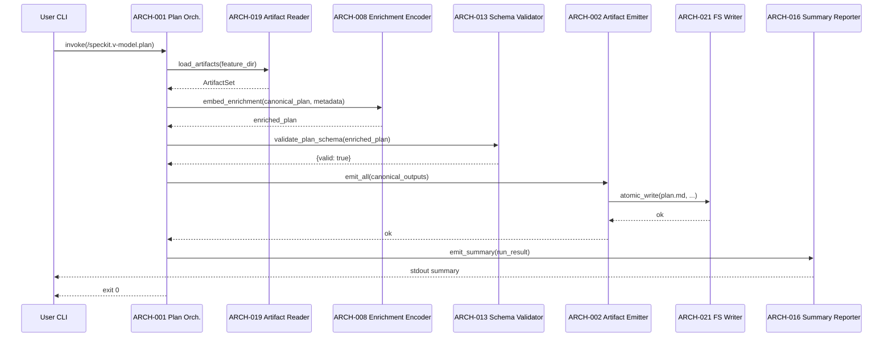
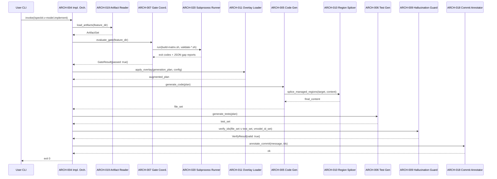
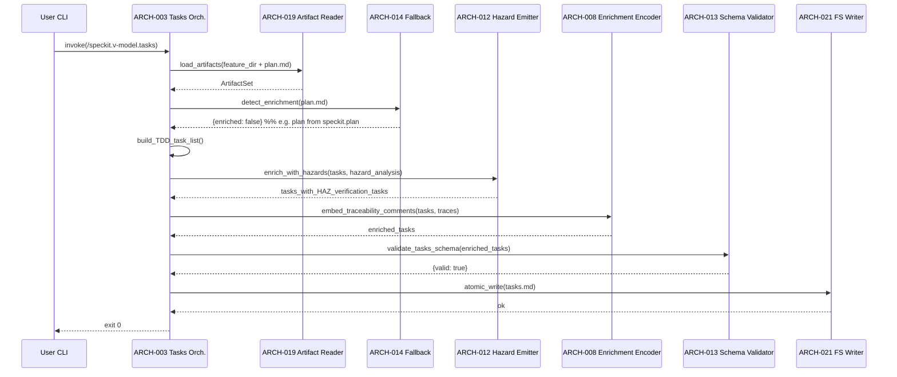

# Architecture Design: Bridge Commands

**Feature Branch**: `feature/007-bridge-commands`
**Created**: 2026-04-26
**Status**: Draft
**Source**: `specs/007-bridge-commands/v-model/system-design.md`

## Overview

The bridge-commands architecture decomposes each system component (`SYS-NNN`)
into one or more architecture modules (`ARCH-NNN`) along two principal
seams: (1) **orchestration vs. emission** — the three top-level command
subsystems each split into a flow-driving orchestrator and one or more
content-producing modules, and (2) **canonical-output vs. fallback** — the
spec-kit-core compatibility layer (SYS-010) splits into strict schema
validation and reduced-enrichment fallback so each can be tested and evolved
independently. Three cross-cutting infrastructure modules (V-Model artifact
reader, subprocess runner, filesystem writer) supply common services to the
business modules; they are tagged `[CROSS-CUTTING]` rather than parented to a
SYS, since they implement no requirement-traceable capability of their own.

The runtime model is **single-threaded sequential** per command invocation —
the bridge commands run as one-shot CLI processes with no internal
concurrency. Synchronization is filesystem-level only (atomic-write semantics
provided by ARCH-021). This choice trades performance for determinism and
simplicity, anchored to the idempotency requirement (REQ-025).

**Sensitivity points:**
- The pinned spec-kit-core schema version (`v0.7.0`) — any drift in the
  upstream `plan-template.md` or `tasks-template.md` immediately breaks
  ARCH-013 (Schema Validator). Mitigation: schema fixtures versioned with
  the project; ARCH-013 reports the pinned version in its summary.
- The Markdown / HTML-comment grammar used for additive enrichment — small
  changes to the comment delimiter convention propagate to ARCH-008,
  ARCH-013, and ARCH-019.

**Trade-off points:**
- Single-threaded sequential execution → trades performance efficiency
  (ISO 25010 §4.2.3) for **idempotency** (REQ-025) and **maintainability**
  (ISO 25010 §4.2.7). Acceptable because bridge-command runtime is bounded
  by I/O and LLM latency, not by intra-process concurrency.
- Reduced-enrichment fallback (ARCH-014) → trades enrichment-completeness
  for **co-existence** with `speckit.*` outputs (ISO 25010 §4.2.4). Required
  by REQ-028 (Hybrid path).

No domain overlay is loaded for this feature (`v-model-config.yml` is absent
at the repository root); only the base IEEE 42010 / Kruchten 4+1 views are
populated, and no safety-integrity decomposition, defensive-programming
table, or temporal-constraints table is required.

## ID Schema

- **Architecture Module**: `ARCH-NNN` — sequential identifier, never renumbered.
- **Parent System Components**: Comma-separated `SYS-NNN` list per module
  (many-to-many). Coverage is computed against the active SYS set in
  `system-design.md`.
- **Cross-Cutting Tag**: `[CROSS-CUTTING]` for infrastructure modules
  (artifact reader, subprocess runner, filesystem writer) that implement no
  requirement-traceable capability of their own.
- Example: `ARCH-001` with Parent System Components `SYS-001` — module
  implements (in part) the Plan Synthesizer.

## Logical View — Component Breakdown (IEEE 42010 / Kruchten 4+1)

| ARCH ID | Name | Description | Parent System Components | Type |
|---------|------|-------------|--------------------------|------|
| ARCH-001 | Plan Synthesis Orchestrator | Drives the `/speckit.v-model.plan` flow: loads V-Model artifacts via ARCH-019, requests enrichment from ARCH-008, validates the assembled `plan.md` via ARCH-013, and emits the final canonical artifact set via ARCH-002. Reports the run via ARCH-016. | SYS-001 | Component |
| ARCH-002 | Canonical Artifact Emitter | Renders and writes the canonical spec-kit-core output set (`plan.md`, `data-model.md`, `contracts/` directory entries, `quickstart.md`, `research.md`) to disk through ARCH-021. Each render method consumes the in-memory representation produced by ARCH-001 and produces canonical Markdown / file-tree output. | SYS-001 | Component |
| ARCH-003 | Tasks Synthesis Orchestrator | Drives the `/speckit.v-model.tasks` flow: loads V-Model artifacts plus any `plan.md` (V-Model-enriched or core-only) via ARCH-019, generates the TDD-ordered task list, applies hazard enrichment via ARCH-012, embeds traceability comments via ARCH-008, validates against the canonical schema via ARCH-013, and writes the result via ARCH-021. | SYS-002 | Component |
| ARCH-004 | Implementation Orchestrator | Drives the `/speckit.v-model.implement` flow: loads V-Model artifacts via ARCH-019, gates the run via ARCH-007, applies overlay augmentation via ARCH-011, dispatches to ARCH-005 and ARCH-006, calls ARCH-009 for pre-commit verification, and produces commits via ARCH-018. Aborts on any safety-net failure before the commit phase. | SYS-003 | Component |
| ARCH-005 | Code Generator | Generates source code into the path declared by each `MOD-NNN` Target Source File. Uses ARCH-010 to splice generated content into existing target files while preserving user regions. Emits `# Implements <ID>` traceability comments in the generated language's comment syntax. | SYS-003 | Component |
| ARCH-006 | Test Generator | Generates tests at all four V-Model levels (unit / integration / system / acceptance) by reading the corresponding test-plan artifacts (`unit-test.md`, `integration-test.md`, `system-test.md`, `acceptance-plan.md`) and emitting test files into the project's existing test directories via ARCH-021. | SYS-003 | Component |
| ARCH-007 | Pre-Implementation Gate Coordinator | Composes the existing deterministic scripts (`build-matrix.sh`, the five `validate-*-coverage.sh` scripts) by invoking each via ARCH-020, aggregating their JSON output into a single `GateResult`, and returning it to ARCH-004. Introduces no new gating logic. | SYS-004 | Component |
| ARCH-008 | Additive Enrichment Encoder | Layers V-Model traceability metadata onto canonical spec-kit-core artifacts as HTML comments and optional Markdown sections. Provides `embed_enrichment(plan_doc, metadata)` for plan-style outputs and `embed_traceability_comments(tasks_doc, traces)` for task-style outputs. | SYS-005 | Service |
| ARCH-009 | Hallucination Guard | Pre-commit verification module. Scans every `// Implements <ID>` (or language equivalent) comment in the generated source set, confirms each referenced ID exists in the V-Model artifact set loaded by ARCH-019, and returns `{valid, hallucinations[]}` to ARCH-004. | SYS-006 | Service |
| ARCH-010 | Source Region Splicer | Demarcates and splices V-Model-managed regions inside generated source files using language-appropriate marker comments. Detects overlapping markers and aborts with a diff report. Used by ARCH-005. | SYS-007 | Component |
| ARCH-011 | Domain Overlay Loader | Loads `v-model-config.yml` (when present) and applies overlay-specific output requirements (e.g., MC/DC obligations for DO-178C Level A, ASIL-driven test depth for ISO 26262) to the generation plan consumed by ARCH-005 and ARCH-006. | SYS-008 | Adapter |
| ARCH-012 | Hazard Task Emitter | Activates when `hazard-analysis.md` is present in the artifact set: raises mitigation-task priority and emits dedicated verification tasks naming each `HAZ-NNN`. Consumed by ARCH-003. | SYS-009 | Component |
| ARCH-013 | Spec-Kit Schema Validator | Validates `plan.md` and `tasks.md` against spec-kit-core's canonical `plan-template.md` and `tasks-template.md` schemas pinned at v0.7.0 release time. Returns `{valid, errors[]}`. Owns the round-trip property. | SYS-010 | Library |
| ARCH-014 | Reduced-Enrichment Fallback | Detects upstream artifacts (e.g., a `plan.md` produced by `speckit.plan`) that lack V-Model enrichment metadata and falls back to populating downstream traceability from the V-Model artifact set directly. Enables the Hybrid path. | SYS-010 | Component |
| ARCH-015 | Hook Registrar | Writes hook entries into `.specify/extensions.yml` registering `before_implement` / `after_implement` to invoke `v-model.trace` and `after_specify` to invoke `v-model.requirements`. Modifies registrations only — never the hook infrastructure itself. | SYS-011 | Adapter |
| ARCH-016 | Structured Summary Reporter | Renders a machine-readable stdout summary (inputs read / outputs produced / artifacts skipped / warnings) in the existing `v-model.test-results` / `v-model.audit-report` summary conventions. Always emits, even on failure paths. | SYS-012 | Component |
| ARCH-017 | Quality Compliance Harness | Computes four-stack coverage (BATS, Pester, structural eval, LLM eval) by invoking the existing test harnesses via ARCH-020 and gates merge on 100% coverage. Also runs scope-guardrail audits (rejects orchestrator/sandbox additions) and dogfood-discipline checks. | SYS-013 | Utility |
| ARCH-018 | Commit Annotator | Suffixes git commit messages with the comma-separated list of V-Model identifiers fulfilled by the change. Invokes Git via ARCH-020 (subprocess to `git commit -m`). Best-effort: warns on failure, commit still proceeds. | SYS-014 | Component |
| ARCH-019 | V-Model Artifact Reader | `[CROSS-CUTTING]` — Loads and parses every V-Model artifact in `specs/<feature>/v-model/` (Markdown + HTML-comment metadata + table extraction). Provides a stable in-memory representation to every consumer. **Rationale:** every command reads the same artifact set; centralising the parser prevents per-command drift. | [CROSS-CUTTING] — shared parser for V-Model Markdown + HTML-comment grammar; consumed by ARCH-001, ARCH-003, ARCH-004, ARCH-007, ARCH-009, ARCH-014. Drift in parsing rules across commands would directly violate REQ-NF-003. | Library |
| ARCH-020 | Subprocess Runner | `[CROSS-CUTTING]` — Invokes external scripts (`build-matrix.sh`, `validate-*-coverage.sh`, BATS, Pester, eval harnesses) and the test runners. Captures stdout/stderr and exit codes; surfaces JSON output transparently. **Rationale:** required by REQ-CN-002 (no new wrapper script) — all gate logic stays in the existing scripts; this module is a thin invocation surface only. | [CROSS-CUTTING] — required by REQ-CN-002; consumed by ARCH-007, ARCH-017, ARCH-018. | Utility |
| ARCH-021 | Filesystem Writer | `[CROSS-CUTTING]` — Atomic file-write primitive (write-to-tmp + rename) used by ARCH-002, ARCH-005, ARCH-006, ARCH-010, ARCH-015. **Rationale:** atomicity is what makes failed runs leave the filesystem in a consistent state; without it a partial write could corrupt a target source file (REQ-022 violation). | [CROSS-CUTTING] — atomic-write infrastructure required by every artifact-emitting module. | Utility |

## Process View — Dynamic Behavior (Kruchten 4+1)

**Concurrency Model:** Single-threaded sequential per command invocation. The
bridge commands run as one-shot CLI processes; there is no internal
concurrency, no thread pool, no event loop, and no actor model. External
subprocesses invoked via ARCH-020 (e.g., `build-matrix.sh`) execute
sequentially in the order shown in the diagrams.

**Synchronization Points:** Filesystem only. ARCH-021 provides atomic-write
semantics (write-to-tmp, then rename) — this is the only synchronization
primitive used. No in-process mutexes, semaphores, or barriers exist.

**Execution-order constraints:** Hard ordering between (a) gate before
generation (ARCH-007 strictly precedes ARCH-005 and ARCH-006), (b)
generation before verification (ARCH-009 strictly precedes ARCH-018), and
(c) verification before commit (the `git commit` invocation in ARCH-018 is
gated on a passing ARCH-009 result).

### Interaction: Plan Synthesis (`/speckit.v-model.plan`)

### Interaction: Implementation Pipeline (`/speckit.v-model.implement`)

> **Fail-closed exits not shown above for brevity:** every dashed return
> from ARCH-007 (`passed: false`), ARCH-009 (`valid: false`), or ARCH-010
> (overlapping markers detected) terminates ARCH-004 with non-zero exit
> before the next downstream call. No partial commit is ever produced.

### Interaction: Hazard-Aware Tasks Synthesis (`/speckit.v-model.tasks`)

## Interface View — API Contracts (Kruchten 4+1)

> All function-style contracts below are **synchronous, in-process** unless
> annotated otherwise. The two CLI-edge contracts (ARCH-001 / ARCH-003 /
> ARCH-004 entry points) are invoked as one-shot subprocesses by the spec-kit
> CLI host.

### ARCH-001: Plan Synthesis Orchestrator

| Direction | Name | Type | Format | Constraints |
|-----------|------|------|--------|-------------|
| Input | `feature_dir` | path | absolute filesystem path | MUST contain `requirements.md`; other artifacts optional |
| Input | `arguments` | string | UTF-8 | optional CLI `$ARGUMENTS` |
| Output | exit code | int | 0 \| 1 | 0 on success (incl. graceful-degradation warnings); 1 on schema-bridge failure |
| Output | stdout summary | text | ARCH-016 format | always emitted |
| Output | side-effects | files | written to `feature_dir/` | `plan.md`, `data-model.md`, `contracts/`, `quickstart.md`, `research.md` (subset when optional inputs absent) |
| Exception | `EnrichmentError` | propagated | text + stack | when ARCH-008 raises |
| Exception | `SchemaValidationError` | propagated | text + section | when ARCH-013 returns `{valid: false}` |

### ARCH-002: Canonical Artifact Emitter

| Direction | Name | Type | Format | Constraints |
|-----------|------|------|--------|-------------|
| Input | `canonical_outputs` | struct | `{plan, data_model, contracts[], quickstart, research}` | each field optional; absent fields → file not emitted |
| Output | written paths | list[path] | absolute paths | one entry per file actually written |
| Exception | `IOError` | from ARCH-021 | text | propagated when atomic write fails |

### ARCH-003: Tasks Synthesis Orchestrator

| Direction | Name | Type | Format | Constraints |
|-----------|------|------|--------|-------------|
| Input | `feature_dir` | path | absolute filesystem path | MUST contain `requirements.md`; `plan.md` optional |
| Input | `arguments` | string | UTF-8 | optional CLI `$ARGUMENTS` |
| Output | exit code | int | 0 \| 1 | 0 on success; 1 on schema or hazard-enrichment failure |
| Output | side-effect | file | `feature_dir/tasks.md` | always emitted on exit 0 |
| Exception | `HazardEnrichmentError` | propagated | text | when ARCH-012 raises and `hazard-analysis.md` is present |

### ARCH-004: Implementation Orchestrator

| Direction | Name | Type | Format | Constraints |
|-----------|------|------|--------|-------------|
| Input | `feature_dir` | path | absolute filesystem path | MUST contain `requirements.md`, `module-design.md`, all four V-Model test plans |
| Input | `arguments` | string | UTF-8 | optional CLI `$ARGUMENTS` |
| Output | exit code | int | 0 \| 1 | 1 if any of: gate fails, hallucination detected, region conflict, overlay failure |
| Output | side-effects | files + commits | written to `MOD-NNN` Target Source Files + git commits | atomically all-or-nothing per run |
| Exception | `GateFailure` | propagated | gap report | when ARCH-007 returns `{passed: false}` |
| Exception | `HallucinationDetected` | propagated | list of `(file, line, id)` | when ARCH-009 returns `{valid: false}` |
| Exception | `RegionConflict` | propagated | diff report | when ARCH-010 detects overlapping markers |

### ARCH-005: Code Generator

| Direction | Name | Type | Format | Constraints |
|-----------|------|------|--------|-------------|
| Input | `generation_plan` | struct | `{modules[], language_per_module, target_paths}` | every entry has a `MOD-NNN` and a Target Source File |
| Output | `file_set` | list[(path, content)] | absolute paths + UTF-8 content | every emitted file contains ≥1 `// Implements <ID>` (language-appropriate) comment |
| Exception | `RegionConflict` | from ARCH-010 | propagated | aborts before any file is written |
| Exception | `IOError` | from ARCH-021 | text + path | raised by ARCH-021 in pipeline Stage 7 (after ARCH-009 returns `valid: true`) when atomic-write of an emitted source file fails (target dir missing, disk full, permission denied); aborts the run during the write phase, after verification has already passed. ARCH-005 itself never writes to disk — the (`path`, `content`) tuples it returns to ARCH-004 are passed through ARCH-009 first, then handed to ARCH-021 for atomic write. This row documents the exception that propagates back through ARCH-005's call frame, not a failure mode of ARCH-005 itself. |

### ARCH-006: Test Generator

| Direction | Name | Type | Format | Constraints |
|-----------|------|------|--------|-------------|
| Input | `generation_plan` | struct | as above | also requires test-plan artifacts |
| Output | `test_set` | list[(path, content)] | absolute paths + UTF-8 content | covers unit / integration / system / acceptance levels |
| Exception | `MalformedTestPlan` | raised | text + artifact path + line | when an input test-plan artifact (`unit-test.md`, `integration-test.md`, `system-test.md`, `acceptance-plan.md`) cannot be parsed or omits a mandatory field; propagated to ARCH-004 fail-closed |
| Exception | `IOError` | from ARCH-021 | text + path | raised by ARCH-021 in pipeline Stage 7 (after ARCH-009 returns `valid: true`) when atomic-write of an emitted test file fails (e.g., target directory missing, disk full, permission denied); aborts the run during the write phase, after verification has already passed. ARCH-006 itself never writes to disk — the (`path`, `content`) tuples it returns to ARCH-004 are passed through ARCH-009 first, then handed to ARCH-021 for atomic write. This row documents the exception that propagates back through ARCH-006's call frame, not a failure mode of ARCH-006 itself. |

### ARCH-007: Pre-Implementation Gate Coordinator

| Direction | Name | Type | Format | Constraints |
|-----------|------|------|--------|-------------|
| Input | `feature_dir` | path | absolute path | |
| Output | `GateResult` | struct | `{passed: bool, gap_report: str, matrices: {A,B,C,D,H: {pct: float, gaps: [...]}}}` | `passed == true` ⟺ every matrix is 100% complete |
| Side-effect | (none) | — | — | strictly read-only against the feature directory |
| Exception | `SubprocessFailure` | from ARCH-020 | text + exit code | propagated as `{passed: false}` (fail-closed) |

### ARCH-008: Additive Enrichment Encoder

| Direction | Name | Type | Format | Constraints |
|-----------|------|------|--------|-------------|
| Input | `canonical_doc` | string | canonical Markdown | MUST validate against the corresponding spec-kit-core schema before enrichment |
| Input | `metadata` | struct | `{trace_chains[], optional_sections{}}` | empty metadata → identity transform |
| Output | `enriched_doc` | string | canonical Markdown + HTML comments + optional sections | MUST still validate against the spec-kit-core schema after enrichment |
| Exception | `EnrichmentError` | raised | text | when the input `canonical_doc` is itself non-conformant |

### ARCH-009: Hallucination Guard

| Direction | Name | Type | Format | Constraints |
|-----------|------|------|--------|-------------|
| Input | `generated_files` | list[(path, content)] | UTF-8 | parsed for `// Implements <ID>` (and language-equivalent) comments |
| Input | `vmodel_id_set` | set[string] | canonical IDs from ARCH-019 | the authoritative ID universe; constructed by ARCH-019 from the V-Model artifact set per the SYS-006 algorithm specification (system-design.md § "SYS-006 Algorithm Specification") |
| Output | `VerifyResult` | struct | `{valid: bool, hallucinations: [{file, line, id}]}` | `valid` ⟺ `len(hallucinations) == 0`. Field `hallucinations[*].file` is the absolute path; `line` is 1-indexed; `id` is the verbatim claimed identifier as it appeared in the comment. |
| Determinism | (intrinsic) | — | — | ARCH-009 is a pure function of `(generated_files, vmodel_id_set)`; no I/O, no LLM call, no clock, no randomness. Same inputs ⟹ same outputs across hosts and runs. See system-design.md § "SYS-006 Algorithm Specification" for the regex and complexity contract. |

### ARCH-010: Source Region Splicer

| Direction | Name | Type | Format | Constraints |
|-----------|------|------|--------|-------------|
| Input | `target_path` | path | absolute path; may not exist | |
| Input | `generated_content` | string | UTF-8 | belongs inside one V-Model-managed region |
| Output | `final_content` | string | UTF-8 | preserves all bytes outside V-Model-managed regions |
| Exception | `RegionConflict` | raised | diff report | when existing markers overlap |

### ARCH-011: Domain Overlay Loader

| Direction | Name | Type | Format | Constraints |
|-----------|------|------|--------|-------------|
| Input | `generation_plan` | struct | as for ARCH-005/006 | |
| Input | `domain_config` | struct \| null | parsed YAML | `null` ⟹ identity transform; non-null ⟹ overlay-augmented plan |
| Output | `augmented_plan` | struct | superset of input | adds e.g. MC/DC obligations, ASIL markers |
| Exception | `OverlayParseError` | raised | text | propagated to ARCH-004 (fail-closed) |

### ARCH-012: Hazard Task Emitter

| Direction | Name | Type | Format | Constraints |
|-----------|------|------|--------|-------------|
| Input | `tasks` | list[Task] | TDD-ordered task list | |
| Input | `hazard_analysis` | parsed `hazard-analysis.md` | struct | absent ⟹ identity transform (early return) |
| Output | `enriched_tasks` | list[Task] | augmented | adds verification tasks per `HAZ-NNN`; raises priority on mitigation tasks |
| Exception | `MalformedHazardAnalysis` | raised | text + line | when the input fails parse |

### ARCH-013: Spec-Kit Schema Validator

| Direction | Name | Type | Format | Constraints |
|-----------|------|------|--------|-------------|
| Input | `doc` | string | canonical Markdown | schema is selected by call site (`validate_plan_schema` or `validate_tasks_schema`) |
| Output | `ValidationResult` | struct | `{valid: bool, errors: [{section, line, message}]}` | strict against the pinned spec-kit-core schema |
| Output | `pinned_version` | string | semver | reported in run summary |
| Exception | `SchemaValidationError` | raised | text + section + line | wraps `ValidationResult` when callers prefer exception-style flow (ARCH-001, ARCH-003); equivalent to `ValidationResult{valid: false}` and carries the same error list. See ARCH-001 § Interface View "SchemaValidationError" exception row for the propagated semantics. |
| Error-recovery | (none — fail-closed) | — | — | ARCH-013 NEVER attempts to mutate, repair, or downgrade `doc`. Callers MUST abort on any non-`valid` result and MUST NOT invoke ARCH-002 / ARCH-021 to write a non-conformant artifact. The reduced-enrichment fallback (ARCH-014) is a SEPARATE upstream-document path and does NOT bypass ARCH-013 on the output side. |

### ARCH-014: Reduced-Enrichment Fallback

| Direction | Name | Type | Format | Constraints |
|-----------|------|------|--------|-------------|
| Input | `upstream_doc` | string | canonical Markdown | e.g. a `plan.md` |
| Output | `EnrichmentReport` | struct | `{enriched: bool, missing_metadata_keys: [str]}` | `enriched: false` ⟹ ARCH-003 / ARCH-004 will populate from V-Model artifacts directly |
| Exception | `UpstreamParseError` | raised | text + path + line | when `upstream_doc` is not valid UTF-8 Markdown or cannot be parsed for enrichment markers (truncated input, unexpected schema variant, non-UTF-8 byte sequence); propagated to ARCH-003 fail-closed |
| Error-recovery | (none — fail-open on metadata absence) | — | — | a successfully parsed `upstream_doc` whose enrichment metadata is merely absent yields `EnrichmentReport{enriched: false, missing_metadata_keys: [...]}`; this is NOT an error and the Hybrid path proceeds via the fallback branch in ARCH-003 / ARCH-004. Only structural parse failure raises `UpstreamParseError`. |

### ARCH-015: Hook Registrar

| Direction | Name | Type | Format | Constraints |
|-----------|------|------|--------|-------------|
| Input | `extensions_yml_path` | path | `.specify/extensions.yml` | MUST exist; only registrations are written |
| Output | `WriteResult` | struct | `{added: int, skipped_existing: int}` | idempotent — re-runs do not duplicate entries |
| Exception | `IOError` | from ARCH-021 | text | propagated |

### ARCH-016: Structured Summary Reporter

| Direction | Name | Type | Format | Constraints |
|-----------|------|------|--------|-------------|
| Input | `run_result` | struct | `{inputs_read[], outputs_produced[], artifacts_skipped[], warnings[], fatal_errors[]}` | |
| Output | stdout text | text | `v-model.test-results` / `v-model.audit-report` summary grammar | always emitted, even on failure |

### ARCH-017: Quality Compliance Harness

| Direction | Name | Type | Format | Constraints |
|-----------|------|------|--------|-------------|
| Input | `feature_dir` | path | absolute path | |
| Output | `CoverageReport` | struct | `{bats: pct, pester: pct, structural_eval: pct, llm_eval: pct, merge_gate: "allow"\|"block"}` | `merge_gate == "allow"` ⟺ every harness reports 100% |
| Output | `AuditReport` | struct | `{deferred_capability_violations: [], dogfood_discipline_ok: bool}` | for REQ-CN-003 / REQ-CN-004 audit steps |
| Exception | `SubprocessFailure` | from ARCH-020 | text + harness name + exit code | propagated to caller; `merge_gate` left undefined when this is raised — caller must treat as a fail-closed condition equivalent to `merge_gate:"block"`. |

### ARCH-018: Commit Annotator

| Direction | Name | Type | Format | Constraints |
|-----------|------|------|--------|-------------|
| Input | `message` | string | UTF-8 | base commit message |
| Input | `ids` | list[string] | V-Model identifiers | empty list permitted (warning, no suffix) |
| Output | `annotated_message` | string | UTF-8 | `<message> — <id>, <id>, ...` (suffix omitted when `ids == []`) |
| Side-effect | `git commit` | invocation via ARCH-020 | — | exits non-zero only if Git itself fails; annotation failure is a warning, not a hard error |

### ARCH-019 [CROSS-CUTTING]: V-Model Artifact Reader

| Direction | Name | Type | Format | Constraints |
|-----------|------|------|--------|-------------|
| Input | `feature_dir` | path | absolute path | |
| Output | `ArtifactSet` | struct | `{requirements, acceptance_plan, system_design, system_test, architecture_design, integration_test, module_design, unit_test, hazard_analysis, traceability_matrix}` | each field nullable; nulls flow through to "graceful degradation" decisions in callers |
| Output | `vmodel_id_set` | set[string] | union of every REQ/ATP/SCN/SYS/STP/STS/ARCH/ITP/ITS/MOD/UTP/UTS/HAZ ID present | consumed by ARCH-009 |
| Exception | `MalformedArtifact` | raised | path + reason | propagated as fatal |

### ARCH-020 [CROSS-CUTTING]: Subprocess Runner

| Direction | Name | Type | Format | Constraints |
|-----------|------|------|--------|-------------|
| Input | `command` | list[string] | argv | first element MUST be a script path the project itself ships (REQ-CN-002 — no new wrapper script) |
| Input | `cwd` | path | absolute | |
| Output | `RunResult` | struct | `{exit_code: int, stdout: str, stderr: str}` | UTF-8; binary output rejected |
| Exception | `SubprocessFailure` | raised | text + exit code | propagated to caller for fail-closed handling |

### ARCH-021 [CROSS-CUTTING]: Filesystem Writer

| Direction | Name | Type | Format | Constraints |
|-----------|------|------|--------|-------------|
| Input | `path` | path | absolute path | |
| Input | `content` | bytes | UTF-8 (typical) | |
| Output | (side-effect) | file at `path` | atomic | write-to-tmp + rename; failed writes leave the existing file untouched |
| Exception | `IOError` | raised | text + errno | propagated |

## Data Flow View — Data Transformation Chains (Kruchten 4+1)

### Data Flow: Requirements → tasks.md (TDD-ordered, hazard-enriched)

| Stage | Module | Input Format | Transformation | Output Format |
|-------|--------|--------------|----------------|---------------|
| 1 | ARCH-019 | `requirements.md` (Markdown) + `module-design.md` + `hazard-analysis.md` | Parse Markdown tables and HTML-comment metadata | `ArtifactSet` (in-memory struct) |
| 2 | ARCH-014 | optional upstream `plan.md` | Detect V-Model enrichment presence | `EnrichmentReport` |
| 3 | ARCH-003 | `ArtifactSet` + `EnrichmentReport` | Build TDD-ordered task list (unit-tests → impl → integration-tests → system-tests → acceptance-tests) | `list[Task]` (in-memory) |
| 4 | ARCH-012 | `list[Task]` + `hazard_analysis` | Raise mitigation-task priorities; emit verification tasks per `HAZ-NNN` | `list[Task]` (enriched) |
| 5 | ARCH-008 | `list[Task]` + `trace_chains` | Inject `<!-- traces-to: MOD → ARCH → SYS → REQ -->` HTML comments | canonical Markdown with HTML-comment enrichment |
| 6 | ARCH-013 | enriched canonical Markdown | Validate against `tasks-template.md` schema (pinned at v0.7.0) | `ValidationResult` |
| 7 | ARCH-021 | enriched canonical Markdown | Atomic write | `tasks.md` on disk |

### Data Flow: module-design.md MOD entries → source code files

| Stage | Module | Input Format | Transformation | Output Format |
|-------|--------|--------------|----------------|---------------|
| 1 | ARCH-019 | `module-design.md` | Parse MOD table (incl. Target Source File field) | `list[ModuleSpec]` |
| 2 | ARCH-007 | (none — gate inputs are read directly from feature dir) | Compose `build-matrix.sh` + `validate-*-coverage.sh` | `GateResult` (must be `passed: true` to proceed) |
| 3 | ARCH-011 | `list[ModuleSpec]` + `v-model-config.yml` | Apply overlay (e.g. add MC/DC obligations) | `augmented list[ModuleSpec]` |
| 4 | ARCH-005 | `augmented list[ModuleSpec]` | Generate code per MOD; render `# Implements <ID>` comments | `list[(path, content)]` |
| 5 | ARCH-010 | each `(path, content)` + existing file (if any) | Splice generated content into V-Model-managed regions; preserve user content outside | `list[(path, final_content)]` |
| 6 | ARCH-009 | `list[(path, final_content)]` + `vmodel_id_set` | Verify every `// Implements <ID>` references a real ID | `VerifyResult` (must be `valid: true` to proceed) |
| 7 | ARCH-021 | `list[(path, final_content)]` | Atomic write | source files on disk |
| 8 | ARCH-018 | base commit message + `vmodel_id_set` | Append ID suffix; invoke `git commit` | annotated commit in Git history |

### Error and Abort Paths

| Condition | Effect |
|-----------|--------|
| ARCH-013 returns `valid:false` at Stage 6 (tasks flow) | ARCH-003 raises `SchemaValidationError`; Stage 7 NOT executed; no `tasks.md` written. |
| ARCH-009 returns `valid:false` at Stage 6 (source flow) | ARCH-004 raises `HallucinationDetected`; Stages 7–8 NOT executed; no source files written; no commit produced. |
| ARCH-021 raises `IOError` at Stage 7 (source flow) | ARCH-004 propagates; no commit at Stage 8; partial files left in tmp namespace per ARCH-021 atomic semantics. |
| ARCH-007 returns `passed:false` at Stage 3 (source flow) | Upstream caller aborts before Stage 4; no plan/task generation proceeds. |
| ARCH-014 raises `UpstreamParseError` at Stage 2 (tasks flow) | ARCH-003 propagates fail-closed; Stages 3–7 NOT executed; no `tasks.md` written. |

---

## Architecture Evaluation (ISO/IEC 42030:2019 / ISO/IEC 25010:2023)

### Quality Attribute Justification

| Architecture Decision | Quality Characteristic (ISO 25010) | Trade-off Accepted |
|----------------------|------------------------------------|--------------------|
| Split orchestration (ARCH-001/003/004) from emission/generation (ARCH-002/005/006) | Maintainability §4.2.7 ↑ (separation of flow from rendering); Testability ↑ (each renderable independently mockable) | Adds one indirection per command invocation; latency cost negligible against I/O / LLM time. |
| Centralised V-Model Artifact Reader (ARCH-019) as `[CROSS-CUTTING]` | Maintainability §4.2.7 ↑ (single source of parser truth); Compatibility §4.2.4 ↑ (REQ-NF-003 cannot be violated by per-command drift) | Couples every command to one parser version — change requires coordinated update across all callers. |
| Single-threaded sequential runtime (no thread pool, no event loop) | Reliability §4.2.2 ↑ (deterministic execution); Maintainability §4.2.7 ↑ (no concurrency bugs); supports REQ-025 idempotency | Performance Efficiency §4.2.3 ↓ (cannot parallelise within a run). Acceptable: bridge-command runtime is I/O- and LLM-bound, not CPU-bound. |
| Subprocess Runner (ARCH-020) for the existing scripts rather than re-implementing gate logic in-process | Maintainability §4.2.7 ↑ (no drift between CI and command); REQ-CN-002 satisfied by construction | Performance §4.2.3 ↓ (subprocess overhead per invocation). Acceptable: subprocess cost is dominated by script work itself. |
| Splitting SYS-010 into ARCH-013 (strict validator) + ARCH-014 (reduced-enrichment fallback) | Compatibility §4.2.4 ↑ (Hybrid path enabled by REQ-028); Testability ↑ (each path independently exercisable) | Adds one decision point per upstream-artifact ingest; mitigated by clear boundary in the data-flow diagram. |
| Atomic-write Filesystem Writer (ARCH-021) | Reliability §4.2.2 ↑ (failed runs leave filesystem consistent); supports REQ-022 (no destructive overwrite) | Doubles peak temp-file usage during a run. Acceptable on developer machines and CI. |
| Hallucination Guard (ARCH-009) as a mandatory pre-commit step inside ARCH-004 | Functional Suitability (Correctness) §4.2.1 ↑ (REQ-NF-002 satisfied by construction); Reliability §4.2.2 ↑ (fail-closed) | Adds one full file scan per run; small constant against generation cost. |

### Fitness-for-Purpose Scenario Analysis (ISO/IEC 42030:2019 §6)

| Quality Scenario | Architecture Response (ARCH-NNN) | Risk / Sensitivity Point | Verdict |
|-----------------|-----------------------------------|--------------------------|---------|
| Reliability — A run with an incomplete traceability matrix MUST NOT produce code | ARCH-007 (Gate) returns `{passed: false}`; ARCH-004 fail-closed transition before ARCH-005 | Single point of failure: any false negative in `build-matrix.sh` defeats the gate | ✅ Addressed |
| Reliability — A run that would emit a hallucinated `// Implements <ID>` MUST NOT commit | ARCH-009 (Guard) verifies against `vmodel_id_set` from ARCH-019; ARCH-004 fail-closed before ARCH-018 | Sensitive to ARCH-019 parser bugs that drop a valid ID from the set (would convert valid → false-positive hallucination) | ✅ Addressed |
| Compatibility — Outputs MUST parse without warning by unmodified spec-kit-core v0.7.0 | ARCH-008 enrichment confined to HTML comments + optional sections; ARCH-013 validates strictly against the pinned schema | Sensitive to upstream `plan-template.md` / `tasks-template.md` drift across spec-kit releases | ✅ Addressed (within v0.7.0) |
| Compatibility — Hybrid path: a `plan.md` from `speckit.plan` MUST be valid input to `v-model.tasks` | ARCH-014 detects `enriched: false` and signals ARCH-003 to populate traceability from V-Model artifacts directly | Reduced-enrichment outputs may have weaker traceability comments — the trade-off is documented in REQ-028 | ✅ Addressed |
| Maintainability — A future spec-kit-core schema update MUST be absorbable without changing every command | ARCH-013 isolates the schema contract; only one module needs revision | Sensitive to schema-version pinning hygiene; mitigated by ARCH-013 reporting `pinned_version` in every run summary | ✅ Addressed |
| Performance Efficiency — A repeat run on identical inputs SHOULD complete in similar time and produce ≥95% structurally identical output | Single-threaded sequential runtime + idempotent ARCH-005/006 + atomic ARCH-021 | No quantitative wall-clock budget specified by requirements; idempotency is the only Performance proxy | ✅ Addressed (qualitatively); no `[ARCH CONCERN]` raised |
| Security — No sensitive data flows through bridge-command boundaries | Repository-source-only data; no credentials, no secrets in any input or output (see system-design Data Design View note) | If a future requirement introduces credentialed data, ARCH-002 / ARCH-021 would need an encryption-at-rest path | ✅ Addressed (for current requirement set) |
| Safety — Hazards in upstream artifacts propagate into the task list as raised-priority and verification tasks | ARCH-012 emits `HAZ-NNN` verification tasks; raises mitigation-task priority | Sensitive to `hazard-analysis.md` parse correctness | ✅ Addressed |

**`[ARCH CONCERN]` flags raised:** none.

### Sensitivity and Trade-off Points (Summary)

- **Sensitivity:** spec-kit-core schema pinning (any drift breaks ARCH-013); HTML-comment grammar (any change touches ARCH-008/013/019 simultaneously).
- **Trade-off:** single-threaded determinism vs. throughput (chose determinism); subprocess-per-script vs. in-process gate logic (chose subprocess for REQ-CN-002).

---

## Coverage Summary

| Metric | Count |
|--------|-------|
| Total Architecture Modules (ARCH) | 21 (21 active, 0 deprecated, 0 suspect) |
| Cross-Cutting Modules | 3 (ARCH-019, ARCH-020, ARCH-021) |
| Total Parent System Components Covered | 14 / 14 (100%) (active items only) |
| Modules per Type | Component: 11 \| Service: 2 \| Library: 2 \| Utility: 4 \| Adapter: 2 |
| Mermaid Diagrams | 3 (Plan Synthesis, Implementation Pipeline, Hazard-Aware Tasks) |
| Interface Contracts Defined | 21 / 21 (100%) — no black-box modules |
| **Forward Coverage (SYS→ARCH)** | **100%** |

## Derived Modules

None — every non-cross-cutting module traces to one or more existing
`SYS-NNN`. The three cross-cutting modules (ARCH-019, ARCH-020, ARCH-021)
carry explicit `[CROSS-CUTTING]` rationale; none qualify as derived.
