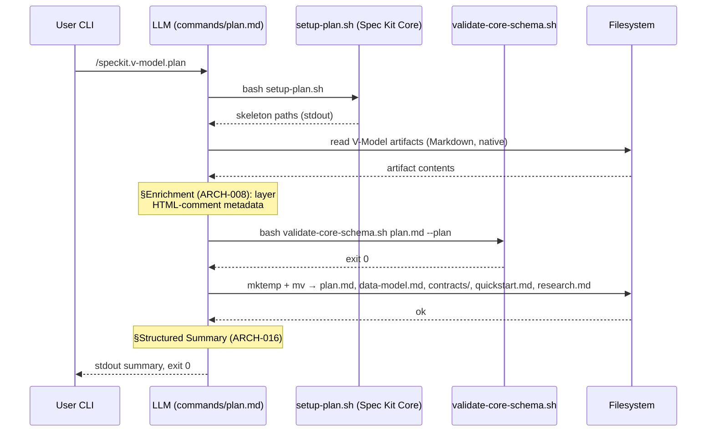
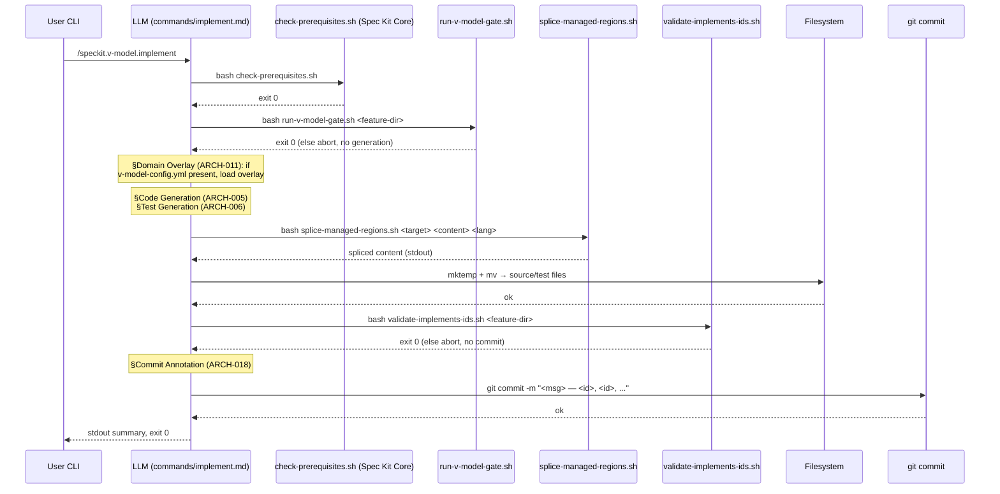
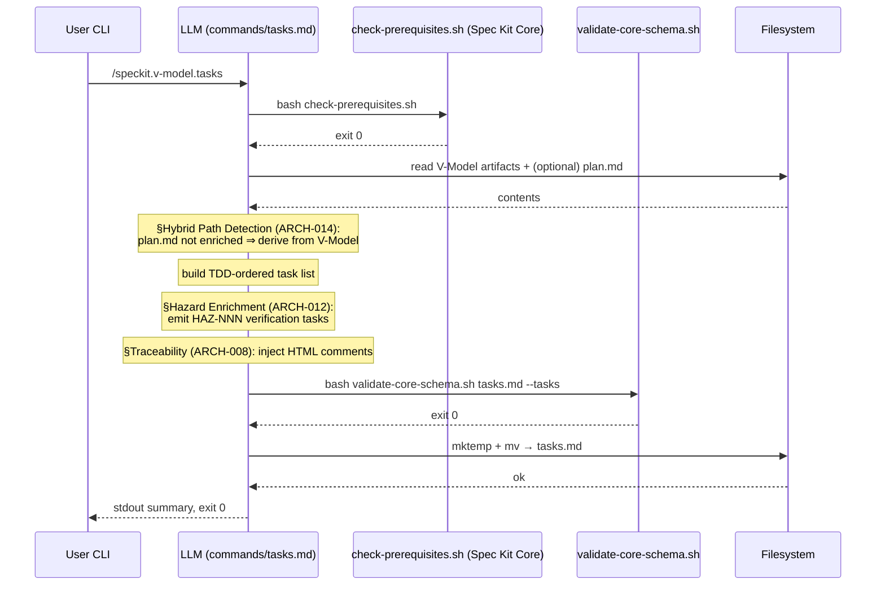

# Architecture Design: Bridge Commands

**Feature Branch**: `feature/007-bridge-commands`
**Created**: 2026-04-26
**Status**: Draft
**Source**: `specs/007-bridge-commands/v-model/system-design.md`

## Overview

The bridge-commands architecture is built on the project's actual delivery
paradigm: **Markdown prompt files + POSIX shell scripts + Spec Kit Core
reuse**. There is no Python runtime, no in-process orchestrator, and no
language-level class hierarchy. Each `/speckit.v-model.<command>` is a
Markdown file under `commands/` that the LLM reads and follows; deterministic
checks (gates, schema validation, ID verification, region splicing) are
delegated to small POSIX shell scripts under `scripts/bash/`.

The runtime model is therefore:

- **LLM as orchestrator.** The Markdown prompt file (e.g.
  `commands/plan.md`) is the orchestrator contract. Pre-conditions,
  post-conditions, and expected output sections are encoded as natural-
  language instructions to the LLM. The LLM reads V-Model artifacts
  natively as Markdown — no runtime parser is shipped.
- **Spec Kit Core reuse.** All bootstrapping reuses the upstream scripts
  shipped in `github/spec-kit/scripts/bash/`:
  - `setup-plan.sh` — creates the canonical artifact skeleton for plan
    synthesis,
  - `check-prerequisites.sh` — confirms the feature directory contains
    the artifacts each command requires,
  - `common.sh` — shared helpers (path resolution, branch detection).
  These are invoked verbatim; this feature never re-implements them.
- **Existing project gate scripts.** The pre-implementation gate composes
  the already-shipped `scripts/bash/build-matrix.sh` plus the five
  `scripts/bash/validate-*-coverage.sh` scripts (requirement / system /
  architecture / module / hazard). The new `run-v-model-gate.sh` is a
  thin composer that exits non-zero on any inner failure; it adds no new
  gating logic (REQ-CN-002).
- **Single-shell, sequential execution.** Each command runs as one shell
  invocation. There is no concurrency primitive in the system. The
  long-standing concurrent-write concern (SYS-015) is recorded below as
  a paradigm-level deferred risk note (see §Concurrent-Write Safety —
  Deferred Risk) rather than as an active runtime component.
- **Atomic file writes.** When a script must write a file, it uses the
  3-line `mktemp` + `mv` pattern inline. There is no centralized
  filesystem-writer module; the pattern is a coding convention enforced
  by review.

**Sensitivity points:**

- The pinned spec-kit-core schema version (`v0.7.0`) — any drift in the
  upstream `plan-template.md` or `tasks-template.md` immediately breaks
  ARCH-013. Mitigation: the validator script uses `grep` against pinned
  required-section names; the pinned version is reported in the run
  summary.
- The HTML-comment grammar used for additive enrichment — small changes
  to the comment delimiter convention propagate to ARCH-008 and
  ARCH-013 simultaneously.

**Trade-off points:**

- LLM-as-orchestrator vs. coded orchestrator → trades CPU determinism
  for a thin, declarative surface that aligns with the surrounding
  spec-kit ecosystem (REQ-CN-002, REQ-CN-003).
- Sequential single-shell execution → trades performance efficiency
  (ISO 25010 §4.2.3) for **idempotency** (REQ-025) and
  **maintainability** (ISO 25010 §4.2.7).
- Reduced-enrichment fallback (ARCH-014) → trades enrichment
  completeness for **co-existence** with `speckit.*` outputs (ISO 25010
  §4.2.4); required by REQ-028 (Hybrid path).

No domain overlay is loaded for this feature (`v-model-config.yml` is
absent at the repository root); only the base IEEE 42010 / Kruchten 4+1
views are populated.

## ID Schema

- **Architecture Module**: `ARCH-NNN` — sequential identifier, never
  renumbered.
- **Parent System Components**: comma-separated `SYS-NNN` list per
  module (many-to-many). Coverage is computed against the active SYS
  set in `system-design.md`.
- **Cross-Cutting Tag**: `[CROSS-CUTTING]` for entries that implement
  no requirement-traceable capability of their own. When the entry is
  also a deferred risk note (carried for traceability only), the
  parent column also bears `[DEFERRED]` / `[DEFERRED RISK NOTE]`.
- **Classification**: one of `NEW-PROMPT-SECTION` (LLM prompt section
  in `commands/<name>.md`), `NEW-SHELL` (POSIX shell script under
  `scripts/bash/`), `REUSE-CORE` (delegates to a Spec Kit Core
  component, no new code), `DROP-recharacterized` (no functional
  contract; carried as a deferred risk note for traceability).

## Logical View — Component Breakdown (IEEE 42010 / Kruchten 4+1)

| ARCH ID | Name | Description | Parent System Components | Type | Classification |
|---------|------|-------------|--------------------------|------|----------------|
| ARCH-001 | Plan Synthesis Orchestrator | LLM section in `commands/plan.md` §Execution Flow that drives `/speckit.v-model.plan`: invokes `setup-plan.sh`, reads V-Model artifacts as Markdown, applies enrichment via ARCH-008, validates the assembled `plan.md` via ARCH-013, and emits the canonical artifact set per ARCH-002. Reports the run via ARCH-016. | SYS-001 | Prompt | NEW-PROMPT-SECTION |
| ARCH-002 | Canonical Artifact Emitter | LLM section in `commands/plan.md` §Output Artifacts that names every canonical spec-kit-core output (`plan.md`, `data-model.md`, `contracts/`, `quickstart.md`, `research.md`) and the inline 3-line `mktemp` + `mv` write pattern the LLM must use. | SYS-001 | Prompt | NEW-PROMPT-SECTION |
| ARCH-003 | Tasks Synthesis Orchestrator | LLM section in `commands/tasks.md` §Execution Flow that drives `/speckit.v-model.tasks`: reads V-Model artifacts plus any `plan.md` (V-Model-enriched or core-only), generates the TDD-ordered task list, applies hazard enrichment via ARCH-012, embeds traceability comments via ARCH-008, validates against the canonical schema via ARCH-013, and writes the result inline. | SYS-002 | Prompt | NEW-PROMPT-SECTION |
| ARCH-004 | Implementation Orchestrator | LLM section in `commands/implement.md` §Execution Flow that drives `/speckit.v-model.implement`: invokes `check-prerequisites.sh`, runs the gate via ARCH-007, dispatches code generation (ARCH-005) and test generation (ARCH-006), runs the hallucination guard via ARCH-009 before any commit, and produces commits annotated by ARCH-018. Aborts on any safety-net failure before the commit phase. | SYS-003 | Prompt | NEW-PROMPT-SECTION |
| ARCH-005 | Code Generator | LLM section in `commands/implement.md` §Code Generation + §Traceability Comments that instructs the LLM to emit source code into the path declared by each `MOD-NNN` Target Source File, splice it through ARCH-010, and stamp every generated region with a language-appropriate `Implements <ID>` comment. | SYS-003 | Prompt | NEW-PROMPT-SECTION |
| ARCH-006 | Test Generator | LLM section in `commands/implement.md` §Test Generation + §Test Levels that instructs the LLM to emit tests at all four V-Model levels (unit / integration / system / acceptance) into the project's existing test directories, sourced from the corresponding `unit-test.md`, `integration-test.md`, `system-test.md`, `acceptance-plan.md` artifacts. | SYS-003 | Prompt | NEW-PROMPT-SECTION |
| ARCH-007 | Pre-Implementation Gate | `scripts/bash/run-v-model-gate.sh <feature-dir>` (PLANNED; ~30 lines). Composes `build-matrix.sh` + `validate-requirement-coverage.sh` + `validate-system-coverage.sh` + `validate-architecture-coverage.sh` + `validate-module-coverage.sh` + `validate-hazard-coverage.sh`. Exits 0 only when every inner check exits 0; introduces no new gating logic. | SYS-004 | Shell | NEW-SHELL |
| ARCH-008 | Additive Enrichment Encoder | LLM section in `commands/plan.md` §Enrichment + `commands/tasks.md` §Traceability that instructs the LLM to layer V-Model traceability metadata onto canonical spec-kit-core artifacts as HTML comments and optional Markdown sections, never modifying canonical sections. | SYS-005 | Prompt | NEW-PROMPT-SECTION |
| ARCH-009 | Hallucination Guard | `scripts/bash/validate-implements-ids.sh <feature-dir>` (PLANNED; `grep`+`awk`, ~80 lines). Scans every `Implements <ID>` (or language-equivalent) comment in the generated source set, confirms each referenced ID exists in the V-Model artifact set, exits 0 only when none are unknown. | SYS-006 | Shell | NEW-SHELL |
| ARCH-010 | Source Region Splicer | `scripts/bash/splice-managed-regions.sh <target-file> <generated-content> <language>` (PLANNED; `awk`, ~85 lines). Demarcates and splices V-Model-managed regions inside generated source files using language-appropriate marker comments; aborts non-zero on overlapping markers with a diff report on stderr. The `mktemp`-into-same-directory + `mv` atomic-rename pattern used here is the in-force safeguard for SYS-015 (Concurrent Write Safety). | SYS-007, SYS-015 | Shell | NEW-SHELL |
| ARCH-011 | Domain Overlay Loader | LLM section in `commands/implement.md` §Domain Overlay that activates when `v-model-config.yml` is present at the repository root: reads the `domain:` value (e.g., `automotive`, `medical`, `aerospace`) and adjusts code-generation and test-generation prompts accordingly (additive overlay only — never overrides base instructions). When the file is absent, no overlay is loaded and base behavior applies. | SYS-008 | Prompt | NEW-PROMPT-SECTION |
| ARCH-012 | Hazard Task Emitter | LLM section in `commands/tasks.md` §Hazard Enrichment that activates when `hazard-analysis.md` is present: raises mitigation-task priority and emits dedicated verification tasks naming each `HAZ-NNN`. | SYS-009 | Prompt | NEW-PROMPT-SECTION |
| ARCH-013 | Schema Validator | `scripts/bash/validate-core-schema.sh <file> --plan&#124;--tasks` (PLANNED; `grep`, ~50 lines). Validates `plan.md` and `tasks.md` against spec-kit-core's canonical `plan-template.md` and `tasks-template.md` schemas pinned at v0.7.0. Exit 0 ⇔ every required section present in order. | SYS-010 | Shell | NEW-SHELL |
| ARCH-014 | Reduced-Enrichment Fallback | LLM section in `commands/tasks.md` §Hybrid Path Detection that instructs the LLM to detect upstream artifacts (e.g., a `plan.md` produced by `speckit.plan`) lacking V-Model enrichment metadata and fall back to populating downstream traceability from the V-Model artifact set directly. | SYS-010 | Prompt | NEW-PROMPT-SECTION |
| ARCH-015 | Hook Registrar | Three YAML entries in `extension.yml` (`before_implement` → `v-model.gate`, `after_implement` → `v-model.trace`, `after_specify` → `v-model.requirements`). Registration is performed by Spec Kit Core's `CommandRegistrar` in `src/specify_cli/extensions.py`; this feature ships no new registration code. | SYS-011 | Config | REUSE-CORE |
| ARCH-016 | Structured Summary Reporter | `§Structured Summary` section in each of `commands/plan.md`, `commands/tasks.md`, `commands/implement.md` that instructs the LLM to print a machine-readable stdout summary (inputs read / outputs produced / artifacts skipped / warnings / fatal errors) using the existing `v-model.test-results` / `v-model.audit-report` summary grammar. Always emitted, even on failure. | SYS-012 | Prompt | NEW-PROMPT-SECTION |
| ARCH-017 | Quality Compliance Harness | LLM section in `commands/implement.md` §Quality Compliance that instructs the LLM to invoke the existing four-stack test harnesses (BATS, Pester, structural eval, LLM eval) via `bash`, gate merge on 100% coverage, and run scope-guardrail and dogfood-discipline audits. (Inherits the deprecated SYS-013 traceability: this prompt section is the recharacterised functional intent of the original "Quality & Process Compliance Harness".) | SYS-003, SYS-013 | Prompt | NEW-PROMPT-SECTION |
| ARCH-018 | Commit Annotator | LLM section in `commands/implement.md` §Commit Annotation that instructs the LLM to suffix git commit messages with the comma-separated list of V-Model identifiers fulfilled by the change. Best-effort: warns on annotation failure, commit still proceeds. | SYS-014 | Prompt | NEW-PROMPT-SECTION |
| ARCH-019 | V-Model Artifact Reader (Deferred) | `[CROSS-CUTTING] [DEFERRED]` — the LLM reads V-Model Markdown artifacts natively; no runtime parser is shipped. Recorded for traceability only; no functional contract. | [CROSS-CUTTING] [DEFERRED] | Note | DROP-recharacterized |
| ARCH-020 | Subprocess Runner (Deferred) | `[CROSS-CUTTING] [DEFERRED]` — shell scripts invoke other scripts via `bash` directly; the allowlist is the contents of `scripts/bash/`. No runtime subprocess module exists. Recorded for traceability only; no functional contract. | [CROSS-CUTTING] [DEFERRED] | Note | DROP-recharacterized |
| ARCH-021 | Filesystem Writer (Deferred) | `[CROSS-CUTTING] [DEFERRED]` — atomic writes are realised by the inline 3-line `mktemp` + `mv` pattern used directly in shell scripts. No runtime writer module exists. Recorded for traceability only; no functional contract. | [CROSS-CUTTING] [DEFERRED] | Note | DROP-recharacterized |

## Process View — Dynamic Behavior (Kruchten 4+1)

**Concurrency Model:** Single-shell sequential per command invocation.
The bridge commands run as one-shot LLM-driven processes; there is no
internal concurrency, no thread pool, no event loop. Shell scripts
invoked from the LLM (e.g., `run-v-model-gate.sh`) execute sequentially
in the order shown.

**Synchronization Points:** None at the process level. Each script that
writes a file uses the inline `mktemp` + `mv` pattern. The
concurrent-write concern (SYS-015) is documented below as a paradigm-level
deferred risk note (see §Concurrent-Write Safety — Deferred Risk);
concurrent runs against the same feature directory are not supported.

**Execution-order constraints:** Hard ordering between (a) gate before
generation (ARCH-007 strictly precedes ARCH-005 / ARCH-006), (b)
generation before verification (ARCH-009 strictly precedes ARCH-018),
and (c) verification before commit (the `git commit` step in ARCH-018
is gated on ARCH-009 exiting 0).

### Interaction: Plan Synthesis (`/speckit.v-model.plan`)

### Interaction: Implementation Pipeline (`/speckit.v-model.implement`)

> **Fail-closed exits not shown above for brevity:** any non-zero exit
> from `run-v-model-gate.sh` (ARCH-007), `splice-managed-regions.sh`
> (ARCH-010), or `validate-implements-ids.sh` (ARCH-009) terminates
> the LLM-orchestrated flow with non-zero before the next downstream
> step. No partial commit is ever produced.

### Interaction: Hazard-Aware Tasks Synthesis (`/speckit.v-model.tasks`)

## Interface View — Contracts (Kruchten 4+1)

> Three contract shapes are used in this feature:
>
> - **Shell** — `scripts/bash/<name>.sh <args>` → exit 0 on success,
>   non-zero on failure; stdout is a documented schema; stderr carries
>   diagnostic text.
> - **Prompt** — a named section in `commands/<name>.md`. The contract
>   is encoded as preconditions / postconditions / expected sub-sections
>   the LLM must produce, plus the error path it must follow.
> - **REUSE-CORE** — a YAML configuration entry plus a citation of the
>   Spec Kit Core component that performs the work.
> - **DROP-recharacterized** — a one-line deferred-risk note; no
>   functional contract.

### ARCH-001: Plan Synthesis Orchestrator (Prompt)

| Field | Value |
|-------|-------|
| Realised By | `commands/plan.md` §Execution Flow |
| Preconditions | `feature_dir` contains `requirements.md`; Spec Kit Core's `setup-plan.sh` is on `PATH` |
| Postconditions | Canonical artifact set written to `feature_dir/`; structured summary printed; exit 0 (else exit 1 with summary still emitted) |
| Expected sections in `commands/plan.md` | §Execution Flow, §Output Artifacts, §Enrichment, §Structured Summary |
| Error path | Any failure (missing input, validator non-zero, write failure) ⇒ LLM must abort, emit §Structured Summary with `fatal_errors[]` populated, exit 1 |

### ARCH-002: Canonical Artifact Emitter (Prompt)

| Field | Value |
|-------|-------|
| Realised By | `commands/plan.md` §Output Artifacts |
| Preconditions | In-memory canonical content for each emitted artifact has been validated by ARCH-013 |
| Postconditions | Each of `plan.md`, `data-model.md`, `contracts/<name>.md`, `quickstart.md`, `research.md` written via inline `mktemp` + `mv`; absent inputs ⇒ artifact skipped (logged in §Structured Summary) |
| Expected sections in `commands/plan.md` | §Output Artifacts (file list + per-file required-sections + write pattern) |
| Error path | Write failure ⇒ propagate, emit `fatal_errors[]`, exit 1; no partial overwrite (atomic move semantics) |

### ARCH-003: Tasks Synthesis Orchestrator (Prompt)

| Field | Value |
|-------|-------|
| Realised By | `commands/tasks.md` §Execution Flow |
| Preconditions | `feature_dir` contains `requirements.md`; `plan.md` may be absent, V-Model-enriched, or speckit-only |
| Postconditions | `feature_dir/tasks.md` written; structured summary printed; exit 0 (else exit 1 with summary still emitted) |
| Expected sections in `commands/tasks.md` | §Execution Flow, §Hybrid Path Detection, §Hazard Enrichment, §Traceability, §Structured Summary |
| Error path | ARCH-013 non-zero ⇒ abort before write; ARCH-014 cannot parse upstream ⇒ abort fail-closed |

### ARCH-004: Implementation Orchestrator (Prompt)

| Field | Value |
|-------|-------|
| Realised By | `commands/implement.md` §Execution Flow |
| Preconditions | `feature_dir` contains `requirements.md`, `module-design.md`, all four V-Model test plans; gate (ARCH-007) exits 0 |
| Postconditions | Source + test files written; ARCH-009 exits 0; commit produced via ARCH-018 |
| Expected sections in `commands/implement.md` | §Execution Flow, §Code Generation, §Traceability Comments, §Test Generation, §Test Levels, §Domain Overlay, §Quality Compliance, §Commit Annotation, §Structured Summary |
| Error path | Any of {gate, splicer, hallucination guard} non-zero ⇒ abort before commit; emit `fatal_errors[]`, exit 1 |

### ARCH-005: Code Generator (Prompt)

| Field | Value |
|-------|-------|
| Realised By | `commands/implement.md` §Code Generation + §Traceability Comments |
| Preconditions | Each `MOD-NNN` row in `module-design.md` declares a Target Source File and a target language |
| Postconditions | Generated content per `MOD-NNN` is spliced through ARCH-010 and stamped with at least one language-appropriate `Implements <ID>` comment per emitted region |
| Expected sections in `commands/implement.md` | §Code Generation (per-MOD generation rules), §Traceability Comments (comment syntax per language) |
| Error path | ARCH-010 non-zero (overlapping markers) ⇒ abort before write |

### ARCH-006: Test Generator (Prompt)

| Field | Value |
|-------|-------|
| Realised By | `commands/implement.md` §Test Generation + §Test Levels |
| Preconditions | `unit-test.md`, `integration-test.md`, `system-test.md`, `acceptance-plan.md` are present |
| Postconditions | Tests emitted at all four V-Model levels into existing test directories; each test references the source `UTP/ITP/STP/ATP` ID |
| Expected sections in `commands/implement.md` | §Test Generation (per-level rules), §Test Levels (mapping artifact → directory) |
| Error path | Any test-plan artifact fails to parse for the LLM ⇒ abort fail-closed |

### ARCH-007: Pre-Implementation Gate (Shell)

| Field | Value |
|-------|-------|
| Realised By | `scripts/bash/run-v-model-gate.sh` (PLANNED) |
| CLI invocation | `bash scripts/bash/run-v-model-gate.sh <feature-dir>` |
| Input args | `<feature-dir>` (required, absolute or repo-relative path) |
| Output — exit code | 0 ⇔ every inner script exits 0; 1 otherwise |
| Output — stdout schema | Concatenated stdout of `build-matrix.sh` + each `validate-*-coverage.sh`; final line `GATE: PASS` or `GATE: FAIL` |
| Side-effects | None (read-only against `<feature-dir>`) |
| Error paths | Inner script non-zero ⇒ propagate, exit 1; missing inner script ⇒ exit 1 with diagnostic on stderr |

### ARCH-008: Additive Enrichment Encoder (Prompt)

| Field | Value |
|-------|-------|
| Realised By | `commands/plan.md` §Enrichment + `commands/tasks.md` §Traceability |
| Preconditions | The canonical document being enriched has already been validated by ARCH-013 |
| Postconditions | Enrichment confined to HTML comments and optional Markdown sections; canonical sections untouched; document still validates by ARCH-013 |
| Expected sections | §Enrichment (HTML-comment grammar) in `commands/plan.md`; §Traceability (comment placement rules) in `commands/tasks.md` |
| Error path | Canonical doc fails post-enrichment validation ⇒ abort, do not write |

### ARCH-009: Hallucination Guard (Shell)

| Field | Value |
|-------|-------|
| Realised By | `scripts/bash/validate-implements-ids.sh` (PLANNED, `grep`+`awk`, ~80 lines) |
| CLI invocation | `bash scripts/bash/validate-implements-ids.sh <feature-dir>` |
| Input args | `<feature-dir>` (required); script discovers generated source files and the V-Model artifact set itself |
| Output — exit code | 0 ⇔ every `Implements <ID>` comment references an ID present in the V-Model artifact set; 1 otherwise |
| Output — stdout schema | One line per offending occurrence: `<file>:<line>: unknown id <id>`; final line `GUARD: PASS` or `GUARD: FAIL` |
| Side-effects | None (read-only) |
| Error paths | Unknown ID found ⇒ exit 1; missing feature dir ⇒ exit 1 |

### ARCH-010: Source Region Splicer (Shell)

| Field | Value |
|-------|-------|
| Realised By | `scripts/bash/splice-managed-regions.sh` (PLANNED, `awk`, ~85 lines) |
| CLI invocation | `bash scripts/bash/splice-managed-regions.sh <target-file> <generated-content> <language>` |
| Input args | `<target-file>` (path, may not exist), `<generated-content>` (path to file containing generated region), `<language>` (one of `bash`, `pwsh`, `python`, `js`, `ts`, …) |
| Output — exit code | 0 on clean splice; 1 on overlapping markers |
| Output — stdout schema | Final spliced content written to stdout; on conflict, no stdout, diff report on stderr |
| Side-effects | None — caller is responsible for atomic write of stdout |
| Error paths | Overlapping V-Model markers ⇒ exit 1 with diff report on stderr |

### ARCH-011: Domain Overlay Loader (Prompt)

| Field | Value |
|-------|-------|
| Realised By | `commands/implement.md` §Domain Overlay |
| Preconditions | None — applies if `v-model-config.yml` is present at repository root, otherwise no overlay |
| Postconditions | Code- and test-generation prompts are augmented (additively only) per the `domain:` value (e.g., `automotive`, `medical`, `aerospace`); base instructions are never overridden |
| Expected sections in `commands/implement.md` | §Domain Overlay (file-presence check + per-domain prompt augmentation rules) |
| Side-effects | None at this contract's level — augmented prompts feed ARCH-005 / ARCH-006 |
| Error path | `v-model-config.yml` present but malformed (unparseable YAML, missing `domain:` key) ⇒ abort fail-closed with non-zero exit |

### ARCH-012: Hazard Task Emitter (Prompt)

| Field | Value |
|-------|-------|
| Realised By | `commands/tasks.md` §Hazard Enrichment |
| Preconditions | `hazard-analysis.md` is present in `feature_dir` |
| Postconditions | TDD task list contains one verification task per `HAZ-NNN`; mitigation tasks have raised priority |
| Expected sections in `commands/tasks.md` | §Hazard Enrichment (priority-raise rule + verification-task template) |
| Error path | `hazard-analysis.md` malformed ⇒ abort fail-closed |

### ARCH-013: Schema Validator (Shell)

| Field | Value |
|-------|-------|
| Realised By | `scripts/bash/validate-core-schema.sh` (PLANNED, `grep`, ~50 lines) |
| CLI invocation | `bash scripts/bash/validate-core-schema.sh <file> --plan\|--tasks` |
| Input args | `<file>` (path to `plan.md` or `tasks.md`); `--plan` or `--tasks` selects the pinned schema |
| Output — exit code | 0 ⇔ every required section of the v0.7.0 pinned schema is present in canonical order; 1 otherwise |
| Output — stdout schema | One line per missing/out-of-order section: `<section>: MISSING` / `<section>: OUT_OF_ORDER`; final line `SCHEMA: PASS` (with `pinned_version=v0.7.0`) or `SCHEMA: FAIL` |
| Side-effects | None (read-only) |
| Error paths | Required section missing or out of order ⇒ exit 1; never mutates `<file>` |

### ARCH-014: Reduced-Enrichment Fallback (Prompt)

| Field | Value |
|-------|-------|
| Realised By | `commands/tasks.md` §Hybrid Path Detection |
| Preconditions | A `plan.md` exists at `feature_dir/plan.md` |
| Postconditions | If V-Model enrichment markers absent ⇒ LLM derives traceability from V-Model artifacts directly (Hybrid path, REQ-028); if present ⇒ LLM consumes them as-is |
| Expected sections in `commands/tasks.md` | §Hybrid Path Detection (decision rule + fallback procedure) |
| Error path | Upstream `plan.md` cannot be parsed at all ⇒ abort fail-closed |

### ARCH-015: Hook Registrar (REUSE-CORE)

| Field | Value |
|-------|-------|
| Realised By | YAML entries in `extension.yml`; registration handled by `CommandRegistrar` in Spec Kit Core's `src/specify_cli/extensions.py` |
| YAML entries | `before_implement: v-model.gate`, `after_implement: v-model.trace`, `after_specify: v-model.requirements` |
| Preconditions | `extension.yml` exists at the project root; Spec Kit Core present (provides `CommandRegistrar`) |
| Postconditions | The three hooks are registered idempotently on next CLI invocation; re-runs do not duplicate entries |
| Side-effects | None at this feature's level — registration is performed by core |
| Error path | Schema-invalid YAML ⇒ core's `CommandRegistrar` rejects; this feature contributes only the YAML payload |

### ARCH-016: Structured Summary Reporter (Prompt)

| Field | Value |
|-------|-------|
| Realised By | §Structured Summary section in each of `commands/plan.md`, `commands/tasks.md`, `commands/implement.md` |
| Preconditions | None — emitted on every code path, including failure |
| Postconditions | stdout contains `inputs_read[]`, `outputs_produced[]`, `artifacts_skipped[]`, `warnings[]`, `fatal_errors[]` per the `v-model.test-results` / `v-model.audit-report` summary grammar |
| Expected sections | §Structured Summary in each command file (identical grammar across the three) |
| Error path | n/a — the summary itself is the error reporting surface |

### ARCH-017: Quality Compliance Harness (Prompt)

| Field | Value |
|-------|-------|
| Realised By | `commands/implement.md` §Quality Compliance |
| Preconditions | The four-stack harnesses (BATS, Pester, structural eval, LLM eval) are installed and on `PATH` |
| Postconditions | Each harness reports 100% on its scope; scope-guardrail audits reject orchestrator/sandbox additions; dogfood-discipline checks pass |
| Expected sections in `commands/implement.md` | §Quality Compliance (per-harness invocation, merge-gate rule, audit checklists) |
| Error path | Any harness <100% ⇒ merge-gate `block`; any audit fails ⇒ exit 1 |

### ARCH-018: Commit Annotator (Prompt)

| Field | Value |
|-------|-------|
| Realised By | `commands/implement.md` §Commit Annotation |
| Preconditions | ARCH-009 has exited 0; the LLM has the list of V-Model IDs fulfilled by the change |
| Postconditions | `git commit -m "<message> — <id>, <id>, …"`; empty ID list ⇒ commit proceeds with original message and a warning entry in §Structured Summary |
| Expected sections in `commands/implement.md` | §Commit Annotation (suffix grammar + best-effort policy) |
| Error path | `git commit` itself fails ⇒ propagate exit 1; annotation construction failure is a warning, not fatal |

### ARCH-019: V-Model Artifact Reader (Deferred)

> **`[CROSS-CUTTING] [DEFERRED]`** — The LLM reads V-Model artifacts as
> Markdown natively; no runtime parser is shipped. Recorded for
> traceability only; no functional contract.

### ARCH-020: Subprocess Runner (Deferred)

> **`[CROSS-CUTTING] [DEFERRED]`** — Shell scripts invoke other shell
> scripts via `bash` directly; the implicit allowlist is the contents of
> `scripts/bash/`. No runtime subprocess module exists. Recorded for
> traceability only; no functional contract.

### ARCH-021: Filesystem Writer (Deferred)

> **`[CROSS-CUTTING] [DEFERRED]`** — Atomic writes are realised by the
> inline 3-line `mktemp` + `mv` pattern used directly inside shell
> scripts. No runtime writer module exists. Recorded for traceability
> only; no functional contract.

## Data Flow View — Data Transformation Chains (Kruchten 4+1)

### Data Flow: Requirements → tasks.md (TDD-ordered, hazard-enriched)

| Stage | Actor | Input Format | Transformation | Output Format |
|-------|-------|--------------|----------------|---------------|
| 1 | LLM (commands/tasks.md) | `requirements.md` + `module-design.md` + (optional) `hazard-analysis.md` (Markdown) | Read natively | in-context artifact set |
| 2 | LLM (§Hybrid Path Detection, ARCH-014) | optional upstream `plan.md` | Detect V-Model enrichment presence | enrichment decision (`enriched: true|false`) |
| 3 | LLM (ARCH-003) | in-context artifact set + decision | Build TDD-ordered task list (unit-tests → impl → integration-tests → system-tests → acceptance-tests) | in-context task list |
| 4 | LLM (§Hazard Enrichment, ARCH-012) | task list + hazard-analysis | Raise mitigation-task priority; emit `HAZ-NNN` verification tasks | enriched task list |
| 5 | LLM (§Traceability, ARCH-008) | enriched task list | Inject `<!-- traces-to: MOD → ARCH → SYS → REQ -->` HTML comments | canonical Markdown w/ enrichment |
| 6 | `validate-core-schema.sh --tasks` (ARCH-013) | canonical Markdown (written to a tmp path) | Grep against pinned v0.7.0 required sections | exit 0 / 1 + section-status report |
| 7 | LLM (inline `mktemp` + `mv`) | validated canonical Markdown | Atomic write | `tasks.md` on disk |

### Data Flow: module-design.md MOD entries → source code files

| Stage | Actor | Input Format | Transformation | Output Format |
|-------|-------|--------------|----------------|---------------|
| 1 | LLM (commands/implement.md) | `module-design.md` | Read MOD table (incl. Target Source File field) natively | in-context module list |
| 2 | `run-v-model-gate.sh` (ARCH-007) | feature directory | Compose `build-matrix.sh` + 5× `validate-*-coverage.sh` | exit 0 / 1 + per-matrix gap report |
| 3 | LLM (§Code Generation, ARCH-005) | module list | Generate code per MOD; render `Implements <ID>` comments | per-MOD `(path, content)` candidates |
| 4 | `splice-managed-regions.sh` (ARCH-010) | each `(path, content)` + existing target file (if any) | Splice into V-Model-managed regions; preserve user content | spliced content on stdout |
| 5 | `validate-implements-ids.sh` (ARCH-009) | feature directory after candidates staged | Grep+awk every `Implements <ID>` against the V-Model ID universe | exit 0 / 1 + offending-occurrence list |
| 6 | LLM (inline `mktemp` + `mv`) | spliced content (gate-passed) | Atomic write | source files on disk |
| 7 | LLM (§Commit Annotation, ARCH-018) | base commit message + ID list | Append ID suffix; invoke `git commit` | annotated commit in Git history |

### Error and Abort Paths

| Condition | Effect |
|-----------|--------|
| ARCH-013 exits non-zero at Stage 6 (tasks flow) | LLM aborts; Stage 7 NOT executed; no `tasks.md` written. |
| ARCH-009 exits non-zero at Stage 5 (source flow) | LLM aborts; Stages 6–7 NOT executed; no source files written; no commit produced. |
| Inline `mv` fails at Stage 6 (source flow) | LLM aborts; no commit at Stage 7; previous file untouched (rename atomicity). |
| ARCH-007 exits non-zero at Stage 2 (source flow) | LLM aborts before Stage 3; no generation proceeds. |
| ARCH-014 detects unparseable upstream `plan.md` (tasks flow Stage 2) | LLM aborts fail-closed; Stages 3–7 NOT executed; no `tasks.md` written. |

---

## Architecture Evaluation (ISO/IEC 42030:2019 / ISO/IEC 25010:2023)

### Quality Attribute Justification

| Architecture Decision | Quality Characteristic (ISO 25010) | Trade-off Accepted |
|----------------------|------------------------------------|--------------------|
| LLM-as-orchestrator via `commands/*.md` rather than a coded entry point | Maintainability §4.2.7 ↑ (declarative, versioned with the spec); Compatibility §4.2.4 ↑ (aligns with surrounding spec-kit ecosystem) | Loses static-typing guarantees of a coded orchestrator; mitigated by deterministic shell scripts at every safety-critical step. |
| Spec Kit Core reuse (`setup-plan.sh`, `check-prerequisites.sh`, `common.sh`) instead of re-implementing bootstrapping | Maintainability §4.2.7 ↑ (zero duplication); Reliability §4.2.2 ↑ (battle-tested code path) | Couples this feature to upstream changes in those scripts; mitigated by the v0.7.0 pin. |
| Composing existing project gate scripts (ARCH-007 = `run-v-model-gate.sh` over `build-matrix.sh` + 5 validators) instead of new gate logic | Maintainability §4.2.7 ↑ (REQ-CN-002 satisfied by construction); no drift between CI and command | Performance §4.2.3 ↓ (one shell process per inner script). Acceptable: gate runtime is dominated by validator work. |
| Single-shell sequential runtime (no thread pool, no event loop) | Reliability §4.2.2 ↑ (deterministic execution); Maintainability §4.2.7 ↑ (no concurrency bugs); supports REQ-025 idempotency | Performance Efficiency §4.2.3 ↓ (cannot parallelise within a run). Acceptable: bridge-command runtime is I/O- and LLM-bound. Concurrent-write concern (SYS-015) recorded as a paradigm-level deferred risk note (see §Concurrent-Write Safety — Deferred Risk). |
| Splitting SYS-010 into ARCH-013 (strict validator script) + ARCH-014 (LLM fallback prompt section) | Compatibility §4.2.4 ↑ (Hybrid path enabled by REQ-028); Testability ↑ (each path independently exercisable) | Adds one decision point per upstream-artifact ingest; documented in `commands/tasks.md` §Hybrid Path Detection. |
| Inline `mktemp` + `mv` atomic-write pattern (vs. a centralized writer module) | Reliability §4.2.2 ↑ (failed runs leave filesystem consistent; supports REQ-022); Simplicity ↑ (no shared module to evolve) | Pattern is a coding convention enforced by review; mitigated by being a 3-line cliché in every shell script. |
| Hallucination Guard (ARCH-009) as a mandatory pre-commit shell check | Functional Suitability (Correctness) §4.2.1 ↑ (REQ-NF-002 satisfied by construction); Reliability §4.2.2 ↑ (fail-closed) | Adds one full-tree `grep` per run; small constant against generation cost. |

### Fitness-for-Purpose Scenario Analysis (ISO/IEC 42030:2019 §6)

| Quality Scenario | Architecture Response (ARCH-NNN) | Risk / Sensitivity Point | Verdict |
|-----------------|-----------------------------------|--------------------------|---------|
| Reliability — A run with an incomplete traceability matrix MUST NOT produce code | ARCH-007 (`run-v-model-gate.sh`) exits non-zero; LLM (ARCH-004) aborts before ARCH-005 | Single point of failure: any false negative in `build-matrix.sh` defeats the gate | ✅ Addressed |
| Reliability — A run that would emit a hallucinated `Implements <ID>` MUST NOT commit | ARCH-009 (`validate-implements-ids.sh`) verifies every comment against the V-Model artifact set; LLM (ARCH-004) aborts before ARCH-018 | Sensitive to artifact-set parsing bugs that drop a valid ID (would convert valid → false-positive hallucination) | ✅ Addressed |
| Compatibility — Outputs MUST parse without warning by unmodified spec-kit-core v0.7.0 | ARCH-008 enrichment confined to HTML comments + optional sections; ARCH-013 grep-validates strictly against the pinned schema | Sensitive to upstream `plan-template.md` / `tasks-template.md` drift across spec-kit releases | ✅ Addressed (within v0.7.0) |
| Compatibility — Hybrid path: a `plan.md` from `speckit.plan` MUST be valid input to `v-model.tasks` | ARCH-014 detects `enriched: false` and instructs the LLM to derive traceability from V-Model artifacts | Reduced-enrichment outputs may have weaker traceability comments — trade-off documented in REQ-028 | ✅ Addressed |
| Maintainability — A future spec-kit-core schema update MUST be absorbable without changing every command | ARCH-013 isolates the schema contract; only one shell script needs revision | Sensitive to schema-version pinning hygiene; mitigated by `pinned_version=v0.7.0` reported in every run summary | ✅ Addressed |
| Performance Efficiency — A repeat run on identical inputs SHOULD complete in similar time and produce ≥95% structurally identical output | Sequential single-shell runtime + idempotent ARCH-005/006 + atomic inline writes | No quantitative wall-clock budget specified by requirements; idempotency is the only Performance proxy | ✅ Addressed (qualitatively); no `[ARCH CONCERN]` raised |
| Security — No sensitive data flows through bridge-command boundaries | Repository-source-only data; no credentials, no secrets in any input or output | If a future requirement introduces credentialed data, the inline write pattern would need an encryption-at-rest path | ✅ Addressed (for current requirement set) |
| Safety — Hazards in upstream artifacts propagate into the task list as raised-priority and verification tasks | ARCH-012 (LLM §Hazard Enrichment) emits `HAZ-NNN` verification tasks; raises mitigation-task priority | Sensitive to LLM correctly recognising `hazard-analysis.md` shape | ✅ Addressed |

**`[ARCH CONCERN]` flags raised:** none.

### Sensitivity and Trade-off Points (Summary)

- **Sensitivity:** spec-kit-core schema pinning (any drift breaks
  ARCH-013); HTML-comment grammar (any change touches ARCH-008/013
  simultaneously).
- **Trade-off:** LLM-as-orchestrator vs. coded orchestrator (chose
  declarative for ecosystem alignment); single-shell determinism vs.
  throughput (chose determinism); composing existing scripts vs.
  in-process gate logic (chose composition for REQ-CN-002).

### Concurrent-Write Safety — Deferred Risk

> **`[DEFERRED RISK NOTE]` — covers SYS-015.** The bridge commands run
> as one-shot, single-shell, sequential invocations; there is no
> concurrency primitive in the architecture. Concurrent runs against
> the same `feature_dir` are explicitly **not supported** by this
> release. This note exists for `SYS-015` traceability only; it carries
> no functional contract and is not assigned an `ARCH-NNN`. Should a
> future release introduce parallel agent execution, a concrete
> write-coordination component will need to be added to this design.

---

## Coverage Summary

| Metric | Count |
|--------|-------|
| Total Architecture Modules (ARCH) | 21 (18 active + 3 DROP-recharacterized, 0 deprecated, 0 suspect) |
| NEW-PROMPT-SECTION (LLM prompt sections in `commands/*.md`) | 13 (ARCH-001, 002, 003, 004, 005, 006, 008, 011, 012, 014, 016, 017, 018) |
| NEW-SHELL (POSIX shell scripts under `scripts/bash/`) | 4 (ARCH-007, 009, 010, 013) |
| REUSE-CORE (delegates to Spec Kit Core; no new code) | 1 (ARCH-015) |
| DROP-recharacterized (deferred risk notes; no functional contract) | 3 (ARCH-019, 020, 021) |
| Total Parent System Components Covered | 14 / 14 (100%) [^sys013-deprecation] — SYS-015 (Concurrent-Write Safety) is covered as a paradigm-level deferred risk note (see §Concurrent-Write Safety — Deferred Risk), not by a runtime ARCH |
| Mermaid Diagrams | 3 (Plan Synthesis, Implementation Pipeline, Hazard-Aware Tasks) |
| Interface Contracts Defined | 18 / 18 (100%) for active modules; 3 deferred risk notes carry no contract |
| **Forward Coverage (SYS→ARCH)** | **14 / 14 (100%)** — all active SYS components have an owning ARCH or paradigm-level deferred-risk note |

[^sys013-deprecation]: SYS-013 deprecated; superseded by the Quality Compliance prompt section under ARCH-017 (parent SYS-003).

## Derived Modules

None — every active module traces to one or more `SYS-NNN`. Three
deferred-risk modules (ARCH-019, ARCH-020, ARCH-021) carry explicit
`[DEFERRED]` rationale; none qualify as derived.
