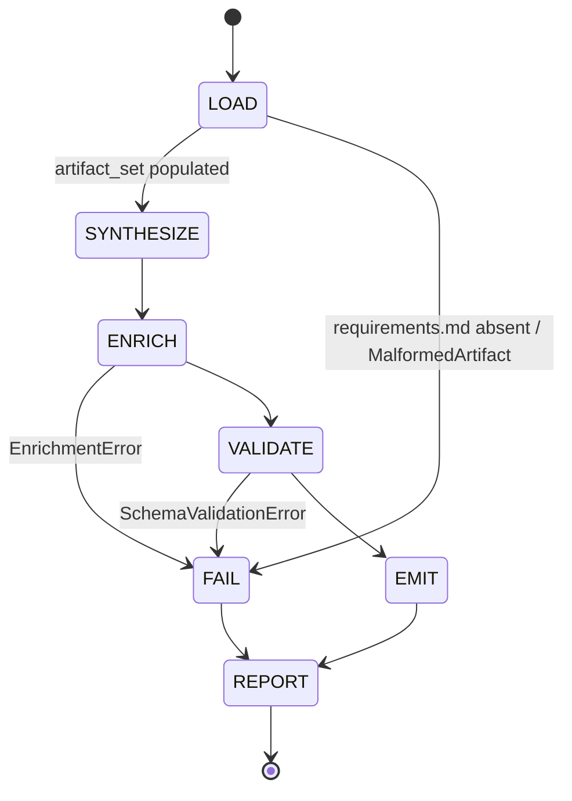
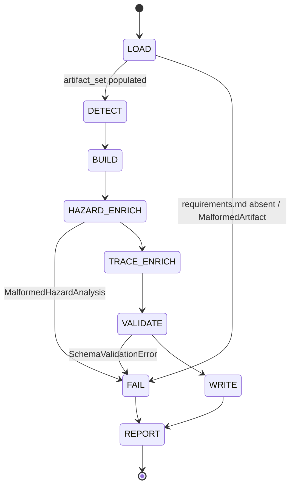
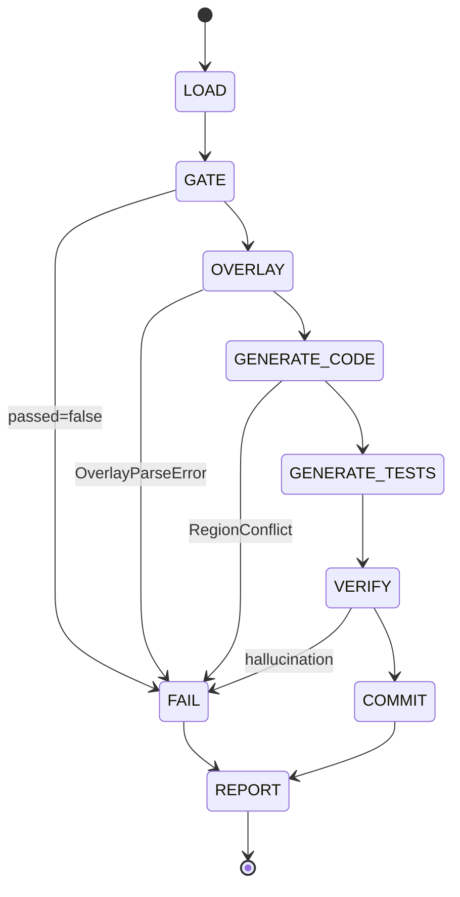

# Module Design: Bridge Commands

**Feature Branch**: `feature/007-bridge-commands`
**Created**: 2026-04-26
**Status**: Draft
**Source**: `specs/007-bridge-commands/v-model/architecture-design.md`

## Overview

This document decomposes the 21 architecture modules from
`architecture-design.md` into 27 low-level module designs (`MOD-001` …
`MOD-027`). Each `MOD-NNN` is a single Python function (or, for the three
orchestrators, a `run()` entry point with phase-driven internal state)
detailed enough that implementation is a translation exercise — no further
design decisions are required.

Most ARCHs decompose 1 : 1 to a single MOD; the four ARCHs whose contracts
expose more than one callable surface decompose 1 : N — ARCH-005
(dispatcher + per-module renderer), ARCH-006 (dispatcher + per-level
renderer), ARCH-008 (plan enrichment + tasks enrichment), ARCH-013 (plan
schema + tasks schema), and ARCH-019 (artifact loader + ID-set extractor).
This decomposition matches each entry in the Architecture Interface View
to one MOD function signature, satisfying ISO/IEC/IEEE 12207:2017 §8.4.4.3
(formal interface definition per module).

The runtime model remains **single-threaded sequential per command
invocation**, so no MOD has inter-invocation state. The three
orchestrators (MOD-001, MOD-003, MOD-005) carry within-run phase state
expressive enough to warrant a state diagram (Step 5.2); the other 24
MODs are stateless pure functions and use the bypass string.

No domain overlay is loaded for this feature (`v-model-config.yml` absent
at the repository root); only base IEEE 1016:2009 / ISO/IEC/IEEE
12207:2017 §8.4.4 sections are populated. The MISRA / Memory Management /
Single Entry-Exit safety-critical sections are omitted entirely.

## ID Schema

- **Module Design**: `MOD-NNN` — sequential identifier (3-digit zero-padded), independent of ARCH numbering.
- **Parent Architecture Modules**: Comma-separated `ARCH-NNN` list per MOD (many-to-many; authoritative for traceability — coverage validators use this field, not ID parsing).
- **Target Source File(s)**: Comma-separated repository-relative paths.
- Example: `MOD-007` with Parent Architecture Modules `ARCH-005` — module is the per-module renderer of the Code Generator.

## Module Map (Summary Index)

| MOD | Function | Parent ARCH | Target Source File |
|-----|----------|-------------|--------------------|
| MOD-001 | `plan_orchestrator.run` | ARCH-001 | `src/v_model_extension/commands/plan.py` |
| MOD-002 | `emit_canonical_outputs` | ARCH-002 | `src/v_model_extension/emit/canonical.py` |
| MOD-003 | `tasks_orchestrator.run` | ARCH-003 | `src/v_model_extension/commands/tasks.py` |
| MOD-004 | `build_tdd_task_list` | ARCH-003 | `src/v_model_extension/tasks/sequencer.py` |
| MOD-005 | `implement_orchestrator.run` | ARCH-004 | `src/v_model_extension/commands/implement.py` |
| MOD-006 | `generate_code` (dispatcher) | ARCH-005 | `src/v_model_extension/codegen/generator.py` |
| MOD-007 | `render_module_source` | ARCH-005 | `src/v_model_extension/codegen/renderer.py` |
| MOD-008 | `generate_tests` (dispatcher) | ARCH-006 | `src/v_model_extension/testgen/generator.py` |
| MOD-009 | `render_test_file_for_level` | ARCH-006 | `src/v_model_extension/testgen/renderer.py` |
| MOD-010 | `evaluate_gate` | ARCH-007 | `src/v_model_extension/gate/coordinator.py` |
| MOD-011 | `embed_enrichment` | ARCH-008 | `src/v_model_extension/enrich/encoder.py` |
| MOD-012 | `embed_traceability_comments` | ARCH-008 | `src/v_model_extension/enrich/encoder.py` |
| MOD-013 | `verify_ids` | ARCH-009 | `src/v_model_extension/guard/hallucination.py` |
| MOD-014 | `splice_managed_regions` | ARCH-010 | `src/v_model_extension/codegen/splicer.py` |
| MOD-015 | `apply_overlay` | ARCH-011 | `src/v_model_extension/overlay/loader.py` |
| MOD-016 | `enrich_with_hazards` | ARCH-012 | `src/v_model_extension/tasks/hazards.py` |
| MOD-017 | `validate_plan_schema` | ARCH-013 | `src/v_model_extension/schema/validator.py` |
| MOD-018 | `validate_tasks_schema` | ARCH-013 | `src/v_model_extension/schema/validator.py` |
| MOD-019 | `detect_enrichment` | ARCH-014 | `src/v_model_extension/schema/fallback.py` |
| MOD-020 | `register_hooks` | ARCH-015 | `src/v_model_extension/hooks/registrar.py` |
| MOD-021 | `emit_summary` | ARCH-016 | `src/v_model_extension/report/summary.py` |
| MOD-022 | `compute_coverage_report` | ARCH-017 | `src/v_model_extension/quality/harness.py` |
| MOD-023 | `annotate_commit` | ARCH-018 | `src/v_model_extension/git/annotator.py` |
| MOD-024 | `load_artifacts` | ARCH-019 [CC] | `src/v_model_extension/io/artifact_reader.py` |
| MOD-025 | `extract_id_set` | ARCH-019 [CC] | `src/v_model_extension/io/artifact_reader.py` |
| MOD-026 | `run_subprocess` | ARCH-020 [CC] | `src/v_model_extension/io/subprocess_runner.py` |
| MOD-027 | `atomic_write` | ARCH-021 [CC] | `src/v_model_extension/io/fs_writer.py` |

## Module Designs

### Module: MOD-001 (Plan Synthesis Orchestrator — `run`)

**Parent Architecture Modules**: ARCH-001
**Target Source File(s)**: `src/v_model_extension/commands/plan.py`
**Implements REQ:** REQ-001, REQ-002, REQ-003, REQ-004, REQ-005, REQ-006, REQ-008, REQ-026, REQ-027, REQ-NF-005, REQ-IF-001

#### Algorithmic / Logic View

```pseudocode
FUNCTION plan_orchestrator.run(feature_dir: Path, arguments: str = "") -> int:
    summary = RunResult()
    TRY:
        // Phase: LOAD
        artifact_set = MOD-024.load_artifacts(feature_dir)
        summary.inputs_read.append(artifact_set.populated_paths())
        IF artifact_set.requirements IS NULL:
            summary.fatal_errors.append("requirements.md required")
            MOD-021.emit_summary(summary)
            RETURN 1

        // Phase: SYNTHESIZE
        canonical = synthesize_plan_skeleton(artifact_set)
        metadata  = build_enrichment_metadata(artifact_set)

        // Phase: ENRICH
        enriched_plan = MOD-011.embed_enrichment(canonical, metadata)

        // Phase: VALIDATE
        result = MOD-017.validate_plan_schema(enriched_plan)
        IF NOT result.valid:
            summary.fatal_errors.append(format_schema_error(result))
            MOD-021.emit_summary(summary)
            RETURN 1

        // Phase: EMIT
        outputs = build_canonical_outputs(artifact_set, enriched_plan)
        written = MOD-002.emit_canonical_outputs(feature_dir, outputs)
        summary.outputs_produced = written
        summary.artifacts_skipped = outputs.absent_field_names()

        // Phase: REPORT
        MOD-021.emit_summary(summary)
        RETURN 0
    EXCEPT EnrichmentError AS e:
        summary.fatal_errors.append(str(e))
        MOD-021.emit_summary(summary)
        RETURN 1
    EXCEPT MalformedArtifact AS e:
        summary.fatal_errors.append(f"{e.path}: {e.reason}")
        MOD-021.emit_summary(summary)
        RETURN 1
```

#### State Machine View



#### Internal Data Structures

| Name | Type | Size/Constraints | Initialization | Description |
|------|------|------------------|----------------|-------------|
| `summary` | `RunResult` | 5 string-list fields | empty | Accumulated for ARCH-016 |
| `artifact_set` | `ArtifactSet` | 10 nullable fields | from MOD-024 | Loaded V-Model artifacts |
| `metadata` | `EnrichmentMetadata` | dict | derived | Trace chains + optional sections |
| `outputs` | `CanonicalOutputs` | 5 fields (4 nullable) | derived | Per-field nullability drives selective emission |
| `written` | `list[Path]` | ≥ 1 entry | from MOD-002 | Audit trail |

#### Error Handling & Return Codes

| Error Condition | Error Code / Exception | Architecture Contract | Recovery |
|----------------|------------------------|-----------------------|----------|
| `requirements.md` absent | exit 1 + `summary.fatal_errors` | ARCH-001 contract: requires REQUIREMENTS to exist | None — fail-closed |
| `MalformedArtifact` from MOD-024 | exit 1 + summary | ARCH-019 → ARCH-001 | Log path + reason |
| `EnrichmentError` from MOD-011 | exit 1 + summary | ARCH-008 → ARCH-001 | Log; emit summary on failure path |
| `SchemaValidationError` (validate returns `valid: false`) | exit 1 + summary | ARCH-013 → ARCH-001 | Log section + line; do NOT call MOD-002 |

---

### Module: MOD-002 (`emit_canonical_outputs`)

**Parent Architecture Modules**: ARCH-002
**Target Source File(s)**: `src/v_model_extension/emit/canonical.py`
**Implements REQ:** REQ-001, REQ-008, REQ-026, REQ-IF-001

#### Algorithmic / Logic View

```pseudocode
FUNCTION emit_canonical_outputs(feature_dir: Path, outputs: CanonicalOutputs) -> list[Path]:
    written = []
    IF outputs.plan IS NOT NULL:
        path = feature_dir / "plan.md"
        MOD-027.atomic_write(path, outputs.plan)
        written.append(path)
    IF outputs.data_model IS NOT NULL:
        path = feature_dir / "data-model.md"
        MOD-027.atomic_write(path, outputs.data_model)
        written.append(path)
    FOR each contract IN outputs.contracts:
        path = feature_dir / "contracts" / contract.filename
        MOD-027.atomic_write(path, contract.content)
        written.append(path)
    IF outputs.quickstart IS NOT NULL:
        path = feature_dir / "quickstart.md"
        MOD-027.atomic_write(path, outputs.quickstart)
        written.append(path)
    IF outputs.research IS NOT NULL:
        path = feature_dir / "research.md"
        MOD-027.atomic_write(path, outputs.research)
        written.append(path)
    RETURN written
```

#### State Machine View

N/A — Stateless

#### Internal Data Structures

| Name | Type | Size/Constraints | Initialization | Description |
|------|------|------------------|----------------|-------------|
| `written` | `list[Path]` | 0 ≤ len ≤ 4 + len(contracts) | empty | Accumulator |
| `outputs` | `CanonicalOutputs` | 5 fields (4 nullable + 1 list) | param | Per-field nullability drives selective emission |

#### Error Handling & Return Codes

| Error Condition | Error Code / Exception | Architecture Contract | Recovery |
|----------------|------------------------|-----------------------|----------|
| `IOError` raised by MOD-027 mid-emission | re-raise unmodified | ARCH-002 contract: propagate `IOError` to caller | None — partial-write tmp file is cleaned up by MOD-027; the partial path is NOT included in `written` |

---

### Module: MOD-003 (Tasks Synthesis Orchestrator — `run`)

**Parent Architecture Modules**: ARCH-003
**Target Source File(s)**: `src/v_model_extension/commands/tasks.py`
**Implements REQ:** REQ-009, REQ-010, REQ-011, REQ-013, REQ-014, REQ-026, REQ-027, REQ-NF-005, REQ-IF-002

#### Algorithmic / Logic View

```pseudocode
FUNCTION tasks_orchestrator.run(feature_dir: Path, arguments: str = "") -> int:
    summary = RunResult()
    TRY:
        // Phase: LOAD
        artifact_set = MOD-024.load_artifacts(feature_dir)
        summary.inputs_read.append(artifact_set.populated_paths())
        IF artifact_set.requirements IS NULL:
            summary.fatal_errors.append("requirements.md required")
            MOD-021.emit_summary(summary)
            RETURN 1

        // Phase: DETECT (Hybrid path)
        upstream_plan = read_optional(feature_dir / "plan.md")
        enrichment_report = NULL
        IF upstream_plan IS NOT NULL:
            enrichment_report = MOD-019.detect_enrichment(upstream_plan)
            // enrichment_report is opaque transport for diagnostics only;
            // it drives no behavioural variant in MOD-003 or MOD-004.
            IF enrichment_report IS NOT NULL AND NOT enrichment_report.enriched:
                log_warning(f"Reduced-enrichment path — upstream lacks {enrichment_report.missing_metadata_keys}; downstream traceability derived directly from V-Model artifact set per ARCH-014")

        // Phase: BUILD
        tasks = MOD-004.build_tdd_task_list(artifact_set)

        // Phase: HAZARD-ENRICH
        IF artifact_set.hazard_analysis IS NOT NULL:
            tasks = MOD-016.enrich_with_hazards(tasks, artifact_set.hazard_analysis)

        // Phase: TRACE-ENRICH
        traces = derive_trace_chains(artifact_set, tasks)
        enriched_doc = MOD-012.embed_traceability_comments(render_tasks_md(tasks), traces)

        // Phase: VALIDATE
        result = MOD-018.validate_tasks_schema(enriched_doc)
        IF NOT result.valid:
            summary.fatal_errors.append(format_schema_error(result))
            MOD-021.emit_summary(summary)
            RETURN 1

        // Phase: WRITE
        path = feature_dir / "tasks.md"
        MOD-027.atomic_write(path, enriched_doc)
        summary.outputs_produced.append(path)
        MOD-021.emit_summary(summary)
        RETURN 0
    EXCEPT MalformedHazardAnalysis AS e:
        summary.fatal_errors.append(f"HazardEnrichmentError: {e}")
        MOD-021.emit_summary(summary)
        RETURN 1
    EXCEPT MalformedArtifact AS e:
        summary.fatal_errors.append(f"{e.path}: {e.reason}")
        MOD-021.emit_summary(summary)
        RETURN 1
```

#### State Machine View



> Both terminal paths (success and failure) flow through `REPORT` so that
> the structured stdout summary (ARCH-016 / MOD-021) is always emitted —
> matching the MOD-001 pattern. Only `REPORT` may transition to `[*]`.

#### Internal Data Structures

| Name | Type | Size/Constraints | Initialization | Description |
|------|------|------------------|----------------|-------------|
| `tasks` | `list[Task]` | bounded by `len(MODs) * 4` (~120 typical) | empty | TDD-ordered task list |
| `enrichment_report` | `EnrichmentReport \| None` | 2 fields | `None` | Hybrid-path detection result |
| `traces` | `list[TraceChain]` | bounded by `len(tasks)` | derived | MOD→ARCH→SYS→REQ chains |
| `enriched_doc` | `str` | UTF-8 Markdown | from MOD-012 | Final tasks.md content |

#### Error Handling & Return Codes

| Error Condition | Error Code / Exception | Architecture Contract | Recovery |
|----------------|------------------------|-----------------------|----------|
| `MalformedHazardAnalysis` from MOD-016 | exit 1 + summary | ARCH-012 → ARCH-003: propagate as `HazardEnrichmentError` | Log line; do NOT call MOD-018 |
| `SchemaValidationError` from MOD-018 | exit 1 + summary | ARCH-013 → ARCH-003 | Log; do NOT write tasks.md |

---

### Module: MOD-004 (`build_tdd_task_list`)

**Parent Architecture Modules**: ARCH-003
**Target Source File(s)**: `src/v_model_extension/tasks/sequencer.py`
**Implements REQ:** REQ-009, REQ-010, REQ-013

#### Algorithmic / Logic View

```pseudocode
FUNCTION build_tdd_task_list(
    artifact_set: ArtifactSet
) -> list[Task]:
    tasks = []
    // Per the TDD ordering invariant: unit-tests → impl → integration → system → acceptance
    FOR each MOD IN artifact_set.module_design.modules:
        tasks.append(Task(kind="unit_test_write",   target=MOD.id, parents=MOD.parent_archs))
    FOR each MOD IN artifact_set.module_design.modules:
        tasks.append(Task(kind="implement",         target=MOD.id, parents=MOD.parent_archs))
    FOR each ITP IN artifact_set.integration_test.test_cases:
        tasks.append(Task(kind="integration_test_write", target=ITP.id, parents=ITP.parent_arch))
    FOR each STP IN artifact_set.system_test.test_plans:
        tasks.append(Task(kind="system_test_write", target=STP.id, parents=STP.parent_sys))
    FOR each ATP IN artifact_set.acceptance_plan.test_plans:
        tasks.append(Task(kind="acceptance_test_write", target=ATP.id, parents=ATP.parent_req))
    RETURN tasks
```

#### State Machine View

N/A — Stateless

#### Internal Data Structures

| Name | Type | Size/Constraints | Initialization | Description |
|------|------|------------------|----------------|-------------|
| `tasks` | `list[Task]` | bounded by sum of artifact list sizes | empty | TDD-ordered output |
| `Task` | `dataclass` | `kind, target, parents, priority` | per row | Single task |

#### Error Handling & Return Codes

| Error Condition | Error Code / Exception | Architecture Contract | Recovery |
|----------------|------------------------|-----------------------|----------|
| Required artifact field is `None` | propagate `KeyError` to caller (MOD-003) | ARCH-003 contract requires upstream artifacts present at gate time — the artifact-presence check is the caller's responsibility | None — caller fail-closes |

---

### Module: MOD-005 (Implementation Orchestrator — `run`)

**Parent Architecture Modules**: ARCH-004
**Target Source File(s)**: `src/v_model_extension/commands/implement.py`
**Implements REQ:** REQ-015, REQ-018, REQ-019, REQ-020, REQ-021, REQ-022, REQ-024, REQ-025, REQ-026, REQ-027, REQ-NF-005

#### Algorithmic / Logic View

```pseudocode
FUNCTION implement_orchestrator.run(feature_dir: Path, arguments: str = "") -> int:
    summary = RunResult()
    TRY:
        // Phase: LOAD
        artifact_set = MOD-024.load_artifacts(feature_dir)
        summary.inputs_read.append(artifact_set.populated_paths())

        // Phase: GATE (REQ-016, REQ-017 — fail-closed)
        gate = MOD-010.evaluate_gate(feature_dir)
        IF NOT gate.passed:
            summary.fatal_errors.append(f"GateFailure: {gate.gap_report}")
            MOD-021.emit_summary(summary)
            RETURN 1

        // Phase: OVERLAY
        plan = build_generation_plan(artifact_set)
        config = read_optional_yaml(REPO_ROOT / "v-model-config.yml")
        plan = MOD-015.apply_overlay(plan, config)

        // Phase: GENERATE (code, then tests; both produced before verification)
        file_set = MOD-006.generate_code(plan)
        test_set = MOD-008.generate_tests(plan, artifact_set)

        // Phase: VERIFY (REQ-023 — pre-commit hallucination guard)
        all_files = file_set + test_set
        id_set = MOD-025.extract_id_set(artifact_set)
        verify_result = MOD-013.verify_ids(all_files, id_set)
        IF NOT verify_result.valid:
            summary.fatal_errors.append(f"HallucinationDetected: {verify_result.hallucinations}")
            MOD-021.emit_summary(summary)
            RETURN 1

        // Phase: COMMIT (REQ-021)
        ids = derive_ids_from(plan)
        message = build_base_commit_message(plan)
        MOD-023.annotate_commit(message, ids)
        summary.outputs_produced = [f.path FOR f IN all_files]
        MOD-021.emit_summary(summary)
        RETURN 0
    EXCEPT RegionConflict AS e:
        summary.fatal_errors.append(f"RegionConflict: {e.diff_report}")
        MOD-021.emit_summary(summary)
        RETURN 1
    EXCEPT OverlayParseError AS e:
        summary.fatal_errors.append(f"OverlayParseError: {e}")
        MOD-021.emit_summary(summary)
        RETURN 1
```

#### State Machine View



> Both terminal paths (success and failure) flow through `REPORT` so that
> the structured stdout summary (ARCH-016 / MOD-021) is always emitted —
> matching the MOD-001 / MOD-003 pattern. Only `REPORT` may transition to `[*]`.

#### Internal Data Structures

| Name | Type | Size/Constraints | Initialization | Description |
|------|------|------------------|----------------|-------------|
| `gate` | `GateResult` | `{passed: bool, gap_report: str, matrices: dict}` | from MOD-010 | Pre-impl gate result |
| `plan` | `GenerationPlan` | `{modules: list, language_per_module: dict, target_paths: list}` | derived | Drives generators |
| `file_set` | `list[(Path, str)]` | bounded by `len(plan.modules)` | from MOD-006 | Generated source |
| `test_set` | `list[(Path, str)]` | bounded by sum of test artifact sizes | from MOD-008 | Generated tests |
| `id_set` | `set[str]` | union of all V-Model IDs | from MOD-025 | Authoritative set for verify |

#### Error Handling & Return Codes

| Error Condition | Error Code / Exception | Architecture Contract | Recovery |
|----------------|------------------------|-----------------------|----------|
| `GateResult.passed == false` | exit 1 + summary | ARCH-007 → ARCH-004 fail-closed | Skip GENERATE/VERIFY/COMMIT |
| `RegionConflict` from MOD-006 (via MOD-014) | exit 1 + summary | ARCH-010 → ARCH-005 → ARCH-004 | Skip GENERATE_TESTS, VERIFY, COMMIT |
| `verify_result.valid == false` | exit 1 + summary | ARCH-009 → ARCH-004 | Skip COMMIT (files written stay on disk per ITS-004-B2) |
| `OverlayParseError` from MOD-015 | exit 1 + summary | ARCH-011 → ARCH-004 | Skip downstream phases |

---

### Module: MOD-006 (`generate_code` — dispatcher)

**Parent Architecture Modules**: ARCH-005
**Target Source File(s)**: `src/v_model_extension/codegen/generator.py`
**Implements REQ:** REQ-018, REQ-022, REQ-024

#### Algorithmic / Logic View

```pseudocode
FUNCTION generate_code(plan: GenerationPlan) -> list[(Path, str)]:
    file_set = []
    FOR each module IN plan.modules:
        target_path = plan.target_paths[module.id]
        language    = plan.language_per_module[module.id]
        // Render the new generated content for this module
        new_content = MOD-007.render_module_source(module, language)
        // Splice into existing file (or create from single managed region)
        final_content = MOD-014.splice_managed_regions(target_path, new_content, language)
        file_set.append((target_path, final_content))
    RETURN file_set
```

#### State Machine View

N/A — Stateless

#### Internal Data Structures

| Name | Type | Size/Constraints | Initialization | Description |
|------|------|------------------|----------------|-------------|
| `file_set` | `list[(Path, str)]` | bounded by `len(plan.modules)` | empty | Accumulated output |

#### Error Handling & Return Codes

| Error Condition | Error Code / Exception | Architecture Contract | Recovery |
|----------------|------------------------|-----------------------|----------|
| `RegionConflict` from MOD-014 | re-raise unmodified | ARCH-005 contract: abort BEFORE any file written | Caller (MOD-005) fail-closes |

---

### Module: MOD-007 (`render_module_source`)

**Parent Architecture Modules**: ARCH-005
**Target Source File(s)**: `src/v_model_extension/codegen/renderer.py`
**Implements REQ:** REQ-018, REQ-024

#### Algorithmic / Logic View

```pseudocode
FUNCTION render_module_source(module: ModuleSpec, language: str) -> str:
    comment_prefix = LANGUAGE_COMMENT[language]   // e.g. "#" for python/sh, "//" for ts/c
    lines = []
    // Traceability comment (REQ-018: every generated artifact contains its parent ID)
    lines.append(f"{comment_prefix} Implements {module.id}")
    FOR each parent IN module.parent_archs:
        lines.append(f"{comment_prefix} Implements {parent}")
    // Body: render the function signature + pseudocode-derived body
    lines.append(render_signature(module, language))
    lines.append(render_body_from_pseudocode(module.algorithmic_view, language))
    RETURN "\n".join(lines)

CONSTANT LANGUAGE_COMMENT = {
    "python": "#",
    "shell":  "#",
    "powershell": "#",
    "typescript": "//",
    "c":      "//",
    "yaml":   "#",
}
```

#### State Machine View

N/A — Stateless

#### Internal Data Structures

| Name | Type | Size/Constraints | Initialization | Description |
|------|------|------------------|----------------|-------------|
| `LANGUAGE_COMMENT` | `dict[str, str]` | exactly 6 entries | const | Language→comment-prefix map |
| `lines` | `list[str]` | bounded by body size | empty | Rendered file content |

#### Error Handling & Return Codes

| Error Condition | Error Code / Exception | Architecture Contract | Recovery |
|----------------|------------------------|-----------------------|----------|
| `KeyError` on `LANGUAGE_COMMENT[language]` | re-raise as `UnsupportedLanguageError(language)` | ARCH-005 implicit: language must be in supported set | None — fail-closed (caller skips this module) |

---

### Module: MOD-008 (`generate_tests` — dispatcher)

**Parent Architecture Modules**: ARCH-006
**Target Source File(s)**: `src/v_model_extension/testgen/generator.py`
**Implements REQ:** REQ-019, REQ-020

#### Algorithmic / Logic View

```pseudocode
FUNCTION generate_tests(plan: GenerationPlan, artifact_set: ArtifactSet) -> list[(Path, str)]:
    test_set = []
    levels = [
        ("unit",        artifact_set.unit_test,        plan.test_dirs.unit),
        ("integration", artifact_set.integration_test, plan.test_dirs.integration),
        ("system",      artifact_set.system_test,      plan.test_dirs.system),
        ("acceptance",  artifact_set.acceptance_plan,  plan.test_dirs.acceptance),
    ]
    FOR each (level_name, plan_artifact, target_dir) IN levels:
        IF plan_artifact IS NULL:
            CONTINUE  // graceful degradation — caller (MOD-005) reports skip via summary
        rendered = MOD-009.render_test_file_for_level(level_name, plan_artifact, target_dir)
        test_set.extend(rendered)
    RETURN test_set
```

#### State Machine View

N/A — Stateless

#### Internal Data Structures

| Name | Type | Size/Constraints | Initialization | Description |
|------|------|------------------|----------------|-------------|
| `levels` | `list[tuple]` | exactly 4 | per call | Iteration source |
| `test_set` | `list[(Path, str)]` | bounded by sum of artifact sizes | empty | Accumulator |

#### Error Handling & Return Codes

| Error Condition | Error Code / Exception | Architecture Contract | Recovery |
|----------------|------------------------|-----------------------|----------|
| Test plan artifact `None` | continue (skip level) | ARCH-006 graceful degradation per ITS-006-A2 | Skip silently; summary records skip via MOD-021 caller path |

---

### Module: MOD-009 (`render_test_file_for_level`)

**Parent Architecture Modules**: ARCH-006
**Target Source File(s)**: `src/v_model_extension/testgen/renderer.py`
**Implements REQ:** REQ-019, REQ-020

#### Algorithmic / Logic View

```pseudocode
FUNCTION render_test_file_for_level(
    level_name: str,
    plan_artifact: ParsedTestPlan,
    target_dir: Path
) -> list[(Path, str)]:
    rendered = []
    FOR each test_case IN plan_artifact.test_cases:
        path = target_dir / f"test_{test_case.id.lower()}.py"
        lines = []
        lines.append(f"# Implements {test_case.id}")    // REQ-018 traceability
        FOR each scenario IN test_case.scenarios:
            lines.append(render_scenario_as_test_function(scenario, level_name))
        rendered.append((path, "\n".join(lines)))
    RETURN rendered
```

#### State Machine View

N/A — Stateless

#### Internal Data Structures

| Name | Type | Size/Constraints | Initialization | Description |
|------|------|------------------|----------------|-------------|
| `rendered` | `list[(Path, str)]` | bounded by `len(test_cases)` | empty | Per-level output |

#### Error Handling & Return Codes

| Error Condition | Error Code / Exception | Architecture Contract | Recovery |
|----------------|------------------------|-----------------------|----------|
| `target_dir` does not exist | propagate `FileNotFoundError` | ARCH-006 implicit precondition: project test dirs exist | None — caller (MOD-005) fail-closes |

---

### Module: MOD-010 (`evaluate_gate`)

**Parent Architecture Modules**: ARCH-007
**Target Source File(s)**: `src/v_model_extension/gate/coordinator.py`
**Implements REQ:** REQ-016, REQ-017, REQ-NF-004, REQ-CN-002

#### Algorithmic / Logic View

```pseudocode
FUNCTION evaluate_gate(feature_dir: Path) -> GateResult:
    matrices = {}
    gap_lines = []
    SCRIPTS = [
        ("A", "scripts/bash/build-matrix.sh", []),
        ("A", "scripts/bash/validate-requirements-coverage.sh", [feature_dir/"v-model"]),
        ("A", "scripts/bash/validate-acceptance-coverage.sh", [feature_dir/"v-model"]),
        ("B", "scripts/bash/validate-system-coverage.sh", [feature_dir/"v-model"]),
        ("C", "scripts/bash/validate-architecture-coverage.sh", [feature_dir/"v-model"]),
        ("D", "scripts/bash/validate-module-coverage.sh", [feature_dir/"v-model"]),
        ("D", "scripts/bash/validate-unit-coverage.sh", [feature_dir/"v-model"]),
    ]
    FOR each (matrix_key, script_path, args) IN SCRIPTS:
        TRY:
            run = MOD-026.run_subprocess([script_path, *args, "--json"], cwd=REPO_ROOT)
            payload = parse_json(run.stdout)
            pct = payload.get("coverage_pct", 100 IF run.exit_code == 0 ELSE 0)
            matrices[matrix_key] = min(matrices.get(matrix_key, 100), pct)
            IF pct < 100:
                gap_lines.append(f"{script_path}: {payload.get('gaps', [])}")
        EXCEPT SubprocessFailure AS e:
            // fail-closed: convert exception to passed=false (per ITS-007-B1)
            matrices[matrix_key] = 0
            gap_lines.append(f"{script_path}: SubprocessFailure: {e}")

    passed = ALL(pct == 100 FOR pct IN matrices.values()) AND len(gap_lines) == 0
    RETURN GateResult(passed=passed, gap_report="\n".join(gap_lines), matrices=matrices)
```

#### State Machine View

N/A — Stateless

#### Internal Data Structures

| Name | Type | Size/Constraints | Initialization | Description |
|------|------|------------------|----------------|-------------|
| `SCRIPTS` | `list[tuple]` | exactly 7 | const | Script invocation table |
| `matrices` | `dict[str, float]` | 4 keys (A, B, C, D) | empty | Per-matrix min coverage |
| `gap_lines` | `list[str]` | bounded by `len(SCRIPTS)` | empty | Aggregate gap text |

#### Error Handling & Return Codes

| Error Condition | Error Code / Exception | Architecture Contract | Recovery |
|----------------|------------------------|-----------------------|----------|
| `SubprocessFailure` from MOD-026 | catch + convert to `passed=false` | ARCH-007 contract: NEVER raise; fail-closed via `GateResult` | Set `matrices[matrix_key] = 0` (which forces the final `passed` flag to false via the ALL-equals-100 invariant); append failure text to `gap_report`; do NOT re-raise. |
| Any script returns `pct < 100` | aggregate into `gap_report` | ARCH-007 contract: `passed ⟺ every matrix is 100` | None — caller (MOD-005) fail-closes |

---

### Module: MOD-011 (`embed_enrichment`)

**Parent Architecture Modules**: ARCH-008
**Target Source File(s)**: `src/v_model_extension/enrich/encoder.py`
**Implements REQ:** REQ-007, REQ-NF-003, REQ-IF-001

#### Algorithmic / Logic View

```pseudocode
FUNCTION embed_enrichment(canonical_doc: str, metadata: EnrichmentMetadata) -> str:
    // Precondition: canonical_doc must already validate against the spec-kit-core schema.
    // Caller (MOD-001) is responsible for invoking the validator FIRST when this function is
    // intended for non-empty metadata. We re-check defensively only in DEBUG mode.
    IF metadata.is_empty():
        RETURN canonical_doc                       // identity transform per ITS-008-A2

    // Inject HTML comment block immediately under the document title (Markdown-transparent).
    metadata_block = render_html_comment(metadata.trace_chains, metadata.optional_sections)
    enriched = inject_after_title(canonical_doc, metadata_block)
    // Append optional sections (e.g., "## V-Model Trace Summary") at the end.
    FOR each (heading, body) IN metadata.optional_sections.items():
        enriched += f"\n\n## {heading}\n\n{body}"
    RETURN enriched
```

#### State Machine View

N/A — Stateless

#### Internal Data Structures

| Name | Type | Size/Constraints | Initialization | Description |
|------|------|------------------|----------------|-------------|
| `metadata_block` | `str` | bounded by `len(trace_chains)` | derived | HTML-comment block |
| `enriched` | `str` | superset of `canonical_doc` | accumulator | Output document |

#### Error Handling & Return Codes

| Error Condition | Error Code / Exception | Architecture Contract | Recovery |
|----------------|------------------------|-----------------------|----------|
| `canonical_doc` is non-conformant (DEBUG-only check fires) | raise `EnrichmentError(reason)` | ARCH-008 contract: precondition violation → exception, NOT silent corruption | None — caller fail-closes |

---

### Module: MOD-012 (`embed_traceability_comments`)

**Parent Architecture Modules**: ARCH-008
**Target Source File(s)**: `src/v_model_extension/enrich/encoder.py`
**Implements REQ:** REQ-012, REQ-NF-003, REQ-IF-002

#### Algorithmic / Logic View

```pseudocode
FUNCTION embed_traceability_comments(tasks_doc: str, traces: list[TraceChain]) -> str:
    IF traces == []:
        RETURN tasks_doc                            // identity transform when no metadata
    lines = tasks_doc.split("\n")
    output = []
    FOR each line IN lines:
        output.append(line)
        match = MATCH_TASK_ID(line)                 // detects "TASK-NNN" or "T-NNN"
        IF match IS NOT NULL:
            chain = LOOKUP(traces, match.task_id)
            IF chain IS NOT NULL:
                output.append(f"<!-- traces-to: {chain.mod} → {chain.arch} → {chain.sys} → {chain.req} -->")
    RETURN "\n".join(output)
```

#### State Machine View

N/A — Stateless

#### Internal Data Structures

| Name | Type | Size/Constraints | Initialization | Description |
|------|------|------------------|----------------|-------------|
| `lines` | `list[str]` | bounded by doc size | from split | Line-by-line buffer |
| `output` | `list[str]` | ≥ `len(lines)` | empty | Accumulator including HTML comments |

#### Error Handling & Return Codes

| Error Condition | Error Code / Exception | Architecture Contract | Recovery |
|----------------|------------------------|-----------------------|----------|
| Trace chain missing for a referenced task ID | append nothing (no comment); do NOT raise | ARCH-008 contract: enrichment is strictly additive — absence is not an error | None — silent skip |

---

### Module: MOD-013 (`verify_ids`)

**Parent Architecture Modules**: ARCH-009
**Target Source File(s)**: `src/v_model_extension/guard/hallucination.py`
**Implements REQ:** REQ-023, REQ-NF-002

#### Algorithmic / Logic View

```pseudocode
FUNCTION verify_ids(generated_files: list[(Path, str)], vmodel_id_set: set[str]) -> VerifyResult:
    hallucinations = []
    PATTERNS = [
        re.compile(r"^\s*#\s*Implements\s+([A-Z\-]+\-\d+)"),         // python/sh/ps/yaml
        re.compile(r"^\s*//\s*Implements\s+([A-Z\-]+\-\d+)"),        // ts/c
        re.compile(r"^\s*<!--\s*Implements\s+([A-Z\-]+\-\d+)\s*-->"),// markdown/html
    ]
    FOR each (path, content) IN generated_files:
        FOR each (line_no, line) IN enumerate(content.split("\n"), start=1):
            FOR each pattern IN PATTERNS:
                m = pattern.match(line)
                IF m IS NOT NULL:
                    referenced_id = m.group(1)
                    IF referenced_id NOT IN vmodel_id_set:
                        hallucinations.append({"file": path, "line": line_no, "id": referenced_id})
    RETURN VerifyResult(valid=(len(hallucinations) == 0), hallucinations=hallucinations)
```

#### State Machine View

N/A — Stateless

#### Internal Data Structures

| Name | Type | Size/Constraints | Initialization | Description |
|------|------|------------------|----------------|-------------|
| `PATTERNS` | `list[Pattern]` | exactly 3 | const | Comment-syntax matchers |
| `hallucinations` | `list[dict]` | unbounded (worst-case = total comment count) | empty | Output list |

#### Error Handling & Return Codes

| Error Condition | Error Code / Exception | Architecture Contract | Recovery |
|----------------|------------------------|-----------------------|----------|
| File content is non-UTF-8 | propagate `UnicodeDecodeError` to caller | ARCH-009 contract: caller (MOD-005) provides UTF-8 only — code/test generators emit UTF-8 by construction | None |

---

### Module: MOD-014 (`splice_managed_regions`)

**Parent Architecture Modules**: ARCH-010
**Target Source File(s)**: `src/v_model_extension/codegen/splicer.py`
**Implements REQ:** REQ-022

#### Algorithmic / Logic View

```pseudocode
FUNCTION splice_managed_regions(target_path: Path, generated_content: str, language: str) -> str:
    OPEN  = f"{LANGUAGE_COMMENT[language]} VMODEL-MANAGED-BEGIN"
    CLOSE = f"{LANGUAGE_COMMENT[language]} VMODEL-MANAGED-END"
    IF NOT target_path.exists():
        RETURN OPEN + "\n" + generated_content + "\n" + CLOSE   // create from single managed region
    existing = target_path.read_text(encoding="utf-8")
    open_indices  = find_all_indices(existing, OPEN)
    close_indices = find_all_indices(existing, CLOSE)
    IF len(open_indices) != len(close_indices):
        raise RegionConflict(diff_report=f"Unbalanced markers: {len(open_indices)} OPEN vs {len(close_indices)} CLOSE")
    // Detect overlap: every CLOSE must come after the immediately preceding OPEN with no nested OPEN
    FOR i IN range(len(open_indices)):
        IF i+1 < len(open_indices) AND open_indices[i+1] < close_indices[i]:
            raise RegionConflict(diff_report=f"Overlapping markers between bytes {open_indices[i]}..{close_indices[i]}")
    // Splice: replace the (single, by convention) managed region with generated content
    IF len(open_indices) > 1:
        raise RegionConflict(diff_report="More than one managed region per file is not supported")
    before = existing[:open_indices[0] + len(OPEN)]
    after  = existing[close_indices[0]:]
    RETURN before + "\n" + generated_content + "\n" + after
```

#### State Machine View

N/A — Stateless

#### Internal Data Structures

| Name | Type | Size/Constraints | Initialization | Description |
|------|------|------------------|----------------|-------------|
| `OPEN` / `CLOSE` | `str` | language-dependent | derived | Marker tokens |
| `open_indices` / `close_indices` | `list[int]` | typically `[1]` (single managed region) | derived | Marker byte offsets |

#### Error Handling & Return Codes

| Error Condition | Error Code / Exception | Architecture Contract | Recovery |
|----------------|------------------------|-----------------------|----------|
| Unbalanced marker count | raise `RegionConflict` | ARCH-010 contract per ITS-010-B1 | None — caller (MOD-006) propagates fail-closed |
| Overlapping markers | raise `RegionConflict` with diff | ARCH-010 contract | None |
| > 1 managed region in one file | raise `RegionConflict` | ARCH-010 implicit invariant (REQ-022 single splice point) | None |

---

### Module: MOD-015 (`apply_overlay`)

**Parent Architecture Modules**: ARCH-011
**Target Source File(s)**: `src/v_model_extension/overlay/loader.py`
**Implements REQ:** REQ-024

#### Algorithmic / Logic View

```pseudocode
FUNCTION apply_overlay(generation_plan: GenerationPlan, domain_config: dict | None) -> GenerationPlan:
    IF domain_config IS NULL:
        RETURN generation_plan                       // identity transform per ITS-011-A1
    TRY:
        domain = domain_config.get("domain")
    EXCEPT (AttributeError, KeyError) AS e:
        raise OverlayParseError(f"v-model-config.yml is malformed: {e}")
    augmented = deep_copy(generation_plan)
    IF domain == "iso_26262":
        augmented = apply_iso_26262_overlay(augmented, domain_config)
    ELIF domain == "do_178c":
        augmented = apply_do_178c_overlay(augmented, domain_config)
    ELIF domain == "iec_62304":
        augmented = apply_iec_62304_overlay(augmented, domain_config)
    ELSE:
        // Unknown domain — log + identity (overlay opt-in, never fail-closed on unknown domain)
        log_warning(f"Unknown domain '{domain}' — overlay skipped")
    RETURN augmented
```

#### State Machine View

N/A — Stateless

#### Internal Data Structures

| Name | Type | Size/Constraints | Initialization | Description |
|------|------|------------------|----------------|-------------|
| `augmented` | `GenerationPlan` | superset of input | deep copy | Overlay-augmented plan |
| `domain` | `str \| None` | one of `{iso_26262, do_178c, iec_62304}` or unknown | from config | Selector |

#### Error Handling & Return Codes

| Error Condition | Error Code / Exception | Architecture Contract | Recovery |
|----------------|------------------------|-----------------------|----------|
| YAML parse failure (raised by caller's `read_optional_yaml` or by attribute access here) | raise `OverlayParseError(text)` | ARCH-011 contract: fail-closed propagation | None — caller (MOD-005) fail-closes |
| Unknown `domain` value | log warning + identity | ARCH-011 contract: overlay is opt-in | Continue with un-augmented plan |

---

### Module: MOD-016 (`enrich_with_hazards`)

**Parent Architecture Modules**: ARCH-012
**Target Source File(s)**: `src/v_model_extension/tasks/hazards.py`
**Implements REQ:** REQ-014

#### Algorithmic / Logic View

```pseudocode
FUNCTION enrich_with_hazards(tasks: list[Task], hazard_analysis: ParsedHazardAnalysis | None) -> list[Task]:
    IF hazard_analysis IS NULL:
        RETURN tasks                                 // identity per ITS-003-B1
    enriched = list(tasks)                            // shallow copy
    FOR each haz IN hazard_analysis.hazards:
        IF NOT IS_VALID_HAZARD_ROW(haz):
            raise MalformedHazardAnalysis(f"line {haz.line}: invalid HAZ row")
        // Raise priority of mitigation tasks
        FOR each task IN enriched:
            IF task.target == haz.mitigation_req_id:
                task.priority = max(task.priority, HAZARD_MITIGATION_PRIORITY)
        // Emit one verification task per HAZ
        enriched.append(Task(
            kind="hazard_verification",
            target=haz.id,
            parents=[haz.id],
            priority=HAZARD_VERIFICATION_PRIORITY,
            text=f"Verify mitigation of {haz.id}: {haz.description}"
        ))
    RETURN enriched

CONSTANT HAZARD_MITIGATION_PRIORITY  = 90
CONSTANT HAZARD_VERIFICATION_PRIORITY = 95
```

#### State Machine View

N/A — Stateless

#### Internal Data Structures

| Name | Type | Size/Constraints | Initialization | Description |
|------|------|------------------|----------------|-------------|
| `enriched` | `list[Task]` | `len(tasks)` + `len(hazards)` | shallow copy | Output |
| `HAZARD_*_PRIORITY` | `int` | `0 ≤ p ≤ 100` | const | Priority constants |

#### Error Handling & Return Codes

| Error Condition | Error Code / Exception | Architecture Contract | Recovery |
|----------------|------------------------|-----------------------|----------|
| Malformed HAZ row | raise `MalformedHazardAnalysis` | ARCH-012 contract → propagated as `HazardEnrichmentError` by caller | None — caller fail-closes |

---

### Module: MOD-017 (`validate_plan_schema`)

**Parent Architecture Modules**: ARCH-013
**Target Source File(s)**: `src/v_model_extension/schema/validator.py`
**Implements REQ:** REQ-028, REQ-029, REQ-IF-001, REQ-CN-001

#### Algorithmic / Logic View

```pseudocode
FUNCTION validate_plan_schema(doc: str) -> ValidationResult:
    schema = LOAD_SCHEMA("plan-template.md", PINNED_VERSION)
    sections_required = schema.required_sections     // e.g. ["Technical Context", "Constitution Check", ...]
    errors = []
    FOR each section IN sections_required:
        position = FIND_HEADER(doc, section)
        IF position == -1:
            errors.append({"section": section, "line": 0, "message": f"Required section '{section}' missing"})
            CONTINUE
        body = EXTRACT_SECTION(doc, position)
        IF body IS EMPTY:
            errors.append({"section": section, "line": position.line, "message": "Section is present but empty"})
    // Optional sections / HTML-comment metadata are NOT validated here (additive enrichment is schema-transparent).
    RETURN ValidationResult(valid=(len(errors) == 0), errors=errors, pinned_version=PINNED_VERSION)

CONSTANT PINNED_VERSION = "v0.7.0"
```

#### State Machine View

N/A — Stateless

#### Internal Data Structures

| Name | Type | Size/Constraints | Initialization | Description |
|------|------|------------------|----------------|-------------|
| `schema` | `SchemaSpec` | static fixture | from `tests/fixtures/spec-kit-core/v0.7.0/plan-template.md` | Pinned schema |
| `errors` | `list[dict]` | unbounded | empty | Validation errors |
| `PINNED_VERSION` | `str` | semver | const = `"v0.7.0"` | Reported in summary |

#### Error Handling & Return Codes

| Error Condition | Error Code / Exception | Architecture Contract | Recovery |
|----------------|------------------------|-----------------------|----------|
| Required section missing | append to `errors`, return `valid: false` | ARCH-013 contract per ITS-013-A2 | Caller decides exit |
| Schema fixture missing on disk | raise `SchemaFixtureNotFound` | Implicit precondition: fixture committed with project | None — fatal |

---

### Module: MOD-018 (`validate_tasks_schema`)

**Parent Architecture Modules**: ARCH-013
**Target Source File(s)**: `src/v_model_extension/schema/validator.py`
**Implements REQ:** REQ-028, REQ-029, REQ-IF-002, REQ-CN-001

#### Algorithmic / Logic View

```pseudocode
FUNCTION validate_tasks_schema(doc: str) -> ValidationResult:
    schema = LOAD_SCHEMA("tasks-template.md", PINNED_VERSION)
    sections_required = schema.required_sections     // e.g. ["Tasks", "Dependencies", ...]
    errors = []
    FOR each section IN sections_required:
        position = FIND_HEADER(doc, section)
        IF position == -1:
            errors.append({"section": section, "line": 0, "message": f"Required section '{section}' missing"})
            CONTINUE
        rows = EXTRACT_TABLE_ROWS(doc, position)
        FOR each row IN rows:
            IF NOT MATCHES(row, schema.row_pattern):
                errors.append({"section": section, "line": row.line, "message": f"Row does not match required pattern"})
    RETURN ValidationResult(valid=(len(errors) == 0), errors=errors, pinned_version=PINNED_VERSION)
```

#### State Machine View

N/A — Stateless

#### Internal Data Structures

| Name | Type | Size/Constraints | Initialization | Description |
|------|------|------------------|----------------|-------------|
| `schema` | `SchemaSpec` | static fixture | from `tests/fixtures/spec-kit-core/v0.7.0/tasks-template.md` | Pinned schema |
| `rows` | `list[TableRow]` | bounded by table size | derived | Per-section rows |

#### Error Handling & Return Codes

| Error Condition | Error Code / Exception | Architecture Contract | Recovery |
|----------------|------------------------|-----------------------|----------|
| Row fails pattern match | append to `errors` with offending line | ARCH-013 contract | Caller decides exit |
| Required section missing | append to `errors`, return `valid: false` | ARCH-013 contract | Caller decides exit |

---

### Module: MOD-019 (`detect_enrichment`)

**Parent Architecture Modules**: ARCH-014
**Target Source File(s)**: `src/v_model_extension/schema/fallback.py`
**Implements REQ:** REQ-028

#### Algorithmic / Logic View

```pseudocode
FUNCTION detect_enrichment(upstream_doc: str) -> EnrichmentReport:
    EXPECTED_KEYS = ["vmodel:traces", "vmodel:hazards", "vmodel:requirements"]
    found_keys = []
    FOR each key IN EXPECTED_KEYS:
        marker = f"<!-- {key}"
        IF marker IN upstream_doc:
            found_keys.append(key)
    missing_keys = [k FOR k IN EXPECTED_KEYS IF k NOT IN found_keys]
    RETURN EnrichmentReport(
        enriched=(len(missing_keys) == 0),
        missing_metadata_keys=missing_keys
    )
```

#### State Machine View

N/A — Stateless

#### Internal Data Structures

| Name | Type | Size/Constraints | Initialization | Description |
|------|------|------------------|----------------|-------------|
| `EXPECTED_KEYS` | `list[str]` | exactly 3 | const | V-Model HTML-comment keys |
| `found_keys` | `list[str]` | ≤ 3 | empty | Detected keys |

#### Error Handling & Return Codes

| Error Condition | Error Code / Exception | Architecture Contract | Recovery |
|----------------|------------------------|-----------------------|----------|
| (none — pure scan) | — | ARCH-014 contract: never raises | — |

---

### Module: MOD-020 (`register_hooks`)

**Parent Architecture Modules**: ARCH-015
**Target Source File(s)**: `src/v_model_extension/hooks/registrar.py`
**Implements REQ:** REQ-IF-003, REQ-IF-005, REQ-NF-006

#### Algorithmic / Logic View

```pseudocode
FUNCTION register_hooks(extensions_yml_path: Path) -> WriteResult:
    DESIRED_HOOKS = [
        ("before_implement", "v-model.trace"),
        ("after_implement",  "v-model.trace"),
        ("after_specify",    "v-model.requirements"),
    ]
    yml = load_yaml(extensions_yml_path)
    added = 0
    skipped = 0
    FOR each (hook_event, command) IN DESIRED_HOOKS:
        existing = yml.get(hook_event, [])
        IF command IN existing:
            skipped += 1
            CONTINUE
        existing.append(command)
        yml[hook_event] = existing
        added += 1
    IF added > 0:
        rendered = dump_yaml(yml)
        MOD-027.atomic_write(extensions_yml_path, rendered)
    RETURN WriteResult(added=added, skipped_existing=skipped)
```

#### State Machine View

N/A — Stateless

#### Internal Data Structures

| Name | Type | Size/Constraints | Initialization | Description |
|------|------|------------------|----------------|-------------|
| `DESIRED_HOOKS` | `list[tuple]` | exactly 3 | const | Hooks to register |
| `yml` | `dict` | bounded by extensions.yml size | from `load_yaml` | Mutable copy |

#### Error Handling & Return Codes

| Error Condition | Error Code / Exception | Architecture Contract | Recovery |
|----------------|------------------------|-----------------------|----------|
| `IOError` from MOD-027 | re-raise unmodified | ARCH-015 contract | None — atomicity guaranteed by ARCH-021 |

---

### Module: MOD-021 (`emit_summary`)

**Parent Architecture Modules**: ARCH-016
**Target Source File(s)**: `src/v_model_extension/report/summary.py`
**Implements REQ:** REQ-027, REQ-IF-004

#### Algorithmic / Logic View

```pseudocode
FUNCTION emit_summary(run_result: RunResult) -> None:
    print("--- v-model run summary ---")
    print(f"inputs_read:")
    FOR each path IN run_result.inputs_read:
        print(f"  - {path}")
    print(f"outputs_produced:")
    FOR each path IN run_result.outputs_produced:
        print(f"  - {path}")
    print(f"artifacts_skipped:")
    FOR each name IN run_result.artifacts_skipped:
        print(f"  - {name}")
    print(f"warnings:")
    FOR each warn IN run_result.warnings:
        print(f"  - {warn}")
    IF len(run_result.fatal_errors) > 0:
        print(f"fatal_errors:")
        FOR each err IN run_result.fatal_errors:
            print(f"  - {err}")
    print("--- end summary ---")
```

#### State Machine View

N/A — Stateless

#### Internal Data Structures

| Name | Type | Size/Constraints | Initialization | Description |
|------|------|------------------|----------------|-------------|
| `run_result` | `RunResult` | 5 string-list fields | param | Aggregated run state |

#### Error Handling & Return Codes

| Error Condition | Error Code / Exception | Architecture Contract | Recovery |
|----------------|------------------------|-----------------------|----------|
| stdout write fails (e.g., broken pipe) | propagate `BrokenPipeError` | ARCH-016 contract: best-effort emit | None — caller exits |

---

### Module: MOD-022 (`compute_coverage_report`)

**Parent Architecture Modules**: ARCH-017
**Target Source File(s)**: `src/v_model_extension/quality/harness.py`
**Implements REQ:** REQ-NF-001, REQ-CN-003, REQ-CN-004

#### Algorithmic / Logic View

```pseudocode
FUNCTION compute_coverage_report(feature_dir: Path) -> CoverageReport:
    HARNESSES = [
        ("bats",            ["bats", "tests/bats", "--report-formatter", "json"]),
        ("pester",          ["pwsh", "-c", "Invoke-Pester tests/pester -CI -PassThru"]),
        ("structural_eval", ["bash", "scripts/bash/run-structural-evals.sh", "--json"]),
        ("llm_eval",        ["bash", "scripts/bash/run-llm-evals.sh", "--json"]),
    ]
    pcts = {}
    FOR each (name, command) IN HARNESSES:
        TRY:
            run = MOD-026.run_subprocess(command, cwd=REPO_ROOT)
            pct = parse_coverage_pct(run.stdout)
        EXCEPT SubprocessFailure:
            pct = 0
        pcts[name] = pct
    merge_gate = "allow" IF ALL(p == 100 FOR p IN pcts.values()) ELSE "block"
    RETURN CoverageReport(
        bats=pcts["bats"], pester=pcts["pester"],
        structural_eval=pcts["structural_eval"], llm_eval=pcts["llm_eval"],
        merge_gate=merge_gate
    )
```

#### State Machine View

N/A — Stateless

#### Internal Data Structures

| Name | Type | Size/Constraints | Initialization | Description |
|------|------|------------------|----------------|-------------|
| `HARNESSES` | `list[tuple]` | exactly 4 | const | Test harness commands |
| `pcts` | `dict[str, float]` | exactly 4 keys | empty | Per-harness coverage |

#### Error Handling & Return Codes

| Error Condition | Error Code / Exception | Architecture Contract | Recovery |
|----------------|------------------------|-----------------------|----------|
| `SubprocessFailure` from MOD-026 | catch + treat as `pct = 0` | ARCH-017 contract: missing harness blocks merge | Continue with other harnesses |

---

### Module: MOD-023 (`annotate_commit`)

**Parent Architecture Modules**: ARCH-018
**Target Source File(s)**: `src/v_model_extension/git/annotator.py`
**Implements REQ:** REQ-021

#### Algorithmic / Logic View

```pseudocode
FUNCTION annotate_commit(message: str, ids: list[str]) -> str:
    IF len(ids) == 0:
        log_warning("annotate_commit called with empty ids list — suffix omitted")
        annotated = message
    ELSE:
        suffix = ", ".join(ids)
        annotated = f"{message} — {suffix}"
    TRY:
        MOD-026.run_subprocess(["git", "commit", "-m", annotated], cwd=REPO_ROOT)
    EXCEPT SubprocessFailure AS e:
        log_warning(f"git commit failed: {e}")    // best-effort: do NOT raise
    RETURN annotated
```

#### State Machine View

N/A — Stateless

#### Internal Data Structures

| Name | Type | Size/Constraints | Initialization | Description |
|------|------|------------------|----------------|-------------|
| `annotated` | `str` | UTF-8 | derived | Annotated commit message |
| `suffix` | `str` | bounded by `len(ids)` | empty when `ids == []` | Comma-joined ID list |

#### Error Handling & Return Codes

| Error Condition | Error Code / Exception | Architecture Contract | Recovery |
|----------------|------------------------|-----------------------|----------|
| `SubprocessFailure` (git fails) | log warning, no raise | ARCH-018 contract: best-effort | Caller continues |
| `ids == []` | log warning, omit suffix | ARCH-018 contract: warning only | Continue |

---

### Module: MOD-024 (`load_artifacts`) [CROSS-CUTTING]

**Parent Architecture Modules**: ARCH-019
**Target Source File(s)**: `src/v_model_extension/io/artifact_reader.py`
**Implements REQ:** REQ-NF-003 (parser-drift prevention)

#### Algorithmic / Logic View

```pseudocode
FUNCTION load_artifacts(feature_dir: Path) -> ArtifactSet:
    vmodel_dir = feature_dir / "v-model"
    artifact_set = ArtifactSet()  // all fields default None
    EXPECTED = [
        ("requirements",          "requirements.md",          parse_requirements),
        ("acceptance_plan",       "acceptance-plan.md",       parse_acceptance_plan),
        ("system_design",         "system-design.md",         parse_system_design),
        ("system_test",           "system-test.md",           parse_system_test),
        ("architecture_design",   "architecture-design.md",   parse_architecture_design),
        ("integration_test",      "integration-test.md",      parse_integration_test),
        ("module_design",         "module-design.md",         parse_module_design),
        ("unit_test",             "unit-test.md",             parse_unit_test),
        ("hazard_analysis",       "hazard-analysis.md",       parse_hazard_analysis),
        ("traceability_matrix",   "traceability-matrix.md",   parse_traceability_matrix),
    ]
    FOR each (field_name, file_name, parser) IN EXPECTED:
        path = vmodel_dir / file_name
        IF path.exists():
            TRY:
                content = path.read_text(encoding="utf-8")
                setattr(artifact_set, field_name, parser(content))
            EXCEPT (ParseError, UnicodeDecodeError) AS e:
                raise MalformedArtifact(path=path, reason=str(e))
    RETURN artifact_set
```

#### State Machine View

N/A — Stateless

#### Internal Data Structures

| Name | Type | Size/Constraints | Initialization | Description |
|------|------|------------------|----------------|-------------|
| `EXPECTED` | `list[tuple]` | exactly 10 | const | Artifact load table |
| `artifact_set` | `ArtifactSet` | 10 nullable fields | all `None` | Output struct |

#### Error Handling & Return Codes

| Error Condition | Error Code / Exception | Architecture Contract | Recovery |
|----------------|------------------------|-----------------------|----------|
| Parse failure on any artifact | raise `MalformedArtifact{path, reason}` | ARCH-019 contract: fatal — no partial `ArtifactSet` returned | None — caller fail-closes |
| File absent | leave field as `None` (graceful degradation) | ARCH-019 contract: nullable fields | Continue |

---

### Module: MOD-025 (`extract_id_set`) [CROSS-CUTTING]

**Parent Architecture Modules**: ARCH-019
**Target Source File(s)**: `src/v_model_extension/io/artifact_reader.py`
**Implements REQ:** REQ-NF-002 (feeds hallucination guard)

#### Algorithmic / Logic View

```pseudocode
FUNCTION extract_id_set(artifact_set: ArtifactSet) -> set[str]:
    ids = set()
    IF artifact_set.requirements IS NOT NULL:
        FOR each req IN artifact_set.requirements.entries:
            ids.add(req.id)             // REQ-NNN
    IF artifact_set.acceptance_plan IS NOT NULL:
        FOR each atp IN artifact_set.acceptance_plan.test_plans:
            ids.add(atp.id)             // ATP-NNN
            FOR each scn IN atp.scenarios:
                ids.add(scn.id)         // SCN-NNN-N
    IF artifact_set.system_design IS NOT NULL:
        FOR each sys IN artifact_set.system_design.components:
            ids.add(sys.id)             // SYS-NNN
    IF artifact_set.system_test IS NOT NULL:
        FOR each stp IN artifact_set.system_test.test_plans:
            ids.add(stp.id)
            FOR each sts IN stp.scenarios:
                ids.add(sts.id)
    IF artifact_set.architecture_design IS NOT NULL:
        FOR each arch IN artifact_set.architecture_design.modules:
            ids.add(arch.id)            // ARCH-NNN
    IF artifact_set.integration_test IS NOT NULL:
        FOR each itp IN artifact_set.integration_test.test_cases:
            ids.add(itp.id)
            FOR each its IN itp.scenarios:
                ids.add(its.id)
    IF artifact_set.module_design IS NOT NULL:
        FOR each mod IN artifact_set.module_design.modules:
            ids.add(mod.id)             // MOD-NNN
    IF artifact_set.unit_test IS NOT NULL:
        FOR each utp IN artifact_set.unit_test.test_plans:
            ids.add(utp.id)
            FOR each uts IN utp.scenarios:
                ids.add(uts.id)
    IF artifact_set.hazard_analysis IS NOT NULL:
        FOR each haz IN artifact_set.hazard_analysis.hazards:
            ids.add(haz.id)             // HAZ-NNN
    RETURN ids
```

#### State Machine View

N/A — Stateless

#### Internal Data Structures

| Name | Type | Size/Constraints | Initialization | Description |
|------|------|------------------|----------------|-------------|
| `ids` | `set[str]` | bounded by total ID count across artifacts (~hundreds typical) | empty | Output set; deduplication is the contract guarantee |

#### Error Handling & Return Codes

| Error Condition | Error Code / Exception | Architecture Contract | Recovery |
|----------------|------------------------|-----------------------|----------|
| (none — pure projection) | — | ARCH-019 contract: never raises | — |

---

### Module: MOD-026 (`run_subprocess`) [CROSS-CUTTING]

**Parent Architecture Modules**: ARCH-020
**Target Source File(s)**: `src/v_model_extension/io/subprocess_runner.py`
**Implements REQ:** REQ-CN-002

#### Algorithmic / Logic View

```pseudocode
FUNCTION run_subprocess(command: list[str], cwd: Path) -> RunResult:
    IF len(command) == 0:
        raise SubprocessFailure(text="empty command", exit_code=-1)
    // Reject non-shipped scripts (REQ-CN-002 — no new wrapper script)
    IF NOT (command[0] in SHIPPED_SCRIPT_ALLOWLIST OR is_system_binary(command[0])):
        raise SubprocessFailure(text=f"script not in allowlist: {command[0]}", exit_code=-2)
    proc = SPAWN(command, cwd=cwd, stdout=PIPE, stderr=PIPE, text=False)
    stdout_bytes, stderr_bytes = proc.communicate()
    TRY:
        stdout = stdout_bytes.decode("utf-8")
        stderr = stderr_bytes.decode("utf-8")
    EXCEPT UnicodeDecodeError AS e:
        raise SubprocessFailure(text=f"binary output rejected: {e}", exit_code=proc.returncode)
    RETURN RunResult(exit_code=proc.returncode, stdout=stdout, stderr=stderr)

CONSTANT SHIPPED_SCRIPT_ALLOWLIST = [
    "scripts/bash/build-matrix.sh",
    "scripts/bash/validate-requirements-coverage.sh",
    "scripts/bash/validate-acceptance-coverage.sh",
    "scripts/bash/validate-system-coverage.sh",
    "scripts/bash/validate-architecture-coverage.sh",
    "scripts/bash/validate-module-coverage.sh",
    "scripts/bash/validate-unit-coverage.sh",
    "scripts/bash/run-structural-evals.sh",
    "scripts/bash/run-llm-evals.sh",
]
CONSTANT SYSTEM_BINARIES = ["git", "bats", "pwsh", "bash"]
```

#### State Machine View

N/A — Stateless

#### Internal Data Structures

| Name | Type | Size/Constraints | Initialization | Description |
|------|------|------------------|----------------|-------------|
| `SHIPPED_SCRIPT_ALLOWLIST` | `list[str]` | 9 entries (current scope) | const | Project-shipped scripts |
| `SYSTEM_BINARIES` | `list[str]` | 4 entries | const | Allowed system tools |

#### Error Handling & Return Codes

| Error Condition | Error Code / Exception | Architecture Contract | Recovery |
|----------------|------------------------|-----------------------|----------|
| Empty command | raise `SubprocessFailure` | ARCH-020 contract | None |
| Script not in allowlist (REQ-CN-002 violation) | raise `SubprocessFailure` | ARCH-020 contract: enforces "no new wrapper script" | None — caller fail-closes |
| Binary output | raise `SubprocessFailure` | ARCH-020 contract per ITS-020-B2 | None |
| Subprocess could not be invoked (`OSError`) | raise `SubprocessFailure(text=..., exit_code=127)` | ARCH-020 contract per ITS-020-B1 | None |

---

### Module: MOD-027 (`atomic_write`) [CROSS-CUTTING]

**Parent Architecture Modules**: ARCH-021
**Target Source File(s)**: `src/v_model_extension/io/fs_writer.py`
**Implements REQ:** REQ-022, REQ-025

#### Algorithmic / Logic View

```pseudocode
FUNCTION atomic_write(path: Path, content: bytes | str) -> None:
    target_dir = path.parent
    target_dir.mkdir(parents=True, exist_ok=True)
    IF isinstance(content, str):
        content = content.encode("utf-8")
    // Tmp file MUST be in the SAME directory as target so rename is atomic (same filesystem)
    fd, tmp_path = mkstemp(dir=target_dir, prefix=".vmodel_tmp_", suffix=path.suffix)
    TRY:
        os.write(fd, content)
        os.fsync(fd)               // flush to disk before rename (durability)
        os.close(fd)
        os.rename(tmp_path, path)  // atomic on POSIX, atomic on Win32 since Python 3.3
    EXCEPT OSError AS e:
        // Cleanup: remove tmp file if rename did not happen
        TRY:
            os.unlink(tmp_path)
        EXCEPT FileNotFoundError:
            PASS
        raise IOError(text=str(e), errno=e.errno)
```

#### State Machine View

N/A — Stateless

#### Internal Data Structures

| Name | Type | Size/Constraints | Initialization | Description |
|------|------|------------------|----------------|-------------|
| `tmp_path` | `Path` | same dir as `path` | `mkstemp` | Pre-rename temp file |
| `fd` | `int` | OS file descriptor | `mkstemp` | Tmp file handle |

#### Error Handling & Return Codes

| Error Condition | Error Code / Exception | Architecture Contract | Recovery |
|----------------|------------------------|-----------------------|----------|
| Disk full / permission denied during write | raise `IOError{text, errno}` + cleanup tmp file | ARCH-021 contract per ITS-021-B1 | Existing file at `path` is byte-equal to prior contents (rename never executed) |
| Process killed mid-write | tmp file remains; target untouched | ARCH-021 contract per ITS-021-D1 | Next `atomic_write` call cleans orphan tmp |
| Process killed after rename | target is new content | ARCH-021 contract per ITS-021-D2 (rename is the linearization point) | None |

---

## Coverage Summary

| Metric | Count |
|--------|-------|
| Total Module Designs (MOD) | 27 (27 active, 0 deprecated, 0 suspect) |
| External Modules (`[EXTERNAL]`) | 0 |
| Cross-Cutting Modules (`[CROSS-CUTTING]`) | 4 (MOD-024, MOD-025, MOD-026, MOD-027) |
| Stateful Modules | 3 (MOD-001, MOD-003, MOD-005 — orchestrators) |
| Stateless Modules | 24 |
| Total Parent Architecture Modules Covered | 21 / 21 (100%) (active items only) |
| Modules with Pseudocode | 27 / 27 (100%) |
| **Forward Coverage (ARCH→MOD)** | **100%** |

## Derived Modules

None — all modules trace to existing architecture modules.
