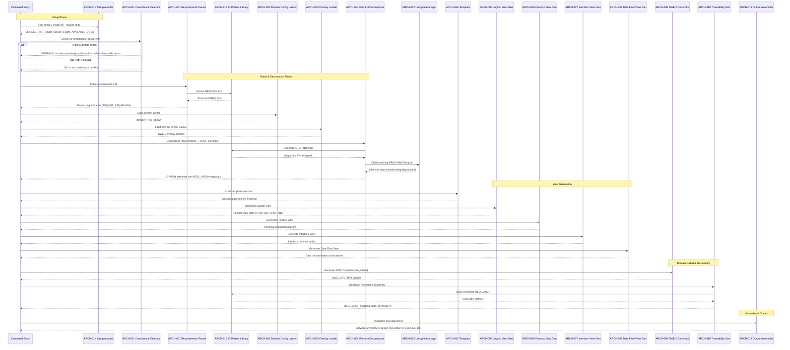
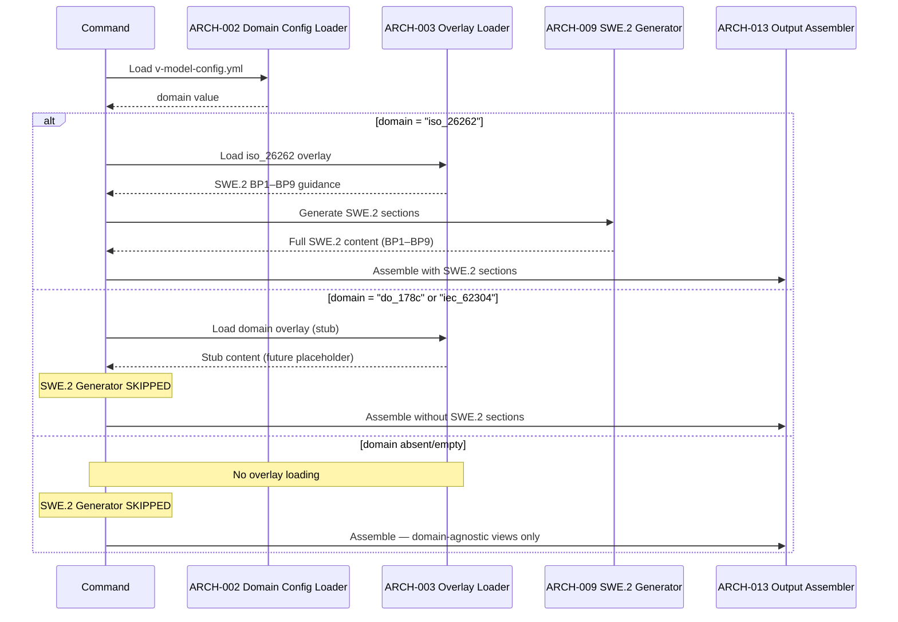

# Software Architecture Design: Software Architecture Design (Path B)

**Feature Branch**: `007-software-architecture-design`
**Created**: 2026-05-04
**Status**: Draft
**Source Requirements**: `specs/007-software-architecture-design/v-model/requirements.md`

## Overview

This software architecture design decomposes the 24 functional requirements and 4 non-functional requirements (REQ-001 through REQ-NF-004) into 16 architecture elements (ARCH-001 through ARCH-016). The decomposition organizes elements across four views: Logical (component breakdown with purpose, function, and dependency attributes), Process (runtime interaction sequences), Interface (entity-to-entity contracts with external/internal distinction), and Data Flow (data transformation chains with data design).

The architecture follows a pipeline pattern: requirements are parsed → domain configuration is loaded → requirements are decomposed into architecture elements → four architecture views are generated → SWE.2 sections are generated (when `domain: iso_26262`) → output is assembled and written. A coexistence detector checks for Path A artifacts and emits warnings without blocking generation.

This is a **Path B (combined)** artifact — ARCH elements trace strictly to `REQ-NNN` identifiers with no `SYS-NNN` references. The four architecture views are domain-agnostic and always generated. ASPICE SWE.2 BP1–BP9 sections are included because the domain is configured as `iso_26262` in `v-model-config.yml`.

## ID Schema

- **Architecture Element**: `ARCH-NNN` — sequential identifier for each architecture element (3-digit, zero-padded)
- **Parent Requirements**: Comma-separated `REQ-NNN` list per element (many-to-many)
- **Cross-Cutting Tag**: `[CROSS-CUTTING]` for infrastructure/utility elements that serve the system as a whole
- Example: `ARCH-001` with Parent Requirements `REQ-001, REQ-020` — Requirements Parser serves both input validation and graceful error handling.

## Architecture Design

### Logical View

| ARCH ID | Name | Description | Parent Requirements | Type |
|---------|------|-------------|---------------------|------|
| ARCH-001 | Requirements Parser | Reads and parses `requirements.md` to extract all `REQ-NNN` identifiers, descriptions, priorities, rationales, and verification methods. Produces a structured representation of functional and non-functional requirements. Validates that the input file is non-empty and contains at least one REQ-NNN. Fails gracefully with a clear error message when requirements.md is missing, empty, or contains zero REQ identifiers. Supports 50+ REQ identifiers without truncation. | REQ-001, REQ-020 | Component |
| ARCH-002 | Domain Config Loader | Reads `v-model-config.yml` from the repository root and extracts the `domain` field. Returns the domain value (`iso_26262`, `do_178c`, `iec_62304`, or null when absent/empty). Serves as the single source of truth for domain-gated behavior across all downstream generators. | REQ-008, REQ-009, REQ-010 | Component |
| ARCH-003 | Overlay Loader | Discovers and loads domain overlay files from `commands/overlays/{domain}/software-architecture-design.md` based on the domain value from ARCH-002. When `domain: iso_26262`, loads SWE.2 BP1–BP9 guidance content. When domain is `do_178c` or `iec_62304`, loads stub content (future extensibility hook). Returns null when no domain is configured or overlay file does not exist. | REQ-008, REQ-009 | Component |
| ARCH-004 | Architecture Element Decomposer | Receives parsed requirements and decomposes them into `ARCH-NNN` elements. Assigns sequential IDs (never renumbered), maps each element to parent REQ-NNN identifiers (many-to-many), classifies element type (Component, Service, Library, Utility, Adapter, Cross-Cutting), and tags `[CROSS-CUTTING]` elements with rationale. Flags `[DERIVED MODULE]` items when a necessary technical element has no corresponding requirement. Flags `[DERIVED REQUIREMENT]` when an architecture-implied capability lacks a requirement. Enforces the strict translator constraint — does not invent capabilities beyond requirements.md. | REQ-002, REQ-003, REQ-007, REQ-013, REQ-014, REQ-015, REQ-021, REQ-022, REQ-023 | Component |
| ARCH-005 | Logical View Generator | Generates the component breakdown table from ARCH element definitions. Formats each element as a table row with ARCH ID, name, description, parent requirements (comma-separated REQ-NNN list or `[CROSS-CUTTING]` tag with rationale), and type classification. Ensures every REQ-NNN appears as a parent in at least one row (forward coverage). Distinguishes business-logic elements from cross-cutting elements visually. | REQ-003, REQ-021, REQ-023 | Component |
| ARCH-006 | Process View Generator | Generates Mermaid `sequenceDiagram` blocks documenting runtime interactions between ARCH elements. Uses ARCH-NNN IDs as participants. Documents the pipeline execution order: requirements parsing → domain loading → decomposition → view generation → SWE.2 generation → output assembly. Shows synchronization points and decision branches (e.g., SWE.2 generation only when domain is iso_26262). Produces syntactically valid Mermaid markup. | REQ-004 | Component |
| ARCH-007 | Interface View Generator | Generates strict API contract tables for every ARCH-NNN element. Each contract specifies interface name, direction (Input/Output/Bidirectional), protocol, input format, output format, and error handling strategy. Covers both internal element-to-element interfaces and the external command interface (CLI args, file I/O). Rejects black-box descriptions with anti-pattern warnings. | REQ-005 | Component |
| ARCH-008 | Data Flow View Generator | Generates data transformation chain tables tracing data through ARCH elements. Each chain documents stage number, module reference (ARCH-NNN), input format, transformation description, and output format. Shows the complete pipeline: Raw requirements.md text → structured REQ data → ARCH element definitions → four architecture views → SWE.2 sections → final markdown output. | REQ-006 | Component |
| ARCH-009 | SWE.2 Section Generator | Generates ASPICE SWE.2 BP1–BP9 process guidance sections when the domain is `iso_26262`. Produces nine subsections: BP1 (develop architectural design), BP2 (allocate requirements with REQ→ARCH mapping), BP3 (define interfaces with contract summaries), BP4 (describe dynamic behavior with interaction summaries), BP5 (define resource consumption objectives — CPU, memory, latency, throughput), BP6 (evaluate alternative architectures with trade-off rationale), BP7 (establish bidirectional traceability), BP8 (ensure consistency with requirements), BP9 (communicate agreed design). When domain is not `iso_26262`, this generator is skipped entirely. | REQ-008, REQ-011 | Component |
| ARCH-010 | Traceability Summary Generator | Generates the REQ → ARCH mapping table and forward coverage metrics. Computes total requirements, total architecture elements, and coverage percentage (requirements with at least one ARCH parent mapping). Includes a per-requirement breakdown showing which ARCH elements address each REQ-NNN. | REQ-016 | Component |
| ARCH-011 | Coexistence Detector | Checks whether `architecture-design.md` (Path A artifact) already exists in the v-model directory before generation begins. When detected, emits a warning message (does not block generation) and allows `software-architecture-design.md` to be created alongside the existing Path A artifact. Both artifacts coexist; downstream `integration-test` has a documented preference for `software-architecture-design.md`. | REQ-012 | Component |
| ARCH-012 | Lifecycle Manager | Manages existing `ARCH-NNN` identifiers when regenerating `software-architecture-design.md`. Applies lifecycle rules: never renumbers existing IDs, marks replaced modules as `[DEPRECATED — Superseded by ARCH-NNN]`, marks removed modules as `[DEPRECATED — Withdrawn: reason]`, and preserves deprecated modules in output (never deletes). Ensures existing traceability links are not broken by regeneration. | REQ-019 | Component |
| ARCH-013 | Output Assembler | Assembles all generated sections (four architecture views, SWE.2 sections if applicable, traceability summary, derived items list) into a single `software-architecture-design.md` document. Applies the template structure from ARCH-016. Writes the final artifact to `{VMODEL_DIR}/software-architecture-design.md`. | REQ-001 | Component |
| ARCH-014 | Setup Script Adapter | Extends `setup-v-model.sh` and `setup-v-model.ps1` with `--require-reqs` flag support. Verifies `requirements.md` exists in the v-model directory before the command proceeds; returns non-zero exit code with error message if missing. Adds `software-architecture-design.md` to the `AVAILABLE_DOCS` detection list so downstream commands (e.g., `integration-test`) can discover and prefer it. | REQ-017, REQ-018 | Component |
| ARCH-015 | ID Pattern Library | Shared library of compiled regex patterns for deterministic extraction of V-Model identifiers: `REQ-[A-Z]{0,5}-[0-9]{3}` (requirements), `ARCH-[0-9]{3}` (architecture elements). Provides consistent ID extraction logic across parsing, decomposition, and traceability generation. Patterns are POSIX ERE compatible requiring no external tooling. | [CROSS-CUTTING] — Shared regex patterns used by ARCH-001, ARCH-004, ARCH-010, and ARCH-012 for deterministic ID extraction and traceability validation across the entire generation pipeline. | Library |
| ARCH-016 | Software Architecture Design Template | Markdown template defining the required output structure. Provides section headers, HTML comment field definitions, and placeholder tables for four views: Logical View (ARCH-NNN table with Parent Requirements), Process View (Mermaid sequenceDiagram placeholders), Interface View (contract table format), and Data Flow View (transformation chain format). Includes conditional SWE.2 section placeholders (BP1–BP9) populated only when the iso_26262 domain overlay is loaded. | REQ-024 | Library |

## Process View — Dynamic Behavior

### Interaction: Software Architecture Design Generation (Full Pipeline)

### Interaction: Domain Branching (iso_26262 vs Non-Regulated)

## Interface View — External Interface Contracts

> External interfaces: CLI entry point and file I/O boundaries. Each ARCH-NNN has a dedicated sub-section with per-item Input/Output/Exception rows.

<!--
  RULES:
  - No "black box" elements — every ARCH must have explicit contracts
  - Distinguish synchronous / asynchronous interfaces
  - Error contracts directly drive Interface Fault Injection testing
  - Input/output contracts directly drive Interface Contract Testing
-->

#### ARCH-001: Requirements Parser

| Direction | Name | Type | Format | Constraints |
|-----------|------|------|--------|-------------|
| Input | requirements_path | String | File path to `requirements.md` | Required; file must exist and be non-empty |
| Input | id_patterns | Regex | Compiled REQ-NNN pattern from ARCH-015 | Required; must match `REQ-[A-Z]{0,5}-[0-9]{3}` |
| Output | req_data | Array | `[{id: REQ-NNN, description, priority, rationale, verification}]` | Guaranteed non-empty; zero REQs treated as error |
| Exception | FILE_NOT_FOUND | Error | Plain text | "requirements.md not found in {path}" |
| Exception | EMPTY_INPUT | Error | Plain text | "No REQ-NNN identifiers found in requirements.md" |

#### ARCH-002: Domain Config Loader

| Direction | Name | Type | Format | Constraints |
|-----------|------|------|--------|-------------|
| Input | config_path | String | File path to `v-model-config.yml` | Required; relative to repository root |
| Output | domain_value | String \| null | `"iso_26262"` \| `"do_178c"` \| `"iec_62304"` \| `null` | Returns `null` when config file absent or domain field missing |
| Exception | MALFORMED_YAML | Error | Plain text | "v-model-config.yml is malformed: {parse error}" |

#### ARCH-003: Overlay Loader

| Direction | Name | Type | Format | Constraints |
|-----------|------|------|--------|-------------|
| Input | domain_value | String \| null | Domain string from ARCH-002 | Required; non-null triggers overlay resolution |
| Input | overlay_base_path | String | Base path to `commands/overlays/` | Required |
| Output | overlay_content | String \| null | Markdown content from overlay file | `null` when overlay file does not exist |
| Exception | MISSING_OVERLAY | Warning | Plain text | "Overlay file not found for domain {domain}" — logged, does not block generation |

#### ARCH-011: Coexistence Detector

| Direction | Name | Type | Format | Constraints |
|-----------|------|------|--------|-------------|
| Input | vmodel_dir | String | Path to feature v-model directory | Required |
| Output | coexistence_warning | String \| null | Warning message when `architecture-design.md` exists | Never blocks generation; `null` when no Path A artifact detected |

#### ARCH-013: Output Assembler

| Direction | Name | Type | Format | Constraints |
|-----------|------|------|--------|-------------|
| Input | all_sections | Array | Generated view sections (Logical, Process, Interface, Data Flow) | Required; at least Logical View must be non-empty |
| Input | template_structure | String | Template with section placeholders from ARCH-016 | Required; provides section ordering and header metadata |
| Output | assembled_document | File | Markdown written to `{VMODEL_DIR}/software-architecture-design.md` | Written via atomic `mktemp` + `mv` pattern; Git-tracked |
| Exception | WRITE_FAILURE | Error | Plain text | "Failed to write software-architecture-design.md: {reason}" (permissions, disk space) |

#### ARCH-014: Setup Script Adapter

| Direction | Name | Type | Format | Constraints |
|-----------|------|------|--------|-------------|
| Input | require_reqs_flag | Boolean | CLI flag `--require-reqs` | Default: false |
| Input | feature_dir | String | Path to feature directory | Required |
| Output | setup_json | JSON | `{VMODEL_DIR, FEATURE_DIR, BRANCH, REQUIREMENTS, AVAILABLE_DOCS}` | Includes `software-architecture-design.md` in AVAILABLE_DOCS |
| Exception | PREREQUISITE_MISSING | Error | Plain text | "requirements.md not found in {vmodel_dir}" — exits non-zero when `--require-reqs` is set |

## Interface View — Internal Interface Contracts

> Internal interfaces: element-to-element communication within the pipeline. Each row documents one Source→Target data flow contract.

<!--
  RULES:
  - Direction: Unidirectional (Source→Target), Bidirectional, or Callback
  - Type: The runtime type of the data exchanged
  - Format: The precise data structure/format
  - Constraints: Guarantees, invariants, error handling
  - Exceptions are documented in the External Interface section of the Source ARCH
-->

| Source ARCH | Target ARCH | Interface Name | Direction | Type | Format | Constraints |
|-------------|-------------|----------------|-----------|------|--------|-------------|
| ARCH-001 | ARCH-004 | Requirements → Decomposer | Unidirectional | Array | `[{id: REQ-NNN, description, priority, rationale, verification}]` | Must be non-empty; EMPTY_INPUT exception raised when zero REQs found |
| ARCH-002 | ARCH-003 | Domain → Overlay Loader | Unidirectional | String \| null | Domain string or `null` | null → overlay loading skipped; warning logged when domain set but overlay missing |
| ARCH-003 | ARCH-009 | Overlay → SWE.2 Generator | Unidirectional | String \| null | Overlay content (Markdown) or `null` | `null` → SWE.2 generator skips entirely |
| ARCH-004 | ARCH-005 | Decomposer → Logical View Gen | Unidirectional | Array | `[{id: ARCH-NNN, name, description, parentReqs, type, tags, lifecycleState}]` | Returns error when zero ARCH elements provided |
| ARCH-004 | ARCH-006 | Decomposer → Process View Gen | Unidirectional | Object | `{arch_definitions, interaction_paths}` | Returns error when Mermaid syntax is invalid |
| ARCH-004 | ARCH-007 | Decomposer → Interface View Gen | Unidirectional | Array | ARCH element definitions | Emits anti-pattern warning for black-box elements |
| ARCH-004 | ARCH-008 | Decomposer → Data Flow View Gen | Unidirectional | Object | `{arch_definitions, data_flow_paths}` | Returns error when data flow chain is broken |
| ARCH-005 | ARCH-013 | Logical View → Output Assembler | Unidirectional | String | Markdown table string | Structural; validated at generation time |
| ARCH-006 | ARCH-013 | Process View → Output Assembler | Unidirectional | String | Mermaid diagram string | Structural; validated at generation time |
| ARCH-007 | ARCH-013 | Interface View → Output Assembler | Unidirectional | String | Interface contract Markdown tables | Structural; validated at generation time |
| ARCH-008 | ARCH-013 | Data Flow View → Output Assembler | Unidirectional | String | Transformation chain Markdown table | Structural; validated at generation time |
| ARCH-009 | ARCH-013 | SWE.2 Sections → Output Assembler | Unidirectional | String \| null | SWE.2 BP1–BP9 Markdown or `null` | `null` → SWE.2 placeholder replaced with omission note |
| ARCH-010 | ARCH-013 | Traceability → Output Assembler | Unidirectional | Object | `{total_reqs, total_arch, coverage_pct, uncovered[]}` | Handles many-to-many without double-counting |
| ARCH-012 | ARCH-004 | Lifecycle → Decomposer | Unidirectional | Object | `[{arch_id, lifecycle_state, superseded_by, reason}]` | Preserves deprecated entries; never renumbers existing IDs |
| ARCH-015 | ARCH-001, ARCH-004, ARCH-010 | ID Pattern Library → Consumers | Bidirectional | Regex | Compiled regex objects for `REQ-[A-Z]{0,5}-[0-9]{3}`, `ARCH-[0-9]{3}` | Returns empty array when no matches (no false positives) |
| ARCH-016 | ARCH-013 | Template → Output Assembler | Unidirectional | String | Template string with section placeholders | Static template; validated at authoring time |

## Data Flow View — Data Transformation Chain

| Stage | Module | Input Format | Transformation | Output Format |
|-------|--------|-------------|----------------|---------------|
| 1. Input Validation | ARCH-001, ARCH-014 | Raw `requirements.md` file path | Verify file exists, parse Markdown tables, extract REQ-NNN identifiers using ARCH-015 regex patterns. Validate minimum content (non-empty, ≥1 REQ-NNN). | Structured REQ objects: `[{id, description, priority, rationale, verification}]` |
| 2. Domain Resolution | ARCH-002, ARCH-003 | Repository root path | Read `v-model-config.yml`, extract `domain` field. If domain is set, resolve overlay path: `commands/overlays/{domain}/software-architecture-design.md`. Load overlay content. | Domain context: `{domain: "iso_26262" \| "do_178c" \| "iec_62304" \| null, overlayContent: string \| null}` |
| 3. Architecture Decomposition | ARCH-004, ARCH-012, ARCH-015 | Structured REQ objects + Domain context + Existing ARCH state | Apply strict translator: for each REQ-NNN, identify architecture elements needed. Assign ARCH-NNN IDs via ARCH-015. Classify types. Tag cross-cutting elements. Flag derived items. Apply lifecycle rules from ARCH-012. | ARCH element definitions: `[{id, name, description, parentReqs, type, tags, lifecycleState}]` |
| 4. Logical View Generation | ARCH-005 | ARCH element definitions | Map each ARCH element to table row. Format parent requirements as comma-separated REQ-NNN list. Distinguish business-logic from cross-cutting. Ensure every REQ-NNN appears as parent in ≥1 row. | Logical View Markdown table |
| 5. Process View Generation | ARCH-006 | ARCH element definitions + interaction paths | Identify interaction sequences from pipeline stages. Generate Mermaid sequenceDiagram with ARCH-NNN participants. Document concurrency model and synchronization points. | Process View Mermaid diagram block |
| 6. Interface View Generation | ARCH-007 | ARCH element definitions | For each ARCH-NNN, extract interface name, direction, protocol, input/output formats, and error handling strategy. Validate no black-box (empty contract) elements. | Interface View contract table |
| 7. Data Flow View Generation | ARCH-008 | ARCH element definitions + data flow paths | Trace data through pipeline stages. Document input format, transformation, and output format at each stage. Validate no broken chains. | Data Flow View transformation table |
| 8. SWE.2 Section Generation | ARCH-009 | ARCH element definitions + REQ data + overlay content | Only when domain is iso_26262: generate BP1–BP9 subsections. Map REQ→ARCH for BP2. Summarize interfaces for BP3. Document dynamic behavior for BP4. Define resource objectives for BP5. Evaluate alternatives for BP6. Establish traceability for BP7. Ensure consistency for BP8. Document communication for BP9. | SWE.2 BP1–BP9 Markdown sections (or null if not iso_26262) |
| 9. Traceability Computation | ARCH-010, ARCH-015 | ARCH element definitions + REQ data | Cross-reference every REQ-NNN against ARCH parent requirements. Compute total REQs, total ARCHs, coverage count, coverage percentage. Generate per-requirement mapping rows. | Traceability Summary table + coverage metrics |
| 10. Final Assembly | ARCH-013, ARCH-016 | All generated sections + template structure | Merge sections into template structure. Apply header metadata (feature, branch, date). Write to `{VMODEL_DIR}/software-architecture-design.md`. | Complete `software-architecture-design.md` file |

### Data Design

> Data entities, their storage, protection, and lifecycle within the architecture pipeline.

| Data Entity | Owning ARCH | Storage | Protection | Lifecycle |
|-------------|-------------|---------|------------|-----------|
| Structured REQ objects | ARCH-001 | In-memory array during pipeline execution | Validated at parse time (non-empty, ≥1 REQ-NNN); no persistent storage | Created at parse; consumed by decomposer; discarded after assembly |
| ARCH element definitions | ARCH-004 | In-memory array during pipeline execution | Validated by strict translator constraint; derived items flagged | Created at decomposition; consumed by view generators; discarded after assembly |
| Domain context | ARCH-002 | In-memory string or null | Read from YAML config; null-safe throughout pipeline | Created at config load; referenced by overlay loader and SWE.2 generator; discarded |
| Overlay content | ARCH-003 | In-memory string or null | Read from version-controlled Markdown file | Loaded at domain resolution; consumed by SWE.2 generator; embedded in output |
| Generated Markdown sections | ARCH-005..ARCH-010 | In-memory strings; accumulated by ARCH-013 | Template-placeholder validation before write | Each view generator produces; assembler merges; written to disk |
| Final `software-architecture-design.md` | ARCH-013 | Git-tracked file in `v-model/` directory | Git cryptographic commit hashes provide immutable audit trail | Written once per generation; version-controlled; diffable on regeneration |

## Architecture Evaluation

> The following evaluation assesses the architecture's fitness for purpose across quality attributes.

### Quality Attribute Cross-Check

| Quality Characteristic | Reference | Design Evidence | Status |
|------------------------|-----------|-----------------|--------|
| Functional Suitability — Completeness | SC-002 | Every REQ-NNN mapped to ≥1 ARCH-NNN (Logical View + BP2 allocation table) | ✅ Addressed |
| Functional Suitability — Correctness | SC-002 | Strict translator constraint (ARCH-004) prevents invented capabilities | ✅ Addressed |
| Reliability — Fault Tolerance | — | Interface View documents error handling for every element; graceful failure on missing input | ✅ Addressed |
| Reliability — Recoverability | — | Lifecycle rules (ARCH-012) preserve deprecated elements; coexistence detector prevents data loss | ✅ Addressed |
| Performance Efficiency — Time Behaviour | SC-001 | Pipeline completes < 30s for 10,000-word input (SC-001); single-threaded sequential | ✅ Addressed |
| Performance Efficiency — Resource Utilisation | SC-005 | Peak memory < 512 MB for 50+ REQ input; in-memory pipeline, no external DB | ✅ Addressed |
| Security — Integrity | — | Output written to Git-tracked file with cryptographic commit hashes; no external network calls | ✅ Addressed |
| Maintainability — Modularity | — | Pipeline architecture with 16 independently testable ARCH elements; each has single responsibility | ✅ Addressed |
| Maintainability — Reusability | — | ARCH-015 (ID Pattern Library) shared across parsing/decomposition/traceability | ✅ Addressed |
| Maintainability — Testability | — | Every ARCH element has explicit interface contract; integration tests cover all 16 elements | ✅ Addressed |

### Quality Attribute Justification

For each significant architectural decision (one that affects more than one view or introduces a cross-cutting element), document its quality attribute rationale:

| Architecture Decision | Quality Characteristic | Trade-off Accepted |
|----------------------|------------------------|--------------------|
| Pipeline architecture (sequential stages) | Maintainability ↑, Performance Efficiency ↓ | Sequential dependency accepted for modularity and independent testability; no parallelism needed for single-artifact generation |
| Domain overlay mechanism (ARCH-003) | Maintainability ↑, Functional Suitability ↑ | Overlay files add file I/O overhead but enable zero-modification domain extensibility |
| In-memory pipeline (no external DB) | Performance Efficiency ↑, Reliability ↓ | Fast read/write but no crash recovery; acceptable for CLI tool that re-runs on failure |
| Single-threaded concurrency model | Reliability ↑, Performance Efficiency ↓ | No race conditions or deadlocks but no parallelism; acceptable for deterministic document generation |
| Coexistence-first (Path A warning, not error) | Maintainability ↑ | Allows both Path A and Path B artifacts; downstream preference rule resolves ambiguity |

### Sensitivity and Trade-off Points

**Sensitivity Points** (small changes that significantly affect quality):

| Point | Affected Quality | Sensitivity |
|-------|-----------------|------------|
| ARCH-004 strict translator constraint | Functional Suitability | Relaxing this constraint would allow AI hallucination of architecture elements — every ARCH must trace to a REQ-NNN |
| ARCH-009 domain gate (`domain == "iso_26262"`) | Functional Suitability | Adding SWE.2 for non-iso_26262 domains would violate the spec's domain gating rule |
| ARCH-015 regex patterns | Functional Suitability | Pattern changes affect all consumers (ARCH-001, ARCH-004, ARCH-010); must be backward-compatible |

**Trade-off Points** (improving one characteristic degrades another):

| Trade-off | Improved | Degraded | Mitigation |
|-----------|----------|----------|------------|
| Pipeline parallelism | Performance Efficiency | Maintainability, Testability | Not pursued — sequential pipeline is deterministic and easily debuggable |
| Persistent intermediate storage | Reliability (crash recovery) | Performance Efficiency, Security | Not pursued — CLI tool re-runs are cheap; no sensitive intermediate data |
| Dynamic plugin architecture | Maintainability (extensibility) | Performance Efficiency, Complexity | Deferred — overlay mechanism (ARCH-003) provides sufficient domain extensibility |

## ASPICE SWE.2 Process Guidance

> **Note**: This section is included because `v-model-config.yml` specifies `domain: iso_26262`. SWE.2 BP1–BP9 process guidance documents the software architectural design process for ISO 26262 compliance.

### SWE.2.BP1 — Develop Software Architectural Design

The software architecture design was developed by reading `requirements.md` (28 requirements: REQ-001 through REQ-NF-004) and decomposing them into 16 architecture elements (ARCH-001 through ARCH-016). The decomposition organizes elements into four views plus SWE.2 process structure. The architecture employs a pipeline pattern: parse → load config → decompose → generate views → generate SWE.2 → assemble output.

Key design decisions:
- **Pipeline architecture**: Each stage produces structured output consumed by the next, enabling independent testability of each ARCH element.
- **Domain overlay mechanism**: SWE.2 content is loaded from `commands/overlays/iso_26262/software-architecture-design.md` rather than hardcoded, enabling future domain extensions without modifying the base command.
- **Coexistence-first**: Path A artifacts are never overwritten; a warning is emitted and both artifacts coexist.
- **Lifecycle preservation**: Existing ARCH-NNN IDs are never renumbered; deprecated modules are preserved with annotations.

### SWE.2.BP2 — Allocate Software Requirements

| Requirement | Allocated Architecture Elements | Rationale |
|-------------|-------------------------------|-----------|
| REQ-001 | ARCH-001, ARCH-013 | Core input parsing and output assembly form the command's entry and exit points |
| REQ-002 | ARCH-004, ARCH-015 | Sequential ID assignment by the decomposer, validated by the ID pattern library |
| REQ-003 | ARCH-005 | Logical View is a dedicated generator with its own output format |
| REQ-004 | ARCH-006 | Process View is a dedicated generator producing Mermaid diagrams |
| REQ-005 | ARCH-007 | Interface View is a dedicated generator producing contract tables |
| REQ-006 | ARCH-008 | Data Flow View is a dedicated generator producing transformation chains |
| REQ-007 | ARCH-004 | Strict REQ→ARCH traceability is enforced by the decomposer; SYS references are prohibited |
| REQ-008 | ARCH-002, ARCH-003, ARCH-009 | Domain loading and SWE.2 generation are iso_26262-gated through the config loader and overlay loader |
| REQ-009 | ARCH-002, ARCH-003 | do_178c/iec_62304 overlays are loaded as stubs; SWE.2 is not triggered |
| REQ-010 | ARCH-002 | Absent/empty domain results in null config; all domain-gated generators skip |
| REQ-011 | ARCH-009 | SWE.2 BP1–BP9 content is generated by the dedicated SWE.2 section generator |
| REQ-012 | ARCH-011 | Coexistence detection is a dedicated checker that warns but does not block |
| REQ-013 | ARCH-004 | Strict translator constraint enforced at decomposition stage |
| REQ-014 | ARCH-004 | Derived modules are flagged by the decomposer during ARCH element assignment |
| REQ-015 | ARCH-004 | Derived requirements are flagged by the decomposer during capability gap analysis |
| REQ-016 | ARCH-010 | Traceability summary with coverage metrics is generated post-view-generation |
| REQ-017 | ARCH-014 | Setup script adaptation for --require-reqs flag |
| REQ-018 | ARCH-014 | AVAILABLE_DOCS detection for downstream command discovery |
| REQ-019 | ARCH-012 | Lifecycle rules enforced by dedicated lifecycle manager |
| REQ-020 | ARCH-001 | Graceful failure for missing/empty requirements is the parser's responsibility |
| REQ-021 | ARCH-004 | Many-to-many REQ↔ARCH mapping is supported by the decomposer's data model |
| REQ-022 | ARCH-004 | Cross-cutting tagging with rationale is applied during decomposition |
| REQ-023 | ARCH-005 | Business-logic vs cross-cutting distinction rendered in Logical View |
| REQ-024 | ARCH-016 | Template structure defines output format with conditional SWE.2 placeholders |
| REQ-NF-001 | ARCH-001, ARCH-013 | Performance target met by in-process pipeline; no external service calls |
| REQ-NF-002 | ARCH-005, ARCH-006, ARCH-007, ARCH-008 | All four view generators produce non-empty, non-placeholder content |
| REQ-NF-003 | ARCH-001, ARCH-004 | Parser and decomposer handle 50+ REQ identifiers without truncation |
| REQ-NF-004 | ARCH-009 | SWE.2 compliance score ≥ 90% verified by BP1–BP9 completeness check |

### SWE.2.BP3 — Define Interfaces of Software Elements

All 16 architecture elements have fully defined interface contracts in the **Interface View** above. Key interface contracts:

- **ARCH-001 (Requirements Parser)**: Input is a file path to `requirements.md`; output is structured REQ data. Error handling returns descriptive error objects for missing, empty, or invalid input.
- **ARCH-002 (Domain Config Loader)**: Input is the repository root path; output is the domain string or null. Gracefully handles absent config files.
- **ARCH-004 (Architecture Element Decomposer)**: Central internal interface — consumes parsed REQ data, domain context, and existing ARCH state; produces ARCH element definitions with lifecycle annotations. This is the most critical interface as it enforces the strict translator constraint.
- **ARCH-009 (SWE.2 Section Generator)**: Domain-gated interface — only invoked when domain is `iso_26262`; produces nine BP subsections or null.
- **ARCH-013 (Output Assembler)**: Terminal interface — consumes all generated sections and writes the final `software-architecture-design.md` file.

All element-to-element interfaces use in-process calls with structured data objects. The only file I/O interfaces are ARCH-001 (read requirements), ARCH-002 (read config), ARCH-003 (read overlay), ARCH-011 (check existence), and ARCH-013 (write output).

### SWE.2.BP4 — Describe Dynamic Behavior

Dynamic behavior is fully documented in the **Process View** above. Two sequence diagrams capture the key interaction flows:

1. **Full Pipeline Generation**: Shows the complete 7-phase interaction from setup through output assembly, including the coexistence check, domain branching, and all four view generation stages.
2. **Domain Branching**: Shows the conditional logic for `iso_26262` (SWE.2 generated), `do_178c`/`iec_62304` (stub loaded, SWE.2 skipped), and unregulated (no overlay, SWE.2 skipped).

The concurrency model is single-threaded sequential pipeline — each stage depends on the output of the previous stage, so there is no parallelism. This simplifies reasoning about data consistency and makes the generation process deterministic and reproducible.

### SWE.2.BP5 — Define Resource Consumption Objectives

| Resource | Objective | Rationale |
|----------|-----------|-----------|
| **CPU** | Single-core, < 30s wall-clock for 10,000-word requirements.md | SC-001: Interactive workflow responsiveness; pipeline is I/O-bound (file reads/writes), not CPU-bound |
| **Memory** | < 512 MB peak for 50+ REQ-NNN input | REQ-NF-003: All data is held in memory as structured objects during the pipeline; no external database |
| **Latency** | < 30s end-to-end from command invocation to file written | SC-001: Users expect architecture generation to complete within a single interactive session |
| **Throughput** | N/A — single artifact generation per invocation; not a streaming/batch service | Command is invoked once per architecture design cycle, not continuously |
| **Storage** | Output file: typically 20–80 KB Markdown; template: ~5 KB static | Minimal disk footprint; all artifacts are plaintext Markdown in Git |

### SWE.2.BP6 — Evaluate Alternative Software Architectures

| Alternative | Description | Evaluation | Decision |
|-------------|-------------|------------|----------|
| **A: Monolithic single-function generator** | One function reads requirements and produces all output in a single pass | Simple to implement but impossible to test individual views or domain-gate SWE.2 independently. Violates separation of concerns. | Rejected |
| **B: Pipeline with independent generators (chosen)** | Each view and concern has a dedicated ARCH element; pipeline passes structured data between stages | Enables independent testing of each view generator. Domain-gating (SWE.2) is a simple conditional skip of ARCH-009. Coexistence check (ARCH-011) is isolated. Lifecycle management (ARCH-012) is a discrete concern. Each element has a clear single responsibility. | **Chosen** — Best balance of modularity, testability, and domain extensibility |
| **C: Microservices with message queue** | Each ARCH element is a separate service communicating via message bus | Massive over-engineering for a CLI tool that runs in a single process. Adds deployment complexity, network latency, and failure modes with no benefit for a deterministic generation pipeline. | Rejected |
| **D: Plugin architecture with dynamic loading** | Overlays and view generators are dynamically loaded plugins | Over-engineered for current scope. The overlay mechanism (ARCH-003) already provides domain extensibility without dynamic loading. Could be revisited if the number of domains or view types grows beyond ~10. | Deferred to future |

### SWE.2.BP7 — Establish Bidirectional Traceability

**Forward Traceability (REQ → ARCH)**: Every requirement (REQ-001 through REQ-NF-004) is allocated to at least one architecture element in the SWE.2.BP2 allocation table above. The Traceability Summary section at the end of this document provides a consolidated REQ→ARCH mapping with coverage metrics.

**Backward Traceability (ARCH → REQ)**: Every architecture element (ARCH-001 through ARCH-016) lists its parent requirements in the Logical View table. No ARCH element exists without at least one parent REQ-NNN — the strict translator constraint (REQ-013) enforced by ARCH-004 prevents orphaned architecture elements.

**Coverage**: Forward coverage is 100% — all 28 requirements (24 functional + 4 non-functional) are mapped to at least one ARCH element. Backward coverage is 100% — all 16 ARCH elements have parent REQ-NNN identifiers.

### SWE.2.BP8 — Ensure Consistency

Consistency between requirements and architecture design is ensured through:

1. **Strict translator constraint (REQ-013)**: ARCH-004 does not invent architecture elements beyond what requirements.md specifies. Every ARCH-NNN is justified by a REQ-NNN.
2. **Derived item flagging (REQ-014, REQ-015)**: When the architecture reveals a gap (missing requirement or necessary module), it is flagged for human review rather than silently incorporated.
3. **Lifecycle preservation (REQ-019)**: ARCH-012 preserves existing IDs and deprecated modules, ensuring the architecture document remains consistent with its own history.
4. **Template enforcement (REQ-024)**: ARCH-016 provides a fixed output structure that all generators must conform to, preventing structural drift.
5. **Deterministic ID extraction (ARCH-015)**: Regex-based ID patterns ensure consistent identifier recognition across all pipeline stages — no probabilistic matching.

### SWE.2.BP9 — Communicate Agreed Software Architectural Design

This `software-architecture-design.md` document serves as the single communication artifact for the software architectural design. It is:

- **Version-controlled** in Git alongside the feature specification and requirements, providing cryptographic audit trail via commit hashes.
- **Reviewable** as a plaintext Markdown file — no proprietary tooling required; diffable in any Git client.
- **Traceable** from every ARCH element back to its parent requirements via the REQ→ARCH mapping table.
- **Consumable** by downstream V-Model commands: `integration-test` reads this artifact (preferring it over `architecture-design.md` when both exist) to generate integration test plans.

The architecture design is considered "agreed" when:
1. All derived requirements and derived modules flagged by ARCH-004 have been reviewed by a human.
2. The Traceability Summary shows 100% forward coverage (every REQ has ≥1 ARCH).
3. The SWE.2 compliance score meets the ≥90% threshold (SC-004).
4. The artifact is committed to the feature branch.

## Traceability Summary

| Metric | Count |
|--------|-------|
| Total Requirements | 28 (24 functional + 4 non-functional) |
| Total Architecture Elements | 16 |
| Forward Coverage (REQ → ARCH) | 28/28 (100%) |

### REQ → ARCH Mapping

| Requirement | Architecture Elements |
|-------------|----------------------|
| REQ-001 | ARCH-001, ARCH-013 |
| REQ-002 | ARCH-004, ARCH-015 |
| REQ-003 | ARCH-005 |
| REQ-004 | ARCH-006 |
| REQ-005 | ARCH-007 |
| REQ-006 | ARCH-008 |
| REQ-007 | ARCH-004 |
| REQ-008 | ARCH-002, ARCH-003, ARCH-009 |
| REQ-009 | ARCH-002, ARCH-003 |
| REQ-010 | ARCH-002 |
| REQ-011 | ARCH-009 |
| REQ-012 | ARCH-011 |
| REQ-013 | ARCH-004 |
| REQ-014 | ARCH-004 |
| REQ-015 | ARCH-004 |
| REQ-016 | ARCH-010 |
| REQ-017 | ARCH-014 |
| REQ-018 | ARCH-014 |
| REQ-019 | ARCH-012 |
| REQ-020 | ARCH-001 |
| REQ-021 | ARCH-004 |
| REQ-022 | ARCH-004 |
| REQ-023 | ARCH-005 |
| REQ-024 | ARCH-016 |
| REQ-NF-001 | ARCH-001, ARCH-013 |
| REQ-NF-002 | ARCH-005, ARCH-006, ARCH-007, ARCH-008 |
| REQ-NF-003 | ARCH-001, ARCH-004 |
| REQ-NF-004 | ARCH-009 |
