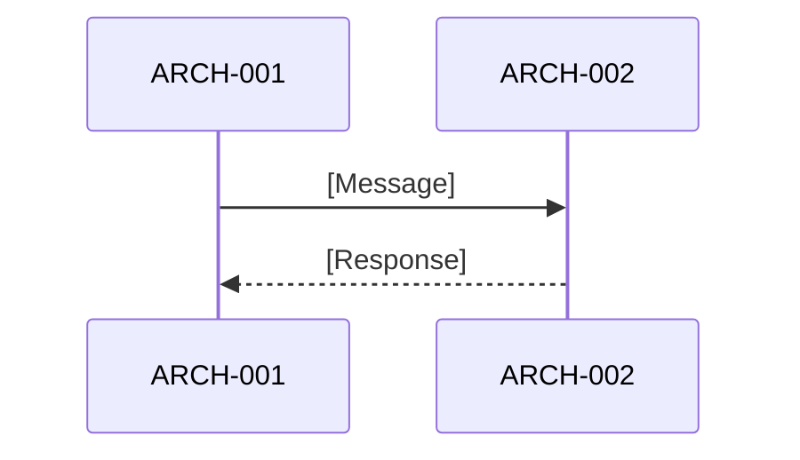

# Software Architecture Design: [FEATURE NAME]

**Feature Branch**: `[###-feature-name]`
**Created**: [DATE]
**Status**: Draft
**Source Requirements**: `specs/[###-feature-name]/v-model/requirements.md`

## Overview

[Brief description of the software architecture, its rationale, and how requirements map into architecture elements.]

> **Standards reference**: This artifact synthesizes **IEEE 1016:2009** (Software Design Description — design entity model and decomposition) within **IEEE 42010:2011** (Architecture Description — viewpoint framework). See the [standards reference](docs/standards-reference.md) for the full mapping.

## ID Schema

- **Architecture Element (Design Entity per IEEE 1016 §4.1)**: `ARCH-NNN` — sequential identifier for each architecture element
- **Requirement**: `REQ-NNN` — from the input `requirements.md`
- **Traceability**: `REQ → ARCH`

## Architecture Design: IEEE 1016 / IEEE 42010 Synthesized Views

> The four views below use IEEE 42010 as the structural framework. IEEE 1016 design entity concepts are embedded within each view as noted.

### Logical View (IEEE 42010 Logical View ← IEEE 1016 Decomposition View §5.1 + Dependency View §5.2)

| ARCH ID | Name | Description (Purpose) | Parent Requirements (Dependencies) | Type |
|---------|------|----------------------|-----------------------------------|------|
| ARCH-001 | [Element Name] | [What it does — IEEE 1016 function attribute] | REQ-001, REQ-002 | Component |

### Process View (IEEE 42010 / Kruchten 4+1 Process View)

> This view has no direct IEEE 1016 counterpart — it is unique to the IEEE 42010/Kruchten 4+1 framework and represents the synthesis differentiator of Path B.

[Describe runtime behavior, concurrency model, and interaction patterns.]

### Interface View (IEEE 1016 §5.3 Interface Identification + IEEE 42010 Interface View)

| ARCH ID | Interface Name | Direction | Protocol | Input | Output | Error Handling |
|----------|----------------|-----------|----------|-------|--------|----------------|
| ARCH-001 | [Name] | Input | [Protocol] | [Format] | [Format] | [Strategy] |

> Each interface identifies: the design entities involved (IEEE 1016 §5.3.2), the interaction protocol (IEEE 42010), and the exception/error strategy.

### Data Flow View (IEEE 1016 §5.4 Data Design + IEEE 42010 Data Flow View)

| Stage | Module | Input Format | Transformation | Output Format |
|-------|--------|-------------|----------------|---------------|
| [Stage] | ARCH-001 | [Format] | [Transformation] | [Format] |

## ASPICE SWE.2 Process Guidance

### SWE.2.BP1 — Develop Software Architectural Design

[Document how the architecture design was developed from requirements.]

### SWE.2.BP2 — Allocate Software Requirements

[Map requirements to architecture elements and explain allocation rationale.]

### SWE.2.BP3 — Define Interfaces of Software Elements

[Describe the key interfaces and contracts for architecture elements.]

### SWE.2.BP4 — Describe Dynamic Behavior

[Describe the runtime interactions and state transitions.] 

### SWE.2.BP5 — Define Resource Consumption Objectives

[List CPU, memory, latency, throughput, and resource constraints.]

### SWE.2.BP6 — Evaluate Alternative Software Architectures

[Compare candidate architecture alternatives and justify the chosen design.]

### SWE.2.BP7 — Establish Bidirectional Traceability

[Confirm requirements are linked to architecture elements.] 

### SWE.2.BP8 — Ensure Consistency

[Confirm the architecture is coherent with requirements.] 

### SWE.2.BP9 — Communicate Agreed Software Architectural Design

[Summarize any review or communication artifacts used to agree the architecture.]

## Traceability Summary

| Metric | Count |
|--------|-------|
| Total Requirements | [N] |
| Total Architecture Elements | [N] |
| Forward Coverage (REQ → ARCH) | [N/%] |

### REQ → ARCH Mapping

| Requirement | Architecture Elements |
|-------------|----------------------|
| REQ-001 | ARCH-001 |

## Derived Requirements and Modules

[List any derived items flagged during generation, or `None` if all items trace to requirements.]

## Glossary

| Term | Definition |
|------|------------|
| [Term] | [Definition] |
