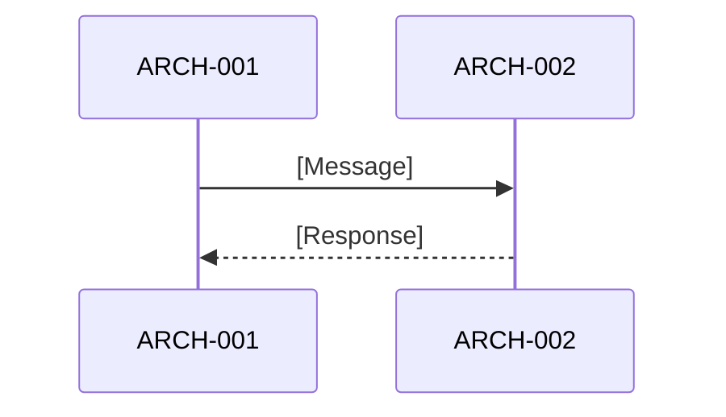

# Software Architecture Design: [FEATURE NAME]

**Feature Branch**: `[###-feature-name]`
**Created**: [DATE]
**Status**: Draft
**Source Requirements**: `specs/[###-feature-name]/v-model/requirements.md`

## Overview

[Brief description of the software architecture, its rationale, and how requirements map into architecture elements.]

## ID Schema

- **Architecture Element**: `ARCH-NNN` — sequential identifier for each architecture element
- **Requirement**: `REQ-NNN` — from the input `requirements.md`
- **Traceability**: `REQ → ARCH`

## Architecture Design

### Logical View

| ARCH ID | Name | Description (Purpose) | Parent Requirements (Dependencies) | Type |
|---------|------|----------------------|-----------------------------------|------|
| ARCH-001 | [Element Name] | [What it does] | REQ-001, REQ-002 | Component |

### Process View

[Describe runtime behavior, concurrency model, and interaction patterns.]

### Interface View — External Interface Contracts

<!--
  每个 ARCH-NNN 必须在此定义外部接口契约（CLI entry point + file I/O boundaries）。

  RULES:
  - No "black box" elements — every ARCH must have explicit contracts
  - 区分 synchronous / asynchronous 接口
  - Error contracts directly drive Interface Fault Injection testing
  - Input/output contracts directly drive Interface Contract Testing
  - 每个 ARCH 至少有一个 Input 和一个 Output

  For each module, document the parameters using the following format:
  - Inputs Accepted: Types, formats, ranges, required/optional
  - Outputs Produced: Types, guarantees, formats
  - Exceptions Thrown: Error codes, failure modes, recovery hints
-->

#### ARCH-001: [Element Name]

| Direction | Name | Type | Format | Constraints |
|-----------|------|------|--------|-------------|
| Input | [param] | [type] | [format] | [range/required] |
| Output | [return] | [type] | [format] | [guarantees] |
| Exception | [error] | [code] | [format] | [when thrown] |

### Interface View — Internal Interface Contracts

<!--
  内部接口：pipeline 中 element-to-element 的数据传递契约。

  RULES:
  - 每条连接必须定义 Source 和 Target
  - Direction 描述数据流向（单向 / 双向 / 回调）
  - Type / Format / Constraints 与 External 保持同等详细程度
  - 异常通过 Source ARCH 的 External Exception 契约覆盖
-->

| Source ARCH | Target ARCH | Interface Name | Direction | Type | Format | Constraints |
|-------------|-------------|----------------|-----------|------|--------|-------------|
| ARCH-001 | ARCH-002 | [interface name] | [direction] | [type] | [format] | [constraint] |

### Data Flow View

| Stage | Module | Input Format | Transformation | Output Format |
|-------|--------|-------------|----------------|---------------|
| [Stage] | ARCH-001 | [Format] | [Transformation] | [Format] |

## Traceability Summary

| Metric | Count |
|--------|-------|
| Total Requirements | [N] |
| Total Architecture Elements | [N] |
| Forward Coverage (REQ → ARCH) | [N/%] |

### REQ → ARCH Mapping

| Requirement | Architecture Elements |
|-------------|----------------------|
| REQ-001 | ARCH-001 |

## Derived Requirements and Modules

[List any derived items flagged during generation, or `None` if all items trace to requirements.]

## Glossary

| Term | Definition |
|------|------------|
| [Term] | [Definition] |
