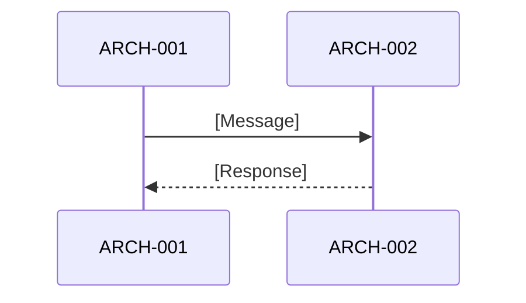

# Software Architecture Design: [FEATURE NAME]

**Feature Branch**: `[###-feature-name]`
**Created**: [DATE]
**Status**: Draft
**Source Requirements**: `specs/[###-feature-name]/v-model/requirements.md`

## Overview

[Brief description of the software architecture, its rationale, and how requirements map into architecture elements.]

## ID Schema

- **Architecture Element**: `ARCH-NNN` — sequential identifier for each architecture element
- **Requirement**: `REQ-NNN` — from the input `requirements.md`
- **Traceability**: `REQ → ARCH`

## Architecture Design

### Logical View

| ARCH ID | Name | Description (Purpose) | Parent Requirements (Dependencies) | Type |
|---------|------|----------------------|-----------------------------------|------|
| ARCH-001 | [Element Name] | [What it does] | REQ-001, REQ-002 | Component |

### Process View

[Describe runtime behavior, concurrency model, and interaction patterns.]

### Interface View

| ARCH ID | Interface Name | Direction | Protocol | Input | Output | Error Handling |
|----------|----------------|-----------|----------|-------|--------|----------------|
| ARCH-001 | [Name] | Input | [Protocol] | [Format] | [Format] | [Strategy] |

### Data Flow View

| Stage | Module | Input Format | Transformation | Output Format |
|-------|--------|-------------|----------------|---------------|
| [Stage] | ARCH-001 | [Format] | [Transformation] | [Format] |

## Traceability Summary

| Metric | Count |
|--------|-------|
| Total Requirements | [N] |
| Total Architecture Elements | [N] |
| Forward Coverage (REQ → ARCH) | [N/%] |

### REQ → ARCH Mapping

| Requirement | Architecture Elements |
|-------------|----------------------|
| REQ-001 | ARCH-001 |

## Derived Requirements and Modules

[List any derived items flagged during generation, or `None` if all items trace to requirements.]

## Glossary

| Term | Definition |
|------|------------|
| [Term] | [Definition] |
