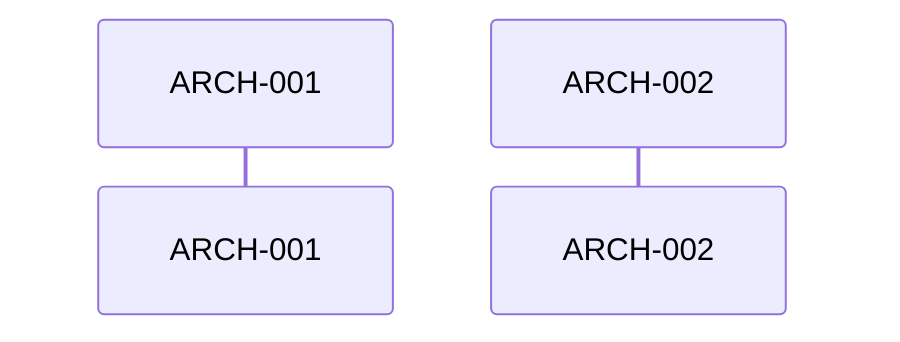

# System + Architecture Design

## 1. Header

- Feature: {FEATURE_NAME}
- Branch: {BRANCH}
- Date: {DATE}
- Sources: `requirements.md`, `spec.md` (if available)

## 2. Overview

Describe the combined system and architecture design rationale, the SWE.2 outer/inner viewpoint merge, and why the single artifact improves review density.

## 3. System Design

### 3.1 System Design Overview

Provide the system-level decomposition rationale and how requirements are grouped into software components.

### 3.2 System Design ID Schema

Explain `SYS-NNN` IDs and the relationship to `REQ-NNN`.

### 3.3 System Design Views (IEEE 1016)

#### Decomposition View

| SYS ID | Name | Description | Parent Requirements | Type |
|--------|------|-------------|---------------------|------|

#### Dependency View

| Source | Target | Relationship | Failure Impact |
|--------|--------|-------------|----------------|

#### Interface View

##### External Interfaces

| Component | Interface Name | Protocol | Input | Output | Error Handling |
|-----------|----------------|----------|-------|--------|----------------|

##### Internal Interfaces

| Source | Target | Interface Name | Protocol | Data Format | Error Handling |
|--------|--------|----------------|----------|-------------|----------------|

#### Data Design View

| Entity | Component | Storage | Protection at Rest | Protection in Transit | Retention |
|--------|-----------|---------|---------------------|------------------------|-----------|

## 4. Architecture Design

### 4.1 Architecture Design Overview

Describe the inner architecture rationale and how system components are implemented by `ARCH-NNN` modules.

### 4.2 Architecture Design ID Schema

Explain `ARCH-NNN` IDs and the relationship to `SYS-NNN`.

### 4.3 Architecture Design Views (IEEE 42010 / 4+1)

#### Logical View

| ARCH ID | Name | Description | Parent System Components | Type |
|---------|------|-------------|--------------------------|------|

#### Process View

Provide sequence diagrams and runtime behavior descriptions.

#### Interface View

| Direction | Name | Type | Format | Constraints |
|-----------|------|------|--------|-------------|

#### Data Flow View

| Stage | Module | Input Format | Transformation | Output Format |
|-------|--------|-------------|----------------|---------------|

## 5. Traceability Summary

| Source | Target | Notes |
|--------|--------|-------|

## 6. Quality Attribute Coverage

Document ISO/IEC 25010 and ISO/IEC 42030 evaluation findings.

## 7. Derived Requirements / Modules

List any derived items or architecture-only gaps.
