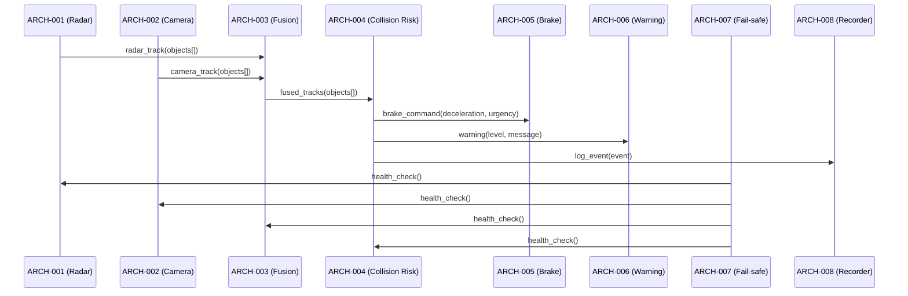

# Software Architecture Design — Automotive ADAS (Golden)

## Logical View (Component Breakdown)

| ARCH ID | Name | Description | Parent Requirements |
|---------|------|-------------|---------------------|
| ARCH-001 | Radar Sensor Interface | Reads radar sensor data for object detection | REQ-001 |
| ARCH-002 | Camera Sensor Interface | Processes camera image frames for object recognition | REQ-001 |
| ARCH-003 | Sensor Fusion Engine | Fuses radar and camera data into unified object tracks | REQ-001, REQ-002 |
| ARCH-004 | Collision Risk Evaluator | Evaluates collision risk from fused object tracks against configurable thresholds | REQ-002, REQ-003 |
| ARCH-005 | Brake Actuation Controller | Interfaces with braking ECU to execute autonomous braking | REQ-004 |
| ARCH-006 | Driver Warning System | Generates visual and audible warnings for the driver | REQ-005 |
| ARCH-007 | Fail-safe Monitor [CROSS-CUTTING] | Monitors all modules for faults and initiates safe-state fallback | REQ-001, REQ-002, REQ-003, REQ-004, REQ-005 |
| ARCH-008 | Data Recorder [CROSS-CUTTING] | Records sensor data, decisions, and system events for post-incident analysis | REQ-001, REQ-002, REQ-005 |

## Process View (Dynamic Behavior)



## Interface View (API Contracts)

### External Interfaces

| ARCH ID | Interface Name | Protocol | Input | Output |
|---------|---------------|----------|-------|--------|
| ARCH-001 | Radar CAN Bus | CAN FD (1 Mbps) | `RadarFrame { object_id: uint16, distance_mm: uint32, velocity_mps: int16, angle_deg: int16 }` | `RadarStatus { sensor_ok: bool, fault_code: uint8 }` |
| ARCH-002 | Camera MIPI CSI-2 | MIPI CSI-2 (4-lane) | `CameraFrame { width: 1920, height: 1080, format: YUV422, fps: 30 }` | `CameraStatus { frame_rate: float32, exposure: uint32 }` |
| ARCH-005 | Brake ECU CAN | CAN FD (500 kbps) | `BrakeCommand { deceleration_mps2: float32, urgency: enum(NORMAL|EMERGENCY), timestamp: ISO8601 }` | `BrakeStatus { engaged: bool, wheel_speed: float32[4], abs_active: bool }` |
| ARCH-006 | HMI Display | Automotive Ethernet (100BASE-T1) | `WarningDisplay { level: enum(INFO|WARNING|CRITICAL), message: string, icon: uint8 }` | `DisplayAck { shown: bool }` |

### Internal Interfaces

| Source | Target | Interface Name | Protocol | Data Format |
|--------|--------|---------------|----------|-------------|
| ARCH-001 | ARCH-003 | Radar Track Feed | Shared memory | `RadarTrack[] { object_id, distance_mm, velocity_mps, angle_deg, confidence }` |
| ARCH-002 | ARCH-003 | Camera Track Feed | Shared memory | `CameraTrack[] { object_id, bounding_box, class_id, confidence }` |
| ARCH-003 | ARCH-004 | Fused Object Feed | In-process call | `FusedTrack[] { object_id, distance_mm, velocity_mps, confidence, source: enum(RADAR|CAMERA|FUSED) }` |
| ARCH-004 | ARCH-005 | Brake Command | In-process call | `BrakeCommand { deceleration_mps2: float32, urgency: enum(NORMAL|EMERGENCY), timestamp: ISO8601 }` |
| ARCH-004 | ARCH-006 | Warning Signal | In-process call | `WarningSignal { level: enum(INFO|WARNING|CRITICAL), message: string, ttc_seconds: float32 }` |
| ARCH-004 | ARCH-008 | Collision Event Log | In-process call | `LogEntry { level: enum(INFO|WARN|CRITICAL), source: string, ttc: float32, brake_command: BrakeCommand }` |
| ARCH-007 | All | Health Query | In-process call | `HealthRequest { module: ARCH-NNN }` → `HealthResponse { operational: bool, fault_code: uint8, last_heartbeat: ISO8601 }` |
| ARCH-007 | ARCH-008 | Fault Log | In-process call | `LogEntry { level: enum(ERROR|CRITICAL), source: string, fault_code: uint8, message: string }` |

## Data Flow View

```
ARCH-001 (Radar) ───┐
                    ├──→ ARCH-003 (Sensor Fusion) → ARCH-004 (Collision Risk)
ARCH-002 (Camera) ──┘       │                              │
                             │                              ├──→ ARCH-005 (Brake ECU)
                             │                              └──→ ARCH-006 (Driver Warning)
                             │
                             └──→ ARCH-008 (Data Recorder)

ARCH-007 (Fail-safe Monitor) → Health Query → All ARCH modules
ARCH-007 (Fail-safe Monitor) → Fault Log → ARCH-008
```

## Derived Requirements

| ID | Description | Source | Annotation |
|----|-------------|--------|------------|
| ARCH-DR-001 | Sensor fusion SHALL run at minimum 30 Hz cycle rate | Real-time collision avoidance requirement | [DERIVED REQUIREMENT] |
| ARCH-DR-002 | Brake command SHALL be transmitted within 10 ms of collision risk detection | Safety-critical latency budget | [DERIVED REQUIREMENT] |
| ARCH-DR-003 | Fault monitor SHALL detect module failure within 100 ms | ARCH-007 fail-safe specification | [DERIVED REQUIREMENT] |
