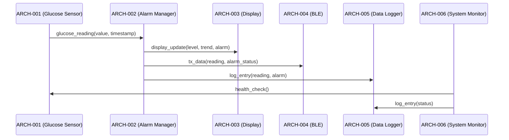

# Software Architecture Design — Medical Device (Golden)

## Logical View (Component Breakdown)

| ARCH ID | Name | Description | Parent Requirements |
|---------|------|-------------|---------------------|
| ARCH-001 | Glucose Sensor Interface | Reads blood glucose level from sensor via I2C | REQ-001 |
| ARCH-002 | Alarm Manager | Evaluates glucose readings against configured thresholds and triggers alarms | REQ-002 |
| ARCH-003 | Display Controller | Renders glucose level, trends, and alarms on LCD panel | REQ-003 |
| ARCH-004 | BLE Communication Manager | Manages Bluetooth Low Energy data transmission to external devices | REQ-004 |
| ARCH-005 | Data Logger [CROSS-CUTTING] | Records glucose readings, alarms, and system events to non-volatile storage | REQ-001, REQ-002, REQ-003, REQ-004, REQ-005 |
| ARCH-006 | System Monitor [CROSS-CUTTING] | Monitors battery level, sensor connectivity, and system health | REQ-005 |

## Process View (Dynamic Behavior)



## Interface View (API Contracts)

### External Interfaces

| ARCH ID | Interface Name | Protocol | Input | Output |
|---------|---------------|----------|-------|--------|
| ARCH-001 | Glucose Sensor I2C | I2C (100 kHz standard mode) | `uint8 i2c_address` (0x68) | `GlucoseReading { value: float32 (mg/dL), timestamp: ISO8601, sensor_status: uint8 }` |
| ARCH-003 | LCD Display SPI | SPI (20 MHz) | `uint16 RGB565 framebuffer` (128×64) | `FrameResult { rendered: bool, error: uint8 }` |
| ARCH-004 | BLE Radio | BLE 5.0 GATT | `Notification { characteristic: uuid, payload: bytes }` | `Ack { success: bool }` |

### Internal Interfaces

| Source | Target | Interface Name | Protocol | Data Format |
|--------|--------|---------------|----------|-------------|
| ARCH-001 | ARCH-002 | Reading Dispatch | In-process call | `GlucoseReading { value: float32, timestamp: ISO8601, sensor_status: uint8 }` |
| ARCH-001 | ARCH-005 | Log Submission | In-process call | `LogEntry { level: enum(INFO), source: string, message: string, reading: float32 }` |
| ARCH-002 | ARCH-003 | Display Update | In-process call | `DisplayData { value: float32, trend: enum(RISING|FALLING|STABLE), alarm: AlarmEvent, battery: uint8 }` |
| ARCH-002 | ARCH-004 | BLE Notification | In-process call | `BLEPacket { type: enum(READING|ALARM|STATUS), payload: bytes }` |
| ARCH-002 | ARCH-005 | Alarm Log | In-process call | `LogEntry { level: enum(WARN|CRITICAL), source: string, message: string }` |
| ARCH-003 | ARCH-005 | Display Log | In-process call | `LogEntry { level: enum(INFO), source: string, message: string }` |
| ARCH-004 | ARCH-005 | BLE Log | In-process call | `LogEntry { level: enum(INFO|WARN), source: string, message: string }` |
| ARCH-006 | ARCH-001 | Sensor Health Check | In-process call | `HealthStatus { connected: bool, battery_level: uint8 (0-100), last_reading_age_s: uint16 }` |
| ARCH-006 | ARCH-005 | System Log | In-process call | `LogEntry { level: enum(INFO|WARN|ERROR), source: string, message: string, battery: uint8 }` |

## Data Flow View

```
ARCH-001 (Glucose Sensor) → GlucoseReading → ARCH-002 (Alarm Manager)
    → DisplayData → ARCH-003 (Display Controller) → LCD Panel
    → BLEPacket → ARCH-004 (BLE Communication) → External BLE Device
    → LogEntry → ARCH-005 (Data Logger) → Non-volatile Storage
ARCH-006 (System Monitor) → HealthStatus → ARCH-001
ARCH-006 (System Monitor) → LogEntry → ARCH-005
```

## Derived Requirements

| ID | Description | Source | Annotation |
|----|-------------|--------|------------|
| ARCH-DR-001 | The system SHALL use ISO 8601 format for all timestamps | ARCH-001, ARCH-002 interface contract | [DERIVED REQUIREMENT] |
| ARCH-DR-002 | The system SHALL maintain a rolling log of at least 1000 entries | ARCH-005 data retention | [DERIVED REQUIREMENT] |
| ARCH-DR-003 | The system SHALL poll the glucose sensor at a minimum interval of 1 second | Real-time alarm requirement | [DERIVED REQUIREMENT] |
