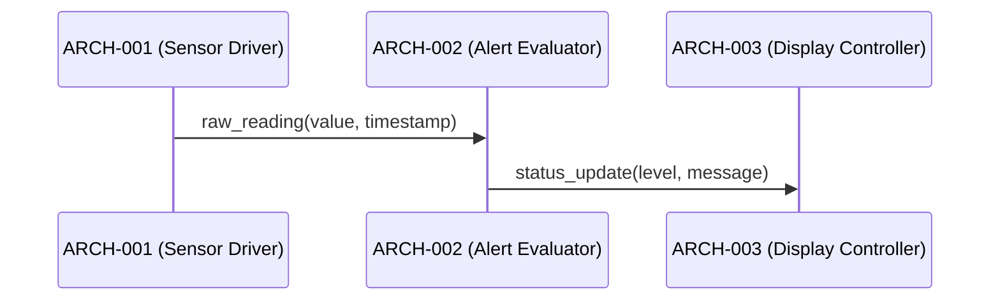

# Software Architecture Design — Path B Combined Fixture

## Logical View (Component Breakdown)

| ARCH ID | Name | Description | Parent Requirements |
|---------|------|-------------|---------------------|
| ARCH-001 | Sensor Driver | Reads raw sensor data via I2C | REQ-001 |
| ARCH-002 | Alert Evaluator | Evaluates thresholds and triggers alerts | REQ-002 |
| ARCH-003 | Display Controller | Renders status to LCD panel | REQ-003 |
| ARCH-004 | Logger [CROSS-CUTTING] | Structured logging for all modules | REQ-001, REQ-002, REQ-003 |

## Process View (Dynamic Behavior)



## Interface View (API Contracts)

### External Interfaces

| ARCH ID | Interface Name | Protocol | Input | Output |
|---------|---------------|----------|-------|--------|
| ARCH-001 | I2C Bus Driver | I2C (400 kHz fast mode) | `uint8 i2c_address`, `uint32 polling_interval_ms` | `SensorReading { value: float32, timestamp: ISO8601, unit: string }` |
| ARCH-003 | LCD Panel Driver | SPI (10 MHz) | `uint16 RGB565 framebuffer` | `FrameResult { rendered: bool }` |

### Internal Interfaces

| Source | Target | Interface Name | Protocol | Data Format |
|--------|--------|---------------|----------|-------------|
| ARCH-001 | ARCH-002 | Reading Dispatch | In-process call | `SensorReading { value: float32, timestamp: ISO8601, unit: string }` |
| ARCH-002 | ARCH-003 | Alert Notification | In-process call | `AlertEvent { level: enum(INFO|WARN|CRITICAL), message: string }` |
| ARCH-001 | ARCH-004 | Log Submission | In-process call | `LogEntry { level: enum(DEBUG|INFO|WARN|ERROR), source: string, message: string }` |
| ARCH-002 | ARCH-004 | Log Submission | In-process call | `LogEntry { level: enum(DEBUG|INFO|WARN|ERROR), source: string, message: string }` |
| ARCH-003 | ARCH-004 | Log Submission | In-process call | `LogEntry { level: enum(DEBUG|INFO|WARN|ERROR), source: string, message: string }` |

## Data Flow View

```
I2C Bus → ARCH-001 (Sensor Driver) → SensorReading → ARCH-002 (Alert Evaluator) → AlertEvent → ARCH-003 (Display Controller) → LCD Panel
```

## Derived Requirements

| ID | Description | Source | Annotation |
|----|-------------|--------|------------|
| ARCH-DR-001 | Inter-module messages SHALL use ISO-8601 timestamps | Architectural decision: common timestamp format across all modules | [DERIVED REQUIREMENT] |
| ARCH-DR-002 | ARCH-001 SHALL poll sensors at a minimum interval of 1 second | Architectural decision: real-time alert generation requires bounded data freshness | [DERIVED REQUIREMENT] |
